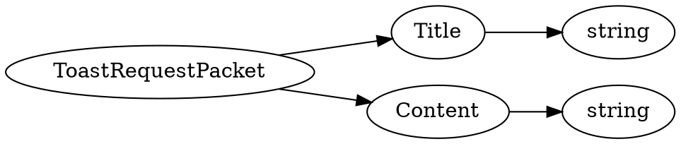

# <!-- md:samp ToastRequestPacket -->

> 文档版本：r/20_u7 协议版本：662

<!-- md:samp ToastRequestPacket -->数据包，数字ID是`186`。

## 结构

## 字段

/// define
ToastRequestPacket

Title：<!-- md:samp string -->

- 类型：string。

Content：<!-- md:samp string -->

- 类型：string。

///
