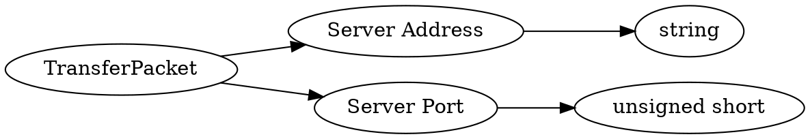

# <!-- md:samp TransferPacket -->

> 文档版本：r/20_u7 协议版本：662

<!-- md:samp TransferPacket -->数据包，数字ID是`85`。

## 结构

## 字段

/// define
TransferPacket

Server Address：<!-- md:samp string -->

- 类型：string。

Server Port：<!-- md:samp unsigned short -->

- 类型：unsigned short。

///
