# <!-- md:samp UpdateAttributesPacket -->

> 文档版本：r/20_u7 协议版本：662

<!-- md:samp UpdateAttributesPacket -->数据包，数字ID是`29`。

## 结构

```dot
digraph UpdateAttributesPacket {
	graph [rankdir=LR];
	{
		graph [rank=max];
		2	[comment="name: \"ActorRuntimeID\", typeName: \"\", id: 2, branchId: 0, recurseId: -1, attributes: 512, notes: \"\"",
			label=ActorRuntimeID];
		5	[comment="name: \"unsigned varint\", typeName: \"\", id: 5, branchId: 0, recurseId: -1, attributes: 512, notes: \"\"",
			label="unsigned varint"];
		8	[comment="name: \"float\", typeName: \"\", id: 8, branchId: 0, recurseId: -1, attributes: 512, notes: \"\"",
			label=float];
		10	[comment="name: \"float\", typeName: \"\", id: 10, branchId: 0, recurseId: -1, attributes: 512, notes: \"\"",
			label=float];
		12	[comment="name: \"float\", typeName: \"\", id: 12, branchId: 0, recurseId: -1, attributes: 512, notes: \"\"",
			label=float];
		14	[comment="name: \"float\", typeName: \"\", id: 14, branchId: 0, recurseId: -1, attributes: 512, notes: \"\"",
			label=float];
		16	[comment="name: \"string\", typeName: \"\", id: 16, branchId: 0, recurseId: -1, attributes: 512, notes: \"\"",
			label=string];
		19	[comment="name: \"unsigned varint\", typeName: \"\", id: 19, branchId: 0, recurseId: -1, attributes: 512, notes: \"\"",
			label="unsigned varint"];
		22	[comment="name: \"string\", typeName: \"\", id: 22, branchId: 0, recurseId: -1, attributes: 512, notes: \"\"",
			label=string];
		24	[comment="name: \"string\", typeName: \"\", id: 24, branchId: 0, recurseId: -1, attributes: 512, notes: \"\"",
			label=string];
		26	[comment="name: \"float\", typeName: \"\", id: 26, branchId: 0, recurseId: -1, attributes: 512, notes: \"\"",
			label=float];
		28	[comment="name: \"int\", typeName: \"\", id: 28, branchId: 0, recurseId: -1, attributes: 512, notes: \"\"",
			label=int];
		30	[comment="name: \"int\", typeName: \"\", id: 30, branchId: 0, recurseId: -1, attributes: 512, notes: \"\"",
			label=int];
		32	[comment="name: \"bool\", typeName: \"\", id: 32, branchId: 0, recurseId: -1, attributes: 512, notes: \"\"",
			label=bool];
		34	[comment="name: \"unsigned varint64\", typeName: \"\", id: 34, branchId: 0, recurseId: -1, attributes: 512, notes: \"\"",
			label="unsigned varint64"];
	}
	0	[comment="name: \"UpdateAttributesPacket\", typeName: \"\", id: 0, branchId: 29, recurseId: -1, attributes: 0, notes: \"\"",
		label=UpdateAttributesPacket];
	1	[comment="name: \"Target Runtime ID\", typeName: \"ActorRuntimeID\", id: 1, branchId: 0, recurseId: -1, attributes: 256, notes: \"\"",
		label="Target Runtime ID"];
	0 -> 1;
	3	[comment="name: \"Attribute List\", typeName: \"\", id: 3, branchId: 0, recurseId: -1, attributes: 8, notes: \"AttributeData - Helper Struct\"",
		label="Attribute List"];
	0 -> 3;
	33	[comment="name: \"Count of ticks since simulation started\", typeName: \"\", id: 33, branchId: 0, recurseId: -1, attributes: 0, notes: \"\"",
		label="Count of ticks since simulation started"];
	0 -> 33;
	1 -> 2;
	4	[comment="name: \"Array Size\", typeName: \"\", id: 4, branchId: 0, recurseId: -1, attributes: 0, notes: \"\"",
		label="Array Size"];
	3 -> 4;
	6	[comment="name: \"example element\", typeName: \"\", id: 6, branchId: 0, recurseId: -1, attributes: 16, notes: \"\"",
		label="example element",
		style=dotted];
	3 -> 6;
	4 -> 5;
	7	[comment="name: \"Min Value\", typeName: \"\", id: 7, branchId: 0, recurseId: -1, attributes: 0, notes: \"\"",
		label="Min Value"];
	6 -> 7;
	9	[comment="name: \"Max Value\", typeName: \"\", id: 9, branchId: 0, recurseId: -1, attributes: 0, notes: \"\"",
		label="Max Value"];
	6 -> 9;
	11	[comment="name: \"Current Value\", typeName: \"\", id: 11, branchId: 0, recurseId: -1, attributes: 0, notes: \"\"",
		label="Current Value"];
	6 -> 11;
	13	[comment="name: \"Default Value\", typeName: \"\", id: 13, branchId: 0, recurseId: -1, attributes: 0, notes: \"\"",
		label="Default Value"];
	6 -> 13;
	15	[comment="name: \"Attribute Name\", typeName: \"\", id: 15, branchId: 0, recurseId: -1, attributes: 0, notes: \"\"",
		label="Attribute Name"];
	6 -> 15;
	17	[comment="name: \"Attribute Modifier\", typeName: \"\", id: 17, branchId: 0, recurseId: -1, attributes: 8, notes: \"\"",
		label="Attribute Modifier"];
	6 -> 17;
	7 -> 8;
	9 -> 10;
	11 -> 12;
	13 -> 14;
	15 -> 16;
	18	[comment="name: \"Array Size\", typeName: \"\", id: 18, branchId: 0, recurseId: -1, attributes: 0, notes: \"\"",
		label="Array Size"];
	17 -> 18;
	20	[comment="name: \"example element\", typeName: \"\", id: 20, branchId: 0, recurseId: -1, attributes: 16, notes: \"\"",
		label="example element",
		style=dotted];
	17 -> 20;
	18 -> 19;
	21	[comment="name: \"ID\", typeName: \"\", id: 21, branchId: 0, recurseId: -1, attributes: 0, notes: \"\"",
		label=ID];
	20 -> 21;
	23	[comment="name: \"Name\", typeName: \"\", id: 23, branchId: 0, recurseId: -1, attributes: 0, notes: \"\"",
		label=Name];
	20 -> 23;
	25	[comment="name: \"Amount\", typeName: \"\", id: 25, branchId: 0, recurseId: -1, attributes: 0, notes: \"\"",
		label=Amount];
	20 -> 25;
	27	[comment="name: \"Operation\", typeName: \"\", id: 27, branchId: 0, recurseId: -1, attributes: 0, notes: \"enumeration: AttributeModifierOperation\"",
		label=Operation];
	20 -> 27;
	29	[comment="name: \"Operand\", typeName: \"\", id: 29, branchId: 0, recurseId: -1, attributes: 0, notes: \"enumeration: AttributeOperands\"",
		label=Operand];
	20 -> 29;
	31	[comment="name: \"isSerializable?\", typeName: \"\", id: 31, branchId: 0, recurseId: -1, attributes: 0, notes: \"\"",
		label="isSerializable?"];
	20 -> 31;
	21 -> 22;
	23 -> 24;
	25 -> 26;
	27 -> 28;
	29 -> 30;
	31 -> 32;
	33 -> 34;
}

```

## 字段

/// define
UpdateAttributesPacket

Target Runtime ID：[<!-- md:samp ActorRuntimeID -->](refs/protocols/types/ActorRuntimeID.md)

- 类型：ActorRuntimeID。

Attribute List

Attribute List数组的大小：<!-- md:samp unsigned varint -->

- 类型：unsigned varint。

Attribute List的示例元素

Min Value：<!-- md:samp float -->

- 类型：float。

Max Value：<!-- md:samp float -->

- 类型：float。

Current Value：<!-- md:samp float -->

- 类型：float。

Default Value：<!-- md:samp float -->

- 类型：float。

Attribute Name：<!-- md:samp string -->

- 类型：string。

Attribute Modifier

Attribute Modifier数组的大小：<!-- md:samp unsigned varint -->

- 类型：unsigned varint。

Attribute Modifier的示例元素

ID：<!-- md:samp string -->

- 类型：string。

Name：<!-- md:samp string -->

- 类型：string。

Amount：<!-- md:samp float -->

- 类型：float。

Operation：<!-- md:samp int -->

- 类型：int。enumeration: AttributeModifierOperation

Operand：<!-- md:samp int -->

- 类型：int。enumeration: AttributeOperands

isSerializable?：<!-- md:samp bool -->

- 类型：bool。

Count of ticks since simulation started：<!-- md:samp unsigned varint64 -->

- 类型：unsigned varint64。

///
