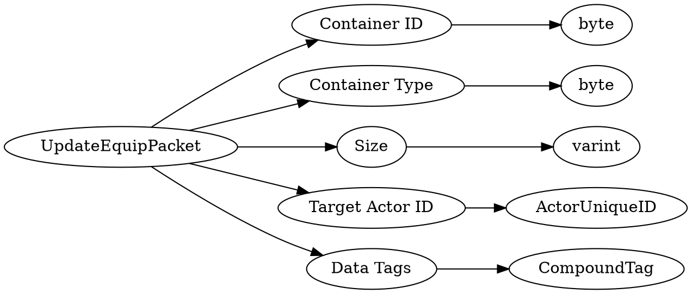

# <!-- md:samp UpdateEquipPacket -->

> 文档版本：r/20_u7 协议版本：662

<!-- md:samp UpdateEquipPacket -->数据包，数字ID是`81`。

## 结构

## 字段

/// define
UpdateEquipPacket

Container ID：<!-- md:samp byte -->

- 类型：byte。enumeration: ContainerID

Container Type：<!-- md:samp byte -->

- 类型：byte。enumeration: ContainerType

Size：<!-- md:samp varint -->

- 类型：varint。

Target Actor ID：[<!-- md:samp ActorUniqueID -->](refs/protocols/types/ActorUniqueID.md)

- 类型：ActorUniqueID。

Data Tags：[<!-- md:samp CompoundTag -->](refs/protocols/types/CompoundTag.md)

- 类型：CompoundTag。

///
