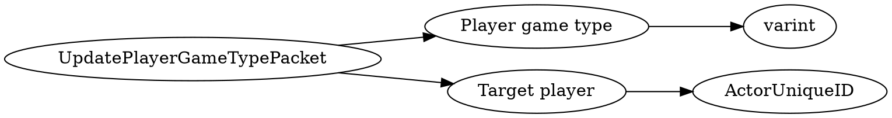

# <!-- md:samp UpdatePlayerGameTypePacket -->

> 文档版本：r/20_u7 协议版本：662

<!-- md:samp UpdatePlayerGameTypePacket -->数据包，数字ID是`151`。

## 结构

## 字段

/// define
UpdatePlayerGameTypePacket

Player game type：<!-- md:samp varint -->

- 类型：varint。enumeration: GameType

Target player：[<!-- md:samp ActorUniqueID -->](refs/protocols/types/ActorUniqueID.md)

- 类型：ActorUniqueID。

///
