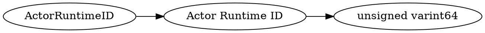

# <!-- md:samp ActorRuntimeID -->

> 文档版本：r/20_u7 协议版本：662

<!-- md:samp ActorRuntimeID -->类型。

## 结构

## 字段

/// define
ActorRuntimeID

Actor Runtime ID：<!-- md:samp unsigned varint64 -->

- 类型：unsigned varint64。

///
