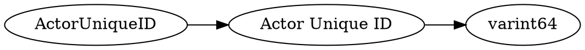

# <!-- md:samp ActorUniqueID -->

> 文档版本：r/20_u7 协议版本：662

<!-- md:samp ActorUniqueID -->类型。

## 结构

```dot
digraph ActorUniqueID {
	graph [rankdir=LR];
	{
		graph [rank=max];
		4	[comment="name: \"varint64\", typeName: \"\", id: 4, branchId: 0, recurseId: -1, attributes: 512, notes: \"\"",
			label=varint64];
	}
	2	[comment="name: \"ActorUniqueID\", typeName: \"\", id: 2, branchId: 0, recurseId: -1, attributes: 0, notes: \"\"",
		label=ActorUniqueID];
	3	[comment="name: \"Actor Unique ID\", typeName: \"\", id: 3, branchId: 0, recurseId: -1, attributes: 0, notes: \"\"",
		label="Actor Unique ID"];
	2 -> 3;
	3 -> 4;
}

```

## 字段

/// define
ActorUniqueID

Actor Unique ID：<!-- md:samp varint64 -->

- 类型：varint64。

///
