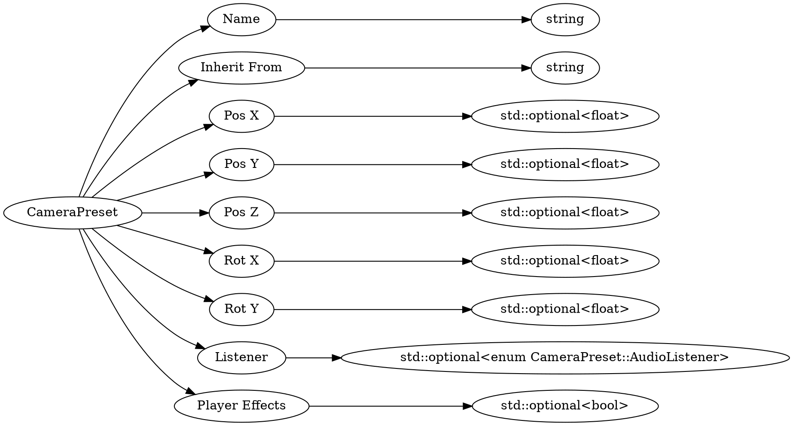

# <!-- md:samp CameraPreset -->

> 文档版本：r/20_u7 协议版本：662

<!-- md:samp CameraPreset -->类型。

## 结构

## 字段

/// define
CameraPreset

Name：<!-- md:samp string -->

- 类型：string。

Inherit From：<!-- md:samp string -->

- 类型：string。

Pos X：[<!-- md:samp std::optional<float> -->](refs/protocols/types/std::optional<float>.md)

- 类型：std::optional<float>。

Pos Y：[<!-- md:samp std::optional<float> -->](refs/protocols/types/std::optional<float>.md)

- 类型：std::optional<float>。

Pos Z：[<!-- md:samp std::optional<float> -->](refs/protocols/types/std::optional<float>.md)

- 类型：std::optional<float>。

Rot X：[<!-- md:samp std::optional<float> -->](refs/protocols/types/std::optional<float>.md)

- 类型：std::optional<float>。

Rot Y：[<!-- md:samp std::optional<float> -->](refs/protocols/types/std::optional<float>.md)

- 类型：std::optional<float>。

Listener：[<!-- md:samp std::optional<enum CameraPreset::AudioListener> -->](refs/protocols/types/std::optional<enum CameraPreset::AudioListener>.md)

- 类型：std::optional<enum CameraPreset::AudioListener>。

Player Effects：[<!-- md:samp std::optional<bool> -->](refs/protocols/types/std::optional<bool>.md)

- 类型：std::optional<bool>。

///
