# <!-- md:samp CameraPresets -->

> 文档版本：r/20_u7 协议版本：662

<!-- md:samp CameraPresets -->类型。

## 结构

```dot
digraph CameraPresets {
	graph [rankdir=LR];
	{
		graph [rank=max];
		5	[comment="name: \"unsigned varint\", typeName: \"\", id: 5, branchId: 0, recurseId: -1, attributes: 512, notes: \"\"",
			label="unsigned varint"];
		36	[comment="name: \"CameraPreset\", typeName: \"\", id: 36, branchId: 0, recurseId: -1, attributes: 512, notes: \"\"",
			label=CameraPreset];
	}
	2	[comment="name: \"CameraPresets\", typeName: \"\", id: 2, branchId: 0, recurseId: -1, attributes: 0, notes: \"\"",
		label=CameraPresets];
	3	[comment="name: \"Presets\", typeName: \"\", id: 3, branchId: 0, recurseId: -1, attributes: 8, notes: \"\"",
		label=Presets];
	2 -> 3;
	4	[comment="name: \"Array Size\", typeName: \"\", id: 4, branchId: 0, recurseId: -1, attributes: 0, notes: \"\"",
		label="Array Size"];
	3 -> 4;
	6	[comment="name: \"example element\", typeName: \"\", id: 6, branchId: 0, recurseId: -1, attributes: 16, notes: \"\"",
		label="example element",
		style=dotted];
	3 -> 6;
	4 -> 5;
	7	[comment="name: \"Camera Preset\", typeName: \"CameraPreset\", id: 7, branchId: 0, recurseId: -1, attributes: 256, notes: \"\"",
		label="Camera Preset"];
	6 -> 7;
	7 -> 36;
}

```

## 字段

/// define
CameraPresets

Presets

Presets数组的大小：<!-- md:samp unsigned varint -->

- 类型：unsigned varint。

Presets的示例元素

Camera Preset：[<!-- md:samp CameraPreset -->](refs/protocols/types/CameraPreset.md)

- 类型：CameraPreset。

///
