# <!-- md:samp CompoundTag -->

> 文档版本：r/20_u7 协议版本：662

<!-- md:samp CompoundTag -->类型。

## 结构

```dot
digraph CompoundTag {
	graph [rankdir=LR];
	{
		graph [rank=max];
		2	[comment="name: \"byte\", typeName: \"\", id: 2, branchId: 0, recurseId: -1, attributes: 512, notes: \"\"",
			label=byte];
		6	[comment="name: \"string\", typeName: \"\", id: 6, branchId: 0, recurseId: -1, attributes: 512, notes: \"\"",
			label=string];
		9	[comment="name: \"[No Data]\", typeName: \"\", id: 9, branchId: 0, recurseId: -1, attributes: 512, notes: \"\"",
			label="[No Data]"];
		12	[comment="name: \"byte\", typeName: \"\", id: 12, branchId: 0, recurseId: -1, attributes: 512, notes: \"\"",
			label=byte];
		15	[comment="name: \"short\", typeName: \"\", id: 15, branchId: 0, recurseId: -1, attributes: 512, notes: \"\"",
			label=short];
		18	[comment="name: \"varint\", typeName: \"\", id: 18, branchId: 0, recurseId: -1, attributes: 512, notes: \"\"",
			label=varint];
		21	[comment="name: \"varint64\", typeName: \"\", id: 21, branchId: 0, recurseId: -1, attributes: 512, notes: \"\"",
			label=varint64];
		24	[comment="name: \"float\", typeName: \"\", id: 24, branchId: 0, recurseId: -1, attributes: 512, notes: \"\"",
			label=float];
		27	[comment="name: \"double\", typeName: \"\", id: 27, branchId: 0, recurseId: -1, attributes: 512, notes: \"\"",
			label=double];
		31	[comment="name: \"varint\", typeName: \"\", id: 31, branchId: 0, recurseId: -1, attributes: 512, notes: \"\"",
			label=varint];
		34	[comment="name: \"byte\", typeName: \"\", id: 34, branchId: 0, recurseId: -1, attributes: 512, notes: \"\"",
			label=byte];
		37	[comment="name: \"string\", typeName: \"\", id: 37, branchId: 0, recurseId: -1, attributes: 512, notes: \"\"",
			label=string];
		42	[comment="name: \"byte\", typeName: \"\", id: 42, branchId: 0, recurseId: -1, attributes: 512, notes: \"\"",
			label=byte];
		45	[comment="name: \"byte\", typeName: \"\", id: 45, branchId: 0, recurseId: -1, attributes: 512, notes: \"\"",
			label=byte];
		48	[comment="name: \"varint\", typeName: \"\", id: 48, branchId: 0, recurseId: -1, attributes: 512, notes: \"\"",
			label=varint];
		58	[comment="name: \"CompoundTag\", typeName: \"\", id: 58, branchId: 0, recurseId: -1, attributes: 512, notes: \"\"",
			label=CompoundTag];
		63	[comment="name: \"CompoundTag\", typeName: \"\", id: 63, branchId: 0, recurseId: -1, attributes: 512, notes: \"\"",
			label=CompoundTag];
		65	[comment="name: \"byte\", typeName: \"\", id: 65, branchId: 0, recurseId: -1, attributes: 512, notes: \"\"",
			label=byte];
		69	[comment="name: \"varint\", typeName: \"\", id: 69, branchId: 0, recurseId: -1, attributes: 512, notes: \"\"",
			label=varint];
		72	[comment="name: \"varint\", typeName: \"\", id: 72, branchId: 0, recurseId: -1, attributes: 512, notes: \"\"",
			label=varint];
		74	[comment="name: \"[No Data]\", typeName: \"\", id: 74, branchId: 0, recurseId: -1, attributes: 512, notes: \"\"",
			label="[No Data]"];
	}
	0	[comment="name: \"CompoundTag\", typeName: \"\", id: 0, branchId: 0, recurseId: -1, attributes: 0, notes: \"\"",
		label=CompoundTag];
	1	[comment="name: \"Tag Type\", typeName: \"\", id: 1, branchId: 0, recurseId: -1, attributes: 0, notes: \"enumeration: Tag::Type\"",
		label="Tag Type"];
	0 -> 1;
	3	[comment="name: \"Dependency on 'if 'Tag Type' is 0'\", typeName: \"\", id: 3, branchId: 0, recurseId: -1, attributes: 2, notes: \"\"",
		label="Dependency on 'if 'Tag Type' is 0'",
		shape=note];
	0 -> 3;
	1 -> 2;
	4	[comment="name: \"if (0)\", typeName: \"\", id: 4, branchId: 0, recurseId: -1, attributes: 4, notes: \"\"",
		label="if (0)",
		shape=diamond];
	3 -> 4;
	73	[comment="name: \"if (1)\", typeName: \"\", id: 73, branchId: 1, recurseId: -1, attributes: 4, notes: \"\"",
		label="if (1)",
		shape=diamond];
	3 -> 73;
	5	[comment="name: \"Tag Name\", typeName: \"\", id: 5, branchId: 0, recurseId: -1, attributes: 0, notes: \"\"",
		label="Tag Name"];
	4 -> 5;
	7	[comment="name: \"Dependency on 'Tag Type'\", typeName: \"\", id: 7, branchId: 0, recurseId: -1, attributes: 2, notes: \"\"",
		label="Dependency on 'Tag Type'",
		shape=note];
	4 -> 7;
	5 -> 6;
	8	[comment="name: \"if (0)\", typeName: \"\", id: 8, branchId: 0, recurseId: -1, attributes: 4, notes: \"\"",
		label="if (0)",
		shape=diamond];
	7 -> 8;
	10	[comment="name: \"if (1)\", typeName: \"\", id: 10, branchId: 1, recurseId: -1, attributes: 4, notes: \"\"",
		label="if (1)",
		shape=diamond];
	7 -> 10;
	13	[comment="name: \"if (2)\", typeName: \"\", id: 13, branchId: 2, recurseId: -1, attributes: 4, notes: \"\"",
		label="if (2)",
		shape=diamond];
	7 -> 13;
	16	[comment="name: \"if (3)\", typeName: \"\", id: 16, branchId: 3, recurseId: -1, attributes: 4, notes: \"\"",
		label="if (3)",
		shape=diamond];
	7 -> 16;
	19	[comment="name: \"if (4)\", typeName: \"\", id: 19, branchId: 4, recurseId: -1, attributes: 4, notes: \"\"",
		label="if (4)",
		shape=diamond];
	7 -> 19;
	22	[comment="name: \"if (5)\", typeName: \"\", id: 22, branchId: 5, recurseId: -1, attributes: 4, notes: \"\"",
		label="if (5)",
		shape=diamond];
	7 -> 22;
	25	[comment="name: \"if (6)\", typeName: \"\", id: 25, branchId: 6, recurseId: -1, attributes: 4, notes: \"\"",
		label="if (6)",
		shape=diamond];
	7 -> 25;
	28	[comment="name: \"if (7)\", typeName: \"\", id: 28, branchId: 7, recurseId: -1, attributes: 4, notes: \"\"",
		label="if (7)",
		shape=diamond];
	7 -> 28;
	35	[comment="name: \"if (8)\", typeName: \"\", id: 35, branchId: 8, recurseId: -1, attributes: 4, notes: \"\"",
		label="if (8)",
		shape=diamond];
	7 -> 35;
	38	[comment="name: \"if (9)\", typeName: \"\", id: 38, branchId: 9, recurseId: -1, attributes: 4, notes: \"\"",
		label="if (9)",
		shape=diamond];
	7 -> 38;
	59	[comment="name: \"if (10)\", typeName: \"\", id: 59, branchId: 10, recurseId: -1, attributes: 4, notes: \"\"",
		label="if (10)",
		shape=diamond];
	7 -> 59;
	66	[comment="name: \"if (11)\", typeName: \"\", id: 66, branchId: 11, recurseId: -1, attributes: 4, notes: \"\"",
		label="if (11)",
		shape=diamond];
	7 -> 66;
	8 -> 9;
	11	[comment="name: \"Tag Value\", typeName: \"\", id: 11, branchId: 0, recurseId: -1, attributes: 0, notes: \"\"",
		label="Tag Value"];
	10 -> 11;
	11 -> 12;
	14	[comment="name: \"Tag Value\", typeName: \"\", id: 14, branchId: 0, recurseId: -1, attributes: 0, notes: \"\"",
		label="Tag Value"];
	13 -> 14;
	14 -> 15;
	17	[comment="name: \"Tag Value\", typeName: \"\", id: 17, branchId: 0, recurseId: -1, attributes: 0, notes: \"\"",
		label="Tag Value"];
	16 -> 17;
	17 -> 18;
	20	[comment="name: \"Tag Value\", typeName: \"\", id: 20, branchId: 0, recurseId: -1, attributes: 0, notes: \"\"",
		label="Tag Value"];
	19 -> 20;
	20 -> 21;
	23	[comment="name: \"Tag Value\", typeName: \"\", id: 23, branchId: 0, recurseId: -1, attributes: 0, notes: \"\"",
		label="Tag Value"];
	22 -> 23;
	23 -> 24;
	26	[comment="name: \"Tag Value\", typeName: \"\", id: 26, branchId: 0, recurseId: -1, attributes: 0, notes: \"\"",
		label="Tag Value"];
	25 -> 26;
	26 -> 27;
	29	[comment="name: \"Byte Array\", typeName: \"\", id: 29, branchId: 0, recurseId: -1, attributes: 8, notes: \"\"",
		label="Byte Array"];
	28 -> 29;
	30	[comment="name: \"Array Size\", typeName: \"\", id: 30, branchId: 0, recurseId: -1, attributes: 0, notes: \"\"",
		label="Array Size"];
	29 -> 30;
	32	[comment="name: \"example element\", typeName: \"\", id: 32, branchId: 0, recurseId: -1, attributes: 16, notes: \"\"",
		label="example element",
		style=dotted];
	29 -> 32;
	30 -> 31;
	33	[comment="name: \"Byte Data\", typeName: \"\", id: 33, branchId: 0, recurseId: -1, attributes: 0, notes: \"\"",
		label="Byte Data"];
	32 -> 33;
	33 -> 34;
	36	[comment="name: \"Tag Value\", typeName: \"\", id: 36, branchId: 0, recurseId: -1, attributes: 0, notes: \"\"",
		label="Tag Value"];
	35 -> 36;
	36 -> 37;
	39	[comment="name: \"Dependency on 'if empty list'\", typeName: \"\", id: 39, branchId: 0, recurseId: -1, attributes: 2, notes: \"\"",
		label="Dependency on 'if empty list'",
		shape=note];
	38 -> 39;
	46	[comment="name: \"Tag Array\", typeName: \"\", id: 46, branchId: 0, recurseId: -1, attributes: 8, notes: \"\"",
		label="Tag Array"];
	38 -> 46;
	40	[comment="name: \"if (0)\", typeName: \"\", id: 40, branchId: 0, recurseId: -1, attributes: 4, notes: \"\"",
		label="if (0)",
		shape=diamond];
	39 -> 40;
	43	[comment="name: \"if (1)\", typeName: \"\", id: 43, branchId: 1, recurseId: -1, attributes: 4, notes: \"\"",
		label="if (1)",
		shape=diamond];
	39 -> 43;
	41	[comment="name: \"Tag Type for list\", typeName: \"\", id: 41, branchId: 0, recurseId: -1, attributes: 0, notes: \"enumeration: Tag::Type\"",
		label="Tag Type for list"];
	40 -> 41;
	41 -> 42;
	44	[comment="name: \"Tag Type (must be 1)\", typeName: \"\", id: 44, branchId: 0, recurseId: -1, attributes: 0, notes: \"enumeration: Tag::Type\"",
		label="Tag Type (must be 1)"];
	43 -> 44;
	44 -> 45;
	47	[comment="name: \"Array Size\", typeName: \"\", id: 47, branchId: 0, recurseId: -1, attributes: 0, notes: \"\"",
		label="Array Size"];
	46 -> 47;
	49	[comment="name: \"example element\", typeName: \"\", id: 49, branchId: 0, recurseId: -1, attributes: 16, notes: \"\"",
		label="example element",
		style=dotted];
	46 -> 49;
	47 -> 48;
	50	[comment="name: \"Tag (Recursive)\", typeName: \"CompoundTag\", id: 50, branchId: 0, recurseId: -1, attributes: 256, notes: \"\"",
		label="Tag (Recursive)"];
	49 -> 50;
	50 -> 58;
	60	[comment="name: \"Tag Array\", typeName: \"\", id: 60, branchId: 0, recurseId: -1, attributes: 8, notes: \"\"",
		label="Tag Array"];
	59 -> 60;
	64	[comment="name: \"End (must be 0)\", typeName: \"\", id: 64, branchId: 0, recurseId: -1, attributes: 0, notes: \"\"",
		label="End (must be 0)"];
	59 -> 64;
	61	[comment="name: \"example element\", typeName: \"\", id: 61, branchId: 0, recurseId: -1, attributes: 16, notes: \"\"",
		label="example element",
		style=dotted];
	60 -> 61;
	62	[comment="name: \"Tag (Recursive)\", typeName: \"CompoundTag\", id: 62, branchId: 0, recurseId: -1, attributes: 256, notes: \"\"",
		label="Tag (Recursive)"];
	61 -> 62;
	62 -> 63;
	64 -> 65;
	67	[comment="name: \"Int Array\", typeName: \"\", id: 67, branchId: 0, recurseId: -1, attributes: 8, notes: \"\"",
		label="Int Array"];
	66 -> 67;
	68	[comment="name: \"Array Size\", typeName: \"\", id: 68, branchId: 0, recurseId: -1, attributes: 0, notes: \"\"",
		label="Array Size"];
	67 -> 68;
	70	[comment="name: \"example element\", typeName: \"\", id: 70, branchId: 0, recurseId: -1, attributes: 16, notes: \"\"",
		label="example element",
		style=dotted];
	67 -> 70;
	68 -> 69;
	71	[comment="name: \"Int Data\", typeName: \"\", id: 71, branchId: 0, recurseId: -1, attributes: 0, notes: \"\"",
		label="Int Data"];
	70 -> 71;
	71 -> 72;
	73 -> 74;
}

```

## 字段

/// define
CompoundTag

Tag Type：<!-- md:samp byte -->

- 类型：byte。enumeration: Tag::Type

Dependency on 'if 'Tag Type' is 0'

//// tab | if (0)
///// define
if (0)

Tag Name：<!-- md:samp string -->

- 类型：string。

Dependency on 'Tag Type'

////// tab | if (0)
/////// define
if (0)：<!-- md:samp [No Data] -->

- 类型：[No Data]。

///////

//////

////// tab | if (1)
/////// define
if (1)

Tag Value：<!-- md:samp byte -->

- 类型：byte。

///////

//////

////// tab | if (2)
/////// define
if (2)

Tag Value：<!-- md:samp short -->

- 类型：short。

///////

//////

////// tab | if (3)
/////// define
if (3)

Tag Value：<!-- md:samp varint -->

- 类型：varint。

///////

//////

////// tab | if (4)
/////// define
if (4)

Tag Value：<!-- md:samp varint64 -->

- 类型：varint64。

///////

//////

////// tab | if (5)
/////// define
if (5)

Tag Value：<!-- md:samp float -->

- 类型：float。

///////

//////

////// tab | if (6)
/////// define
if (6)

Tag Value：<!-- md:samp double -->

- 类型：double。

///////

//////

////// tab | if (7)
/////// define
if (7)

Byte Array

Byte Array数组的大小：<!-- md:samp varint -->

- 类型：varint。

Byte Array的示例元素

Byte Data：<!-- md:samp byte -->

- 类型：byte。

///////

//////

////// tab | if (8)
/////// define
if (8)

Tag Value：<!-- md:samp string -->

- 类型：string。

///////

//////

////// tab | if (9)
/////// define
if (9)

Dependency on 'if empty list'

//////// tab | if (0)
///////// define
if (0)

Tag Type for list：<!-- md:samp byte -->

- 类型：byte。enumeration: Tag::Type

/////////

////////

//////// tab | if (1)
///////// define
if (1)

Tag Type (must be 1)：<!-- md:samp byte -->

- 类型：byte。enumeration: Tag::Type

/////////

////////

Tag Array

Tag Array数组的大小：<!-- md:samp varint -->

- 类型：varint。

Tag Array的示例元素

Tag (Recursive)：[<!-- md:samp CompoundTag -->](refs/protocols/types/CompoundTag.md)

- 类型：CompoundTag。

///////

//////

////// tab | if (10)
/////// define
if (10)

Tag Array

Tag Array的示例元素

Tag (Recursive)：[<!-- md:samp CompoundTag -->](refs/protocols/types/CompoundTag.md)

- 类型：CompoundTag。

End (must be 0)：<!-- md:samp byte -->

- 类型：byte。

///////

//////

////// tab | if (11)
/////// define
if (11)

Int Array

Int Array数组的大小：<!-- md:samp varint -->

- 类型：varint。

Int Array的示例元素

Int Data：<!-- md:samp varint -->

- 类型：varint。

///////

//////

/////

////

//// tab | if (1)
///// define
if (1)：<!-- md:samp [No Data] -->

- 类型：[No Data]。

/////

////

///
