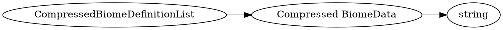

# <!-- md:samp CompressedBiomeDefinitionList -->

> 文档版本：r/20_u7 协议版本：662

<!-- md:samp CompressedBiomeDefinitionList -->类型，数字ID是`301`。

## 结构

## 字段

/// define
CompressedBiomeDefinitionList

Compressed BiomeData：<!-- md:samp string -->

- 类型：string。

///
