# <!-- md:samp CraftingDataEntry -->

> 文档版本：r/20_u7 协议版本：662

<!-- md:samp CraftingDataEntry -->类型。

## 结构

```dot
digraph CraftingDataEntry {
	graph [rankdir=LR];
	{
		graph [rank=max];
		3	[comment="name: \"varint\", typeName: \"\", id: 3, branchId: 0, recurseId: -1, attributes: 512, notes: \"\"",
			label=varint];
		7	[comment="name: \"ShapelessRecipe\", typeName: \"\", id: 7, branchId: 0, recurseId: -1, attributes: 512, notes: \"\"",
			label=ShapelessRecipe];
		9	[comment="name: \"TypedServerNetId<struct RecipeNetIdTag,unsigned int,0>\", typeName: \"\", id: 9, branchId: 0, recurseId: -1, attributes: 512, \
notes: \"\"",
			label="TypedServerNetId<struct RecipeNetIdTag,unsigned int,0>"];
		12	[comment="name: \"ShapedRecipe\", typeName: \"\", id: 12, branchId: 0, recurseId: -1, attributes: 512, notes: \"\"",
			label=ShapedRecipe];
		14	[comment="name: \"TypedServerNetId<struct RecipeNetIdTag,unsigned int,0>\", typeName: \"\", id: 14, branchId: 0, recurseId: -1, attributes: 512, \
notes: \"\"",
			label="TypedServerNetId<struct RecipeNetIdTag,unsigned int,0>"];
		17	[comment="name: \"varint\", typeName: \"\", id: 17, branchId: 0, recurseId: -1, attributes: 512, notes: \"\"",
			label=varint];
		19	[comment="name: \"NetworkItemInstanceDescriptor\", typeName: \"\", id: 19, branchId: 0, recurseId: -1, attributes: 512, notes: \"\"",
			label=NetworkItemInstanceDescriptor];
		21	[comment="name: \"string\", typeName: \"\", id: 21, branchId: 0, recurseId: -1, attributes: 512, notes: \"\"",
			label=string];
		24	[comment="name: \"varint\", typeName: \"\", id: 24, branchId: 0, recurseId: -1, attributes: 512, notes: \"\"",
			label=varint];
		26	[comment="name: \"varint\", typeName: \"\", id: 26, branchId: 0, recurseId: -1, attributes: 512, notes: \"\"",
			label=varint];
		28	[comment="name: \"NetworkItemInstanceDescriptor\", typeName: \"\", id: 28, branchId: 0, recurseId: -1, attributes: 512, notes: \"\"",
			label=NetworkItemInstanceDescriptor];
		30	[comment="name: \"string\", typeName: \"\", id: 30, branchId: 0, recurseId: -1, attributes: 512, notes: \"\"",
			label=string];
		33	[comment="name: \"mce::UUID\", typeName: \"\", id: 33, branchId: 0, recurseId: -1, attributes: 512, notes: \"\"",
			label="mce::UUID"];
		35	[comment="name: \"TypedServerNetId<struct RecipeNetIdTag,unsigned int,0>\", typeName: \"\", id: 35, branchId: 0, recurseId: -1, attributes: 512, \
notes: \"\"",
			label="TypedServerNetId<struct RecipeNetIdTag,unsigned int,0>"];
		38	[comment="name: \"ShulkerBoxRecipe\", typeName: \"\", id: 38, branchId: 0, recurseId: -1, attributes: 512, notes: \"\"",
			label=ShulkerBoxRecipe];
		40	[comment="name: \"TypedServerNetId<struct RecipeNetIdTag,unsigned int,0>\", typeName: \"\", id: 40, branchId: 0, recurseId: -1, attributes: 512, \
notes: \"\"",
			label="TypedServerNetId<struct RecipeNetIdTag,unsigned int,0>"];
		43	[comment="name: \"ShapelessChemistryRecipe\", typeName: \"\", id: 43, branchId: 0, recurseId: -1, attributes: 512, notes: \"\"",
			label=ShapelessChemistryRecipe];
		45	[comment="name: \"TypedServerNetId<struct RecipeNetIdTag,unsigned int,0>\", typeName: \"\", id: 45, branchId: 0, recurseId: -1, attributes: 512, \
notes: \"\"",
			label="TypedServerNetId<struct RecipeNetIdTag,unsigned int,0>"];
		48	[comment="name: \"ShapedChemistryRecipe\", typeName: \"\", id: 48, branchId: 0, recurseId: -1, attributes: 512, notes: \"\"",
			label=ShapedChemistryRecipe];
		50	[comment="name: \"TypedServerNetId<struct RecipeNetIdTag,unsigned int,0>\", typeName: \"\", id: 50, branchId: 0, recurseId: -1, attributes: 512, \
notes: \"\"",
			label="TypedServerNetId<struct RecipeNetIdTag,unsigned int,0>"];
		53	[comment="name: \"SmithingTransformRecipe\", typeName: \"\", id: 53, branchId: 0, recurseId: -1, attributes: 512, notes: \"\"",
			label=SmithingTransformRecipe];
		55	[comment="name: \"TypedServerNetId<struct RecipeNetIdTag,unsigned int,0>\", typeName: \"\", id: 55, branchId: 0, recurseId: -1, attributes: 512, \
notes: \"\"",
			label="TypedServerNetId<struct RecipeNetIdTag,unsigned int,0>"];
		58	[comment="name: \"SmithingTrimRecipe\", typeName: \"\", id: 58, branchId: 0, recurseId: -1, attributes: 512, notes: \"\"",
			label=SmithingTrimRecipe];
		60	[comment="name: \"TypedServerNetId<struct RecipeNetIdTag,unsigned int,0>\", typeName: \"\", id: 60, branchId: 0, recurseId: -1, attributes: 512, \
notes: \"\"",
			label="TypedServerNetId<struct RecipeNetIdTag,unsigned int,0>"];
	}
	1	[comment="name: \"CraftingDataEntry\", typeName: \"\", id: 1, branchId: 0, recurseId: -1, attributes: 0, notes: \"\"",
		label=CraftingDataEntry];
	2	[comment="name: \"Crafting Type\", typeName: \"\", id: 2, branchId: 0, recurseId: -1, attributes: 0, notes: \"enumeration: CraftingDataEntryType\"",
		label="Crafting Type"];
	1 -> 2;
	4	[comment="name: \"Dependency on 'Crafting Type'\", typeName: \"\", id: 4, branchId: 0, recurseId: -1, attributes: 2, notes: \"\"",
		label="Dependency on 'Crafting Type'",
		shape=note];
	1 -> 4;
	2 -> 3;
	5	[comment="name: \"if (0)\", typeName: \"\", id: 5, branchId: 0, recurseId: -1, attributes: 4, notes: \"\"",
		label="if (0)",
		shape=diamond];
	4 -> 5;
	10	[comment="name: \"if (1)\", typeName: \"\", id: 10, branchId: 1, recurseId: -1, attributes: 4, notes: \"\"",
		label="if (1)",
		shape=diamond];
	4 -> 10;
	15	[comment="name: \"if (2)\", typeName: \"\", id: 15, branchId: 2, recurseId: -1, attributes: 4, notes: \"\"",
		label="if (2)",
		shape=diamond];
	4 -> 15;
	22	[comment="name: \"if (3)\", typeName: \"\", id: 22, branchId: 3, recurseId: -1, attributes: 4, notes: \"\"",
		label="if (3)",
		shape=diamond];
	4 -> 22;
	31	[comment="name: \"if (4)\", typeName: \"\", id: 31, branchId: 4, recurseId: -1, attributes: 4, notes: \"\"",
		label="if (4)",
		shape=diamond];
	4 -> 31;
	36	[comment="name: \"if (5)\", typeName: \"\", id: 36, branchId: 5, recurseId: -1, attributes: 4, notes: \"\"",
		label="if (5)",
		shape=diamond];
	4 -> 36;
	41	[comment="name: \"if (6)\", typeName: \"\", id: 41, branchId: 6, recurseId: -1, attributes: 4, notes: \"\"",
		label="if (6)",
		shape=diamond];
	4 -> 41;
	46	[comment="name: \"if (7)\", typeName: \"\", id: 46, branchId: 7, recurseId: -1, attributes: 4, notes: \"\"",
		label="if (7)",
		shape=diamond];
	4 -> 46;
	51	[comment="name: \"if (8)\", typeName: \"\", id: 51, branchId: 8, recurseId: -1, attributes: 4, notes: \"\"",
		label="if (8)",
		shape=diamond];
	4 -> 51;
	56	[comment="name: \"if (9)\", typeName: \"\", id: 56, branchId: 9, recurseId: -1, attributes: 4, notes: \"\"",
		label="if (9)",
		shape=diamond];
	4 -> 56;
	6	[comment="name: \"Shapeless Recipe\", typeName: \"\", id: 6, branchId: 0, recurseId: -1, attributes: 256, notes: \"\"",
		label="Shapeless Recipe"];
	5 -> 6;
	8	[comment="name: \"Net id\", typeName: \"\", id: 8, branchId: 0, recurseId: -1, attributes: 256, notes: \"\"",
		label="Net id"];
	5 -> 8;
	6 -> 7;
	8 -> 9;
	11	[comment="name: \"Shaped Recipe\", typeName: \"\", id: 11, branchId: 0, recurseId: -1, attributes: 256, notes: \"\"",
		label="Shaped Recipe"];
	10 -> 11;
	13	[comment="name: \"Net id\", typeName: \"\", id: 13, branchId: 0, recurseId: -1, attributes: 256, notes: \"\"",
		label="Net id"];
	10 -> 13;
	11 -> 12;
	13 -> 14;
	16	[comment="name: \"Item Data\", typeName: \"\", id: 16, branchId: 0, recurseId: -1, attributes: 0, notes: \"\"",
		label="Item Data"];
	15 -> 16;
	18	[comment="name: \"Result Item\", typeName: \"\", id: 18, branchId: 0, recurseId: -1, attributes: 256, notes: \"\"",
		label="Result Item"];
	15 -> 18;
	20	[comment="name: \"Recipe Tag\", typeName: \"\", id: 20, branchId: 0, recurseId: -1, attributes: 0, notes: \"Available ones: crafting_table, cartography_\
table, stonecutter, furnace, blast_furnace, smoker, campfire\"",
		label="Recipe Tag"];
	15 -> 20;
	16 -> 17;
	18 -> 19;
	20 -> 21;
	23	[comment="name: \"Item Data\", typeName: \"\", id: 23, branchId: 0, recurseId: -1, attributes: 0, notes: \"\"",
		label="Item Data"];
	22 -> 23;
	25	[comment="name: \"Auxiliary Item Data\", typeName: \"\", id: 25, branchId: 0, recurseId: -1, attributes: 0, notes: \"\"",
		label="Auxiliary Item Data"];
	22 -> 25;
	27	[comment="name: \"Result Item\", typeName: \"\", id: 27, branchId: 0, recurseId: -1, attributes: 256, notes: \"\"",
		label="Result Item"];
	22 -> 27;
	29	[comment="name: \"Recipe Tag\", typeName: \"\", id: 29, branchId: 0, recurseId: -1, attributes: 0, notes: \"Available ones: crafting_table, cartography_\
table, stonecutter, furnace, blast_furnace, smoker, campfire\"",
		label="Recipe Tag"];
	22 -> 29;
	23 -> 24;
	25 -> 26;
	27 -> 28;
	29 -> 30;
	32	[comment="name: \"Multi-Recipe\", typeName: \"\", id: 32, branchId: 0, recurseId: -1, attributes: 256, notes: \"\"",
		label="Multi-Recipe"];
	31 -> 32;
	34	[comment="name: \"Net id\", typeName: \"\", id: 34, branchId: 0, recurseId: -1, attributes: 256, notes: \"\"",
		label="Net id"];
	31 -> 34;
	32 -> 33;
	34 -> 35;
	37	[comment="name: \"Shulker Box Recipe\", typeName: \"\", id: 37, branchId: 0, recurseId: -1, attributes: 256, notes: \"\"",
		label="Shulker Box Recipe"];
	36 -> 37;
	39	[comment="name: \"Net id\", typeName: \"\", id: 39, branchId: 0, recurseId: -1, attributes: 256, notes: \"\"",
		label="Net id"];
	36 -> 39;
	37 -> 38;
	39 -> 40;
	42	[comment="name: \"Shapeless Chemistry Recipe\", typeName: \"\", id: 42, branchId: 0, recurseId: -1, attributes: 256, notes: \"\"",
		label="Shapeless Chemistry Recipe"];
	41 -> 42;
	44	[comment="name: \"Net id\", typeName: \"\", id: 44, branchId: 0, recurseId: -1, attributes: 256, notes: \"\"",
		label="Net id"];
	41 -> 44;
	42 -> 43;
	44 -> 45;
	47	[comment="name: \"Shaped Chemistry Recipe\", typeName: \"\", id: 47, branchId: 0, recurseId: -1, attributes: 256, notes: \"\"",
		label="Shaped Chemistry Recipe"];
	46 -> 47;
	49	[comment="name: \"Net id\", typeName: \"\", id: 49, branchId: 0, recurseId: -1, attributes: 256, notes: \"\"",
		label="Net id"];
	46 -> 49;
	47 -> 48;
	49 -> 50;
	52	[comment="name: \"Smithing Transform Recipe\", typeName: \"\", id: 52, branchId: 0, recurseId: -1, attributes: 256, notes: \"\"",
		label="Smithing Transform Recipe"];
	51 -> 52;
	54	[comment="name: \"Net id\", typeName: \"\", id: 54, branchId: 0, recurseId: -1, attributes: 256, notes: \"\"",
		label="Net id"];
	51 -> 54;
	52 -> 53;
	54 -> 55;
	57	[comment="name: \"Smithing Trim Recipe\", typeName: \"\", id: 57, branchId: 0, recurseId: -1, attributes: 256, notes: \"\"",
		label="Smithing Trim Recipe"];
	56 -> 57;
	59	[comment="name: \"Net id\", typeName: \"\", id: 59, branchId: 0, recurseId: -1, attributes: 256, notes: \"\"",
		label="Net id"];
	56 -> 59;
	57 -> 58;
	59 -> 60;
}

```

## 字段

/// define
CraftingDataEntry

Crafting Type：<!-- md:samp varint -->

- 类型：varint。enumeration: CraftingDataEntryType

Dependency on 'Crafting Type'

//// tab | if (0)
///// define
if (0)

Shapeless Recipe：[<!-- md:samp ShapelessRecipe -->](refs/protocols/types/ShapelessRecipe.md)

- 类型：ShapelessRecipe。

Net id：[<!-- md:samp TypedServerNetId<struct RecipeNetIdTag,unsigned int,0> -->](refs/protocols/types/TypedServerNetId<struct RecipeNetIdTag,unsigned int,0>.md)

- 类型：TypedServerNetId<struct RecipeNetIdTag,unsigned int,0>。

/////

////

//// tab | if (1)
///// define
if (1)

Shaped Recipe：[<!-- md:samp ShapedRecipe -->](refs/protocols/types/ShapedRecipe.md)

- 类型：ShapedRecipe。

Net id：[<!-- md:samp TypedServerNetId<struct RecipeNetIdTag,unsigned int,0> -->](refs/protocols/types/TypedServerNetId<struct RecipeNetIdTag,unsigned int,0>.md)

- 类型：TypedServerNetId<struct RecipeNetIdTag,unsigned int,0>。

/////

////

//// tab | if (2)
///// define
if (2)

Item Data：<!-- md:samp varint -->

- 类型：varint。

Result Item：[<!-- md:samp NetworkItemInstanceDescriptor -->](refs/protocols/types/NetworkItemInstanceDescriptor.md)

- 类型：NetworkItemInstanceDescriptor。

Recipe Tag：<!-- md:samp string -->

- 类型：string。Available ones: crafting_table, cartography_table, stonecutter, furnace, blast_furnace, smoker, campfire

/////

////

//// tab | if (3)
///// define
if (3)

Item Data：<!-- md:samp varint -->

- 类型：varint。

Auxiliary Item Data：<!-- md:samp varint -->

- 类型：varint。

Result Item：[<!-- md:samp NetworkItemInstanceDescriptor -->](refs/protocols/types/NetworkItemInstanceDescriptor.md)

- 类型：NetworkItemInstanceDescriptor。

Recipe Tag：<!-- md:samp string -->

- 类型：string。Available ones: crafting_table, cartography_table, stonecutter, furnace, blast_furnace, smoker, campfire

/////

////

//// tab | if (4)
///// define
if (4)

Multi-Recipe：[<!-- md:samp mce::UUID -->](refs/protocols/types/mce::UUID.md)

- 类型：mce::UUID。

Net id：[<!-- md:samp TypedServerNetId<struct RecipeNetIdTag,unsigned int,0> -->](refs/protocols/types/TypedServerNetId<struct RecipeNetIdTag,unsigned int,0>.md)

- 类型：TypedServerNetId<struct RecipeNetIdTag,unsigned int,0>。

/////

////

//// tab | if (5)
///// define
if (5)

Shulker Box Recipe：[<!-- md:samp ShulkerBoxRecipe -->](refs/protocols/types/ShulkerBoxRecipe.md)

- 类型：ShulkerBoxRecipe。

Net id：[<!-- md:samp TypedServerNetId<struct RecipeNetIdTag,unsigned int,0> -->](refs/protocols/types/TypedServerNetId<struct RecipeNetIdTag,unsigned int,0>.md)

- 类型：TypedServerNetId<struct RecipeNetIdTag,unsigned int,0>。

/////

////

//// tab | if (6)
///// define
if (6)

Shapeless Chemistry Recipe：[<!-- md:samp ShapelessChemistryRecipe -->](refs/protocols/types/ShapelessChemistryRecipe.md)

- 类型：ShapelessChemistryRecipe。

Net id：[<!-- md:samp TypedServerNetId<struct RecipeNetIdTag,unsigned int,0> -->](refs/protocols/types/TypedServerNetId<struct RecipeNetIdTag,unsigned int,0>.md)

- 类型：TypedServerNetId<struct RecipeNetIdTag,unsigned int,0>。

/////

////

//// tab | if (7)
///// define
if (7)

Shaped Chemistry Recipe：[<!-- md:samp ShapedChemistryRecipe -->](refs/protocols/types/ShapedChemistryRecipe.md)

- 类型：ShapedChemistryRecipe。

Net id：[<!-- md:samp TypedServerNetId<struct RecipeNetIdTag,unsigned int,0> -->](refs/protocols/types/TypedServerNetId<struct RecipeNetIdTag,unsigned int,0>.md)

- 类型：TypedServerNetId<struct RecipeNetIdTag,unsigned int,0>。

/////

////

//// tab | if (8)
///// define
if (8)

Smithing Transform Recipe：[<!-- md:samp SmithingTransformRecipe -->](refs/protocols/types/SmithingTransformRecipe.md)

- 类型：SmithingTransformRecipe。

Net id：[<!-- md:samp TypedServerNetId<struct RecipeNetIdTag,unsigned int,0> -->](refs/protocols/types/TypedServerNetId<struct RecipeNetIdTag,unsigned int,0>.md)

- 类型：TypedServerNetId<struct RecipeNetIdTag,unsigned int,0>。

/////

////

//// tab | if (9)
///// define
if (9)

Smithing Trim Recipe：[<!-- md:samp SmithingTrimRecipe -->](refs/protocols/types/SmithingTrimRecipe.md)

- 类型：SmithingTrimRecipe。

Net id：[<!-- md:samp TypedServerNetId<struct RecipeNetIdTag,unsigned int,0> -->](refs/protocols/types/TypedServerNetId<struct RecipeNetIdTag,unsigned int,0>.md)

- 类型：TypedServerNetId<struct RecipeNetIdTag,unsigned int,0>。

/////

////

///
