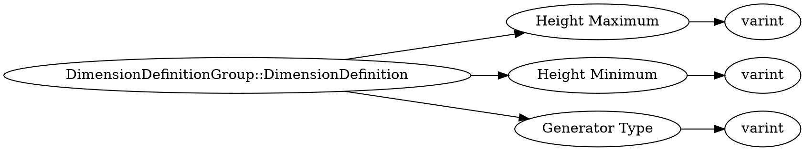

# <!-- md:samp DimensionDefinitionGroup::DimensionDefinition -->

> 文档版本：r/20_u7 协议版本：662

<!-- md:samp DimensionDefinitionGroup::DimensionDefinition -->类型。

## 结构

## 字段

/// define
DimensionDefinitionGroup::DimensionDefinition

Height Maximum：<!-- md:samp varint -->

- 类型：varint。

Height Minimum：<!-- md:samp varint -->

- 类型：varint。

Generator Type：<!-- md:samp varint -->

- 类型：varint。

///
