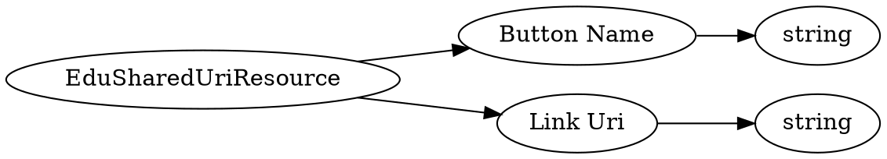

# <!-- md:samp EduSharedUriResource -->

> 文档版本：r/20_u7 协议版本：662

<!-- md:samp EduSharedUriResource -->类型。

## 结构

## 字段

/// define
EduSharedUriResource

Button Name：<!-- md:samp string -->

- 类型：string。

Link Uri：<!-- md:samp string -->

- 类型：string。

///
