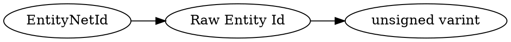

# <!-- md:samp EntityNetId -->

> 文档版本：r/20_u7 协议版本：662

<!-- md:samp EntityNetId -->类型。

## 结构

## 字段

/// define
EntityNetId

Raw Entity Id：<!-- md:samp unsigned varint -->

- 类型：unsigned varint。

///
