# <!-- md:samp Experiments -->

> 文档版本：r/20_u7 协议版本：662

<!-- md:samp Experiments -->类型。

## 结构

```dot
digraph Experiments {
	graph [rankdir=LR];
	{
		graph [rank=max];
		32	[comment="name: \"unsigned int\", typeName: \"\", id: 32, branchId: 0, recurseId: -1, attributes: 512, notes: \"\"",
			label="unsigned int"];
		35	[comment="name: \"string\", typeName: \"\", id: 35, branchId: 0, recurseId: -1, attributes: 512, notes: \"\"",
			label=string];
		37	[comment="name: \"bool\", typeName: \"\", id: 37, branchId: 0, recurseId: -1, attributes: 512, notes: \"\"",
			label=bool];
		39	[comment="name: \"string\", typeName: \"\", id: 39, branchId: 0, recurseId: -1, attributes: 512, notes: \"\"",
			label=string];
		41	[comment="name: \"bool\", typeName: \"\", id: 41, branchId: 0, recurseId: -1, attributes: 512, notes: \"\"",
			label=bool];
		43	[comment="name: \"bool\", typeName: \"\", id: 43, branchId: 0, recurseId: -1, attributes: 512, notes: \"\"",
			label=bool];
	}
	29	[comment="name: \"Experiments\", typeName: \"\", id: 29, branchId: 0, recurseId: -1, attributes: 0, notes: \"\"",
		label=Experiments];
	30	[comment="name: \"Experiments array\", typeName: \"\", id: 30, branchId: 0, recurseId: -1, attributes: 8, notes: \"List of currently enabled experiments\"",
		label="Experiments array"];
	29 -> 30;
	42	[comment="name: \"Were Any Experiments Ever Toggled\", typeName: \"\", id: 42, branchId: 0, recurseId: -1, attributes: 0, notes: \"\"",
		label="Were Any Experiments Ever Toggled"];
	29 -> 42;
	31	[comment="name: \"Streamed Experiment Names Size\", typeName: \"\", id: 31, branchId: 0, recurseId: -1, attributes: 0, notes: \"\"",
		label="Streamed Experiment Names Size"];
	30 -> 31;
	33	[comment="name: \"example element\", typeName: \"\", id: 33, branchId: 0, recurseId: -1, attributes: 16, notes: \"\"",
		label="example element",
		style=dotted];
	30 -> 33;
	31 -> 32;
	34	[comment="name: \"Toggle Name\", typeName: \"\", id: 34, branchId: 0, recurseId: -1, attributes: 0, notes: \"\"",
		label="Toggle Name"];
	33 -> 34;
	36	[comment="name: \"Enabled\", typeName: \"\", id: 36, branchId: 0, recurseId: -1, attributes: 0, notes: \"\"",
		label=Enabled];
	33 -> 36;
	38	[comment="name: \"Always On Name\", typeName: \"\", id: 38, branchId: 0, recurseId: -1, attributes: 0, notes: \"\"",
		label="Always On Name"];
	33 -> 38;
	40	[comment="name: \"Enabled\", typeName: \"\", id: 40, branchId: 0, recurseId: -1, attributes: 0, notes: \"\"",
		label=Enabled];
	33 -> 40;
	34 -> 35;
	36 -> 37;
	38 -> 39;
	40 -> 41;
	42 -> 43;
}

```

## 字段

/// define
Experiments

Experiments array

Streamed Experiment Names Size：<!-- md:samp unsigned int -->

- 类型：unsigned int。

Experiments array的示例元素

Toggle Name：<!-- md:samp string -->

- 类型：string。

Enabled：<!-- md:samp bool -->

- 类型：bool。

Always On Name：<!-- md:samp string -->

- 类型：string。

Were Any Experiments Ever Toggled：<!-- md:samp bool -->

- 类型：bool。

///
