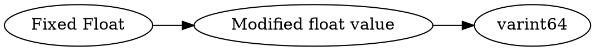

# <!-- md:samp Fixed Float -->

> 文档版本：r/20_u7 协议版本：662

<!-- md:samp Fixed Float -->类型。

## 结构

## 字段

/// define
Fixed Float

Modified float value：<!-- md:samp varint64 -->

- 类型：varint64。Float value multiplied by 32

///
