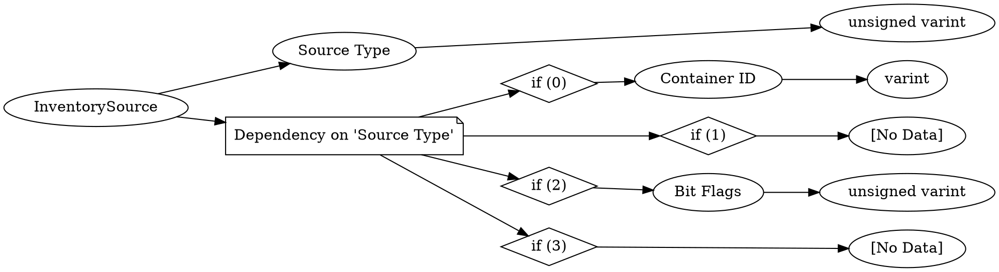

# <!-- md:samp InventorySource -->

> 文档版本：r/20_u7 协议版本：662

<!-- md:samp InventorySource -->类型。

## 结构

## 字段

/// define
InventorySource

Source Type：<!-- md:samp unsigned varint -->

- 类型：unsigned varint。enumeration: InventorySourceType

Dependency on 'Source Type'

//// tab | if (0)
///// define
if (0)

Container ID：<!-- md:samp varint -->

- 类型：varint。enumeration: ContainerID

/////

////

//// tab | if (1)
///// define
if (1)：<!-- md:samp [No Data] -->

- 类型：[No Data]。

/////

////

//// tab | if (2)
///// define
if (2)

Bit Flags：<!-- md:samp unsigned varint -->

- 类型：unsigned varint。enumeration: InventorySource::InventorySourceFlags

/////

////

//// tab | if (3)
///// define
if (3)：<!-- md:samp [No Data] -->

- 类型：[No Data]。

/////

////

///
