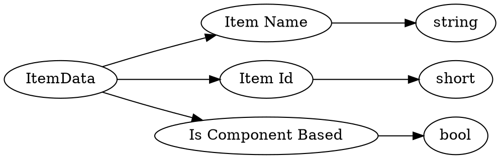

# <!-- md:samp ItemData -->

> 文档版本：r/20_u7 协议版本：662

<!-- md:samp ItemData -->类型。

## 结构

## 字段

/// define
ItemData

Item Name：<!-- md:samp string -->

- 类型：string。

Item Id：<!-- md:samp short -->

- 类型：short。Block 'id''s < 256 (can be negative); Item 'id''s > 257

Is Component Based：<!-- md:samp bool -->

- 类型：bool。

///
