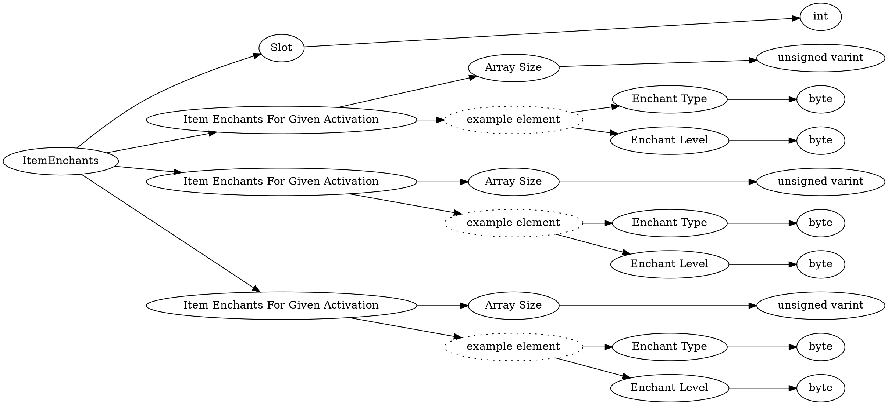

# <!-- md:samp ItemEnchants -->

> 文档版本：r/20_u7 协议版本：662

<!-- md:samp ItemEnchants -->类型。

## 结构

## 字段

/// define
ItemEnchants

Slot：<!-- md:samp int -->

- 类型：int。

Item Enchants For Given Activation

Item Enchants For Given Activation数组的大小：<!-- md:samp unsigned varint -->

- 类型：unsigned varint。

Item Enchants For Given Activation的示例元素

Enchant Type：<!-- md:samp byte -->

- 类型：byte。enumeration: Enchant::Type

Enchant Level：<!-- md:samp byte -->

- 类型：byte。

///
