# <!-- md:samp ItemInstanceUserData -->

> 文档版本：r/20_u7 协议版本：662

<!-- md:samp ItemInstanceUserData -->类型。

## 结构

```dot
digraph ItemInstanceUserData {
	graph [rankdir=LR];
	{
		graph [rank=max];
		2	[comment="name: \"short\", typeName: \"\", id: 2, branchId: 0, recurseId: -1, attributes: 512, notes: \"\"",
			label=short];
		4	[comment="name: \"byte\", typeName: \"\", id: 4, branchId: 0, recurseId: -1, attributes: 512, notes: \"\"",
			label=byte];
		6	[comment="name: \"CompoundTag\", typeName: \"\", id: 6, branchId: 0, recurseId: -1, attributes: 512, notes: \"\"",
			label=CompoundTag];
		9	[comment="name: \"unsigned int\", typeName: \"\", id: 9, branchId: 0, recurseId: -1, attributes: 512, notes: \"\"",
			label="unsigned int"];
		12	[comment="name: \"string\", typeName: \"\", id: 12, branchId: 0, recurseId: -1, attributes: 512, notes: \"\"",
			label=string];
		15	[comment="name: \"unsigned int\", typeName: \"\", id: 15, branchId: 0, recurseId: -1, attributes: 512, notes: \"\"",
			label="unsigned int"];
		18	[comment="name: \"string\", typeName: \"\", id: 18, branchId: 0, recurseId: -1, attributes: 512, notes: \"\"",
			label=string];
	}
	0	[comment="name: \"ItemInstanceUserData\", typeName: \"\", id: 0, branchId: 0, recurseId: -1, attributes: 0, notes: \"\"",
		label=ItemInstanceUserData];
	1	[comment="name: \"User Data Serialization Marker\", typeName: \"\", id: 1, branchId: 0, recurseId: -1, attributes: 0, notes: \"(-1) marking start \
of data\"",
		label="User Data Serialization Marker"];
	0 -> 1;
	3	[comment="name: \"User Data Serialization Version\", typeName: \"\", id: 3, branchId: 0, recurseId: -1, attributes: 0, notes: \"Currently 1\"",
		label="User Data Serialization Version"];
	0 -> 3;
	5	[comment="name: \"User Data Tag(s)\", typeName: \"CompoundTag\", id: 5, branchId: 0, recurseId: -1, attributes: 256, notes: \"See: @CompoundTag.html#\
Compound Tag@ .\"",
		label="User Data Tag(s)"];
	0 -> 5;
	7	[comment="name: \"Can Place On Blocks\", typeName: \"\", id: 7, branchId: 0, recurseId: -1, attributes: 8, notes: \"Blocks that this item can be \
placed on.\"",
		label="Can Place On Blocks"];
	0 -> 7;
	13	[comment="name: \"Can Destroy Blocks\", typeName: \"\", id: 13, branchId: 0, recurseId: -1, attributes: 8, notes: \"Blocks that this item can destroy.\"",
		label="Can Destroy Blocks"];
	0 -> 13;
	1 -> 2;
	3 -> 4;
	5 -> 6;
	8	[comment="name: \"Array Size\", typeName: \"\", id: 8, branchId: 0, recurseId: -1, attributes: 0, notes: \"\"",
		label="Array Size"];
	7 -> 8;
	10	[comment="name: \"example element\", typeName: \"\", id: 10, branchId: 0, recurseId: -1, attributes: 16, notes: \"\"",
		label="example element",
		style=dotted];
	7 -> 10;
	8 -> 9;
	11	[comment="name: \"Block Raw Name ID\", typeName: \"\", id: 11, branchId: 0, recurseId: -1, attributes: 0, notes: \"\"",
		label="Block Raw Name ID"];
	10 -> 11;
	11 -> 12;
	14	[comment="name: \"Array Size\", typeName: \"\", id: 14, branchId: 0, recurseId: -1, attributes: 0, notes: \"\"",
		label="Array Size"];
	13 -> 14;
	16	[comment="name: \"example element\", typeName: \"\", id: 16, branchId: 0, recurseId: -1, attributes: 16, notes: \"\"",
		label="example element",
		style=dotted];
	13 -> 16;
	14 -> 15;
	17	[comment="name: \"Block Raw Name ID\", typeName: \"\", id: 17, branchId: 0, recurseId: -1, attributes: 0, notes: \"\"",
		label="Block Raw Name ID"];
	16 -> 17;
	17 -> 18;
}

```

## 字段

/// define
ItemInstanceUserData

User Data Serialization Marker：<!-- md:samp short -->

- 类型：short。(-1) marking start of data

User Data Serialization Version：<!-- md:samp byte -->

- 类型：byte。Currently 1

User Data Tag(s)：[<!-- md:samp CompoundTag -->](refs/protocols/types/CompoundTag.md)

- 类型：CompoundTag。See: @CompoundTag.html#Compound Tag@ .

Can Place On Blocks

Can Place On Blocks数组的大小：<!-- md:samp unsigned int -->

- 类型：unsigned int。

Can Place On Blocks的示例元素

Block Raw Name ID：<!-- md:samp string -->

- 类型：string。

Can Destroy Blocks

Can Destroy Blocks数组的大小：<!-- md:samp unsigned int -->

- 类型：unsigned int。

Can Destroy Blocks的示例元素

///
