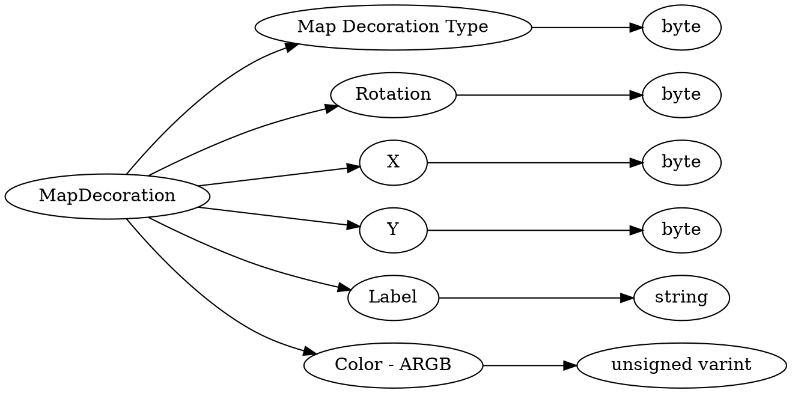

# <!-- md:samp MapDecoration -->

> 文档版本：r/20_u7 协议版本：662

<!-- md:samp MapDecoration -->类型。

## 结构

## 字段

/// define
MapDecoration

Map Decoration Type：<!-- md:samp byte -->

- 类型：byte。enumeration: MapDecoration::Type

Rotation：<!-- md:samp byte -->

- 类型：byte。

X：<!-- md:samp byte -->

- 类型：byte。

Y：<!-- md:samp byte -->

- 类型：byte。

Label：<!-- md:samp string -->

- 类型：string。

Color - ARGB：<!-- md:samp unsigned varint -->

- 类型：unsigned varint。

///
