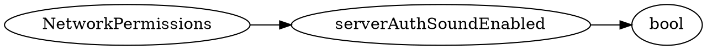

# <!-- md:samp NetworkPermissions -->

> 文档版本：r/20_u7 协议版本：662

<!-- md:samp NetworkPermissions -->类型。

## 结构

## 字段

/// define
NetworkPermissions

serverAuthSoundEnabled：<!-- md:samp bool -->

- 类型：bool。

///
