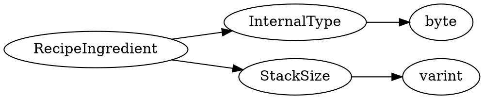

# <!-- md:samp RecipeIngredient -->

> 文档版本：r/20_u7 协议版本：662

<!-- md:samp RecipeIngredient -->类型。

## 结构

## 字段

/// define
RecipeIngredient

InternalType：<!-- md:samp byte -->

- 类型：byte。enumeration: ItemDescriptor::InternalType

StackSize：<!-- md:samp varint -->

- 类型：varint。

///
