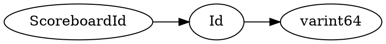

# <!-- md:samp ScoreboardId -->

> 文档版本：r/20_u7 协议版本：662

<!-- md:samp ScoreboardId -->类型。

## 结构

```dot
digraph ScoreboardId {
	graph [rankdir=LR];
	{
		graph [rank=max];
		10	[comment="name: \"varint64\", typeName: \"\", id: 10, branchId: 0, recurseId: -1, attributes: 512, notes: \"\"",
			label=varint64];
	}
	8	[comment="name: \"ScoreboardId\", typeName: \"\", id: 8, branchId: 0, recurseId: -1, attributes: 0, notes: \"\"",
		label=ScoreboardId];
	9	[comment="name: \"Id\", typeName: \"\", id: 9, branchId: 0, recurseId: -1, attributes: 0, notes: \"\"",
		label=Id];
	8 -> 9;
	9 -> 10;
}

```

## 字段

/// define
ScoreboardId

Id：<!-- md:samp varint64 -->

- 类型：varint64。

///
