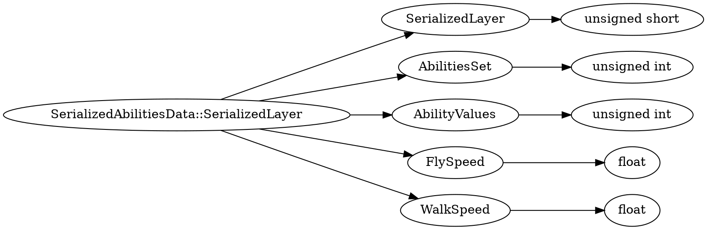

# <!-- md:samp SerializedAbilitiesData::SerializedLayer -->

> 文档版本：r/20_u7 协议版本：662

<!-- md:samp SerializedAbilitiesData::SerializedLayer -->类型。

## 结构

## 字段

/// define
SerializedAbilitiesData::SerializedLayer

SerializedLayer：<!-- md:samp unsigned short -->

- 类型：unsigned short。enumeration: SerializedAbilitiesData::SerializedAbilitiesLayer

AbilitiesSet：<!-- md:samp unsigned int -->

- 类型：unsigned int。

AbilityValues：<!-- md:samp unsigned int -->

- 类型：unsigned int。

FlySpeed：<!-- md:samp float -->

- 类型：float。

WalkSpeed：<!-- md:samp float -->

- 类型：float。

///
