# <!-- md:samp SerializedSkin -->

> 文档版本：r/20_u7 协议版本：662

<!-- md:samp SerializedSkin -->类型。

## 结构

```dot
digraph SerializedSkin {
	graph [rankdir=LR];
	{
		graph [rank=max];
		24	[comment="name: \"string\", typeName: \"\", id: 24, branchId: 0, recurseId: -1, attributes: 512, notes: \"\"",
			label=string];
		26	[comment="name: \"string\", typeName: \"\", id: 26, branchId: 0, recurseId: -1, attributes: 512, notes: \"\"",
			label=string];
		28	[comment="name: \"string\", typeName: \"\", id: 28, branchId: 0, recurseId: -1, attributes: 512, notes: \"\"",
			label=string];
		30	[comment="name: \"unsigned int\", typeName: \"\", id: 30, branchId: 0, recurseId: -1, attributes: 512, notes: \"\"",
			label="unsigned int"];
		32	[comment="name: \"unsigned int\", typeName: \"\", id: 32, branchId: 0, recurseId: -1, attributes: 512, notes: \"\"",
			label="unsigned int"];
		34	[comment="name: \"string\", typeName: \"\", id: 34, branchId: 0, recurseId: -1, attributes: 512, notes: \"\"",
			label=string];
		37	[comment="name: \"unsigned int\", typeName: \"\", id: 37, branchId: 0, recurseId: -1, attributes: 512, notes: \"\"",
			label="unsigned int"];
		40	[comment="name: \"unsigned int\", typeName: \"\", id: 40, branchId: 0, recurseId: -1, attributes: 512, notes: \"\"",
			label="unsigned int"];
		42	[comment="name: \"unsigned int\", typeName: \"\", id: 42, branchId: 0, recurseId: -1, attributes: 512, notes: \"\"",
			label="unsigned int"];
		44	[comment="name: \"string\", typeName: \"\", id: 44, branchId: 0, recurseId: -1, attributes: 512, notes: \"\"",
			label=string];
		46	[comment="name: \"unsigned int\", typeName: \"\", id: 46, branchId: 0, recurseId: -1, attributes: 512, notes: \"\"",
			label="unsigned int"];
		48	[comment="name: \"float\", typeName: \"\", id: 48, branchId: 0, recurseId: -1, attributes: 512, notes: \"\"",
			label=float];
		50	[comment="name: \"unsigned int\", typeName: \"\", id: 50, branchId: 0, recurseId: -1, attributes: 512, notes: \"\"",
			label="unsigned int"];
		52	[comment="name: \"unsigned int\", typeName: \"\", id: 52, branchId: 0, recurseId: -1, attributes: 512, notes: \"\"",
			label="unsigned int"];
		54	[comment="name: \"unsigned int\", typeName: \"\", id: 54, branchId: 0, recurseId: -1, attributes: 512, notes: \"\"",
			label="unsigned int"];
		56	[comment="name: \"string\", typeName: \"\", id: 56, branchId: 0, recurseId: -1, attributes: 512, notes: \"\"",
			label=string];
		58	[comment="name: \"string\", typeName: \"\", id: 58, branchId: 0, recurseId: -1, attributes: 512, notes: \"\"",
			label=string];
		60	[comment="name: \"string\", typeName: \"\", id: 60, branchId: 0, recurseId: -1, attributes: 512, notes: \"\"",
			label=string];
		62	[comment="name: \"string\", typeName: \"\", id: 62, branchId: 0, recurseId: -1, attributes: 512, notes: \"\"",
			label=string];
		64	[comment="name: \"string\", typeName: \"\", id: 64, branchId: 0, recurseId: -1, attributes: 512, notes: \"\"",
			label=string];
		66	[comment="name: \"string\", typeName: \"\", id: 66, branchId: 0, recurseId: -1, attributes: 512, notes: \"\"",
			label=string];
		68	[comment="name: \"string\", typeName: \"\", id: 68, branchId: 0, recurseId: -1, attributes: 512, notes: \"\"",
			label=string];
		70	[comment="name: \"string\", typeName: \"\", id: 70, branchId: 0, recurseId: -1, attributes: 512, notes: \"\"",
			label=string];
		73	[comment="name: \"unsigned int\", typeName: \"\", id: 73, branchId: 0, recurseId: -1, attributes: 512, notes: \"\"",
			label="unsigned int"];
		76	[comment="name: \"string\", typeName: \"\", id: 76, branchId: 0, recurseId: -1, attributes: 512, notes: \"\"",
			label=string];
		78	[comment="name: \"string\", typeName: \"\", id: 78, branchId: 0, recurseId: -1, attributes: 512, notes: \"\"",
			label=string];
		80	[comment="name: \"string\", typeName: \"\", id: 80, branchId: 0, recurseId: -1, attributes: 512, notes: \"\"",
			label=string];
		82	[comment="name: \"bool\", typeName: \"\", id: 82, branchId: 0, recurseId: -1, attributes: 512, notes: \"\"",
			label=bool];
		84	[comment="name: \"string\", typeName: \"\", id: 84, branchId: 0, recurseId: -1, attributes: 512, notes: \"\"",
			label=string];
		87	[comment="name: \"unsigned int\", typeName: \"\", id: 87, branchId: 0, recurseId: -1, attributes: 512, notes: \"\"",
			label="unsigned int"];
		90	[comment="name: \"string\", typeName: \"\", id: 90, branchId: 0, recurseId: -1, attributes: 512, notes: \"\"",
			label=string];
		93	[comment="name: \"unsigned int\", typeName: \"\", id: 93, branchId: 0, recurseId: -1, attributes: 512, notes: \"\"",
			label="unsigned int"];
		96	[comment="name: \"string\", typeName: \"\", id: 96, branchId: 0, recurseId: -1, attributes: 512, notes: \"\"",
			label=string];
		98	[comment="name: \"string\", typeName: \"\", id: 98, branchId: 0, recurseId: -1, attributes: 512, notes: \"\"",
			label=string];
		100	[comment="name: \"string\", typeName: \"\", id: 100, branchId: 0, recurseId: -1, attributes: 512, notes: \"\"",
			label=string];
		102	[comment="name: \"string\", typeName: \"\", id: 102, branchId: 0, recurseId: -1, attributes: 512, notes: \"\"",
			label=string];
		104	[comment="name: \"bool\", typeName: \"\", id: 104, branchId: 0, recurseId: -1, attributes: 512, notes: \"\"",
			label=bool];
		106	[comment="name: \"bool\", typeName: \"\", id: 106, branchId: 0, recurseId: -1, attributes: 512, notes: \"\"",
			label=bool];
		108	[comment="name: \"bool\", typeName: \"\", id: 108, branchId: 0, recurseId: -1, attributes: 512, notes: \"\"",
			label=bool];
		110	[comment="name: \"bool\", typeName: \"\", id: 110, branchId: 0, recurseId: -1, attributes: 512, notes: \"\"",
			label=bool];
		112	[comment="name: \"bool\", typeName: \"\", id: 112, branchId: 0, recurseId: -1, attributes: 512, notes: \"\"",
			label=bool];
	}
	22	[comment="name: \"SerializedSkin\", typeName: \"\", id: 22, branchId: 0, recurseId: -1, attributes: 0, notes: \"\"",
		label=SerializedSkin];
	23	[comment="name: \"Skin Id\", typeName: \"\", id: 23, branchId: 0, recurseId: -1, attributes: 0, notes: \"\"",
		label="Skin Id"];
	22 -> 23;
	25	[comment="name: \"PlayFab Id\", typeName: \"\", id: 25, branchId: 0, recurseId: -1, attributes: 0, notes: \"\"",
		label="PlayFab Id"];
	22 -> 25;
	27	[comment="name: \"Skin Resource Patch\", typeName: \"\", id: 27, branchId: 0, recurseId: -1, attributes: 0, notes: \"Represents a json blob that \
contains information about geometry, animations, animation controllers, and attachables, that can be applied to a skin when deserializing.\"",
		label="Skin Resource Patch"];
	22 -> 27;
	29	[comment="name: \"Skin Image Width\", typeName: \"\", id: 29, branchId: 0, recurseId: -1, attributes: 0, notes: \"\"",
		label="Skin Image Width"];
	22 -> 29;
	31	[comment="name: \"Skin Image Height\", typeName: \"\", id: 31, branchId: 0, recurseId: -1, attributes: 0, notes: \"\"",
		label="Skin Image Height"];
	22 -> 31;
	33	[comment="name: \"Skin Image Image Bytes\", typeName: \"\", id: 33, branchId: 0, recurseId: -1, attributes: 0, notes: \"Serialized into a string\"",
		label="Skin Image Image Bytes"];
	22 -> 33;
	35	[comment="name: \"Animations\", typeName: \"\", id: 35, branchId: 0, recurseId: -1, attributes: 8, notes: \"\"",
		label=Animations];
	22 -> 35;
	51	[comment="name: \"CapeImage Width\", typeName: \"\", id: 51, branchId: 0, recurseId: -1, attributes: 0, notes: \"\"",
		label="CapeImage Width"];
	22 -> 51;
	53	[comment="name: \"CapeImage Height\", typeName: \"\", id: 53, branchId: 0, recurseId: -1, attributes: 0, notes: \"\"",
		label="CapeImage Height"];
	22 -> 53;
	55	[comment="name: \"CapeImage ImageBytes\", typeName: \"\", id: 55, branchId: 0, recurseId: -1, attributes: 0, notes: \"\"",
		label="CapeImage ImageBytes"];
	22 -> 55;
	57	[comment="name: \"GeometryData\", typeName: \"\", id: 57, branchId: 0, recurseId: -1, attributes: 0, notes: \"\"",
		label=GeometryData];
	22 -> 57;
	59	[comment="name: \"Geometry Data Engine Version\", typeName: \"\", id: 59, branchId: 0, recurseId: -1, attributes: 0, notes: \"Semantic version\"",
		label="Geometry Data Engine Version"];
	22 -> 59;
	61	[comment="name: \"AnimationData\", typeName: \"\", id: 61, branchId: 0, recurseId: -1, attributes: 0, notes: \"\"",
		label=AnimationData];
	22 -> 61;
	63	[comment="name: \"Cape Id\", typeName: \"\", id: 63, branchId: 0, recurseId: -1, attributes: 0, notes: \"\"",
		label="Cape Id"];
	22 -> 63;
	65	[comment="name: \"Full Id\", typeName: \"\", id: 65, branchId: 0, recurseId: -1, attributes: 0, notes: \"Uniquely identifies a Skin for a player. \
Skin Pack ID + Skin Id are no longer sufficient, as different players may have the same Classic Skin but different Capes on each \
of them.\"",
		label="Full Id"];
	22 -> 65;
	67	[comment="name: \"Arm Size\", typeName: \"\", id: 67, branchId: 0, recurseId: -1, attributes: 0, notes: \"\"",
		label="Arm Size"];
	22 -> 67;
	69	[comment="name: \"Skin color\", typeName: \"\", id: 69, branchId: 0, recurseId: -1, attributes: 0, notes: \"to hex string\"",
		label="Skin color"];
	22 -> 69;
	71	[comment="name: \"Persona Pieces\", typeName: \"\", id: 71, branchId: 0, recurseId: -1, attributes: 8, notes: \"\"",
		label="Persona Pieces"];
	22 -> 71;
	85	[comment="name: \"Piece Tint Colors\", typeName: \"\", id: 85, branchId: 0, recurseId: -1, attributes: 8, notes: \"\"",
		label="Piece Tint Colors"];
	22 -> 85;
	103	[comment="name: \"Is Premium Skin\", typeName: \"\", id: 103, branchId: 0, recurseId: -1, attributes: 0, notes: \"\"",
		label="Is Premium Skin"];
	22 -> 103;
	105	[comment="name: \"Is Persona Skin\", typeName: \"\", id: 105, branchId: 0, recurseId: -1, attributes: 0, notes: \"Whether a skin is a Classic Skin \
or Persona Skin\"",
		label="Is Persona Skin"];
	22 -> 105;
	107	[comment="name: \"Is Persona Cape On Classic Skin\", typeName: \"\", id: 107, branchId: 0, recurseId: -1, attributes: 0, notes: \"True if this \
a classic skin that has a Persona Cape equipped on it, false otherwise.\"",
		label="Is Persona Cape On Classic Skin"];
	22 -> 107;
	109	[comment="name: \"Is Primary User\", typeName: \"\", id: 109, branchId: 0, recurseId: -1, attributes: 0, notes: \"\"",
		label="Is Primary User"];
	22 -> 109;
	111	[comment="name: \"mOverridesPlayerAppearance\", typeName: \"\", id: 111, branchId: 0, recurseId: -1, attributes: 0, notes: \"\"",
		label=mOverridesPlayerAppearance];
	22 -> 111;
	23 -> 24;
	25 -> 26;
	27 -> 28;
	29 -> 30;
	31 -> 32;
	33 -> 34;
	36	[comment="name: \"Skin Animated Images Size\", typeName: \"\", id: 36, branchId: 0, recurseId: -1, attributes: 0, notes: \"Animation count\"",
		label="Skin Animated Images Size"];
	35 -> 36;
	38	[comment="name: \"example element\", typeName: \"\", id: 38, branchId: 0, recurseId: -1, attributes: 16, notes: \"\"",
		label="example element",
		style=dotted];
	35 -> 38;
	36 -> 37;
	39	[comment="name: \"Image Width\", typeName: \"\", id: 39, branchId: 0, recurseId: -1, attributes: 0, notes: \"\"",
		label="Image Width"];
	38 -> 39;
	41	[comment="name: \"Image Height\", typeName: \"\", id: 41, branchId: 0, recurseId: -1, attributes: 0, notes: \"\"",
		label="Image Height"];
	38 -> 41;
	43	[comment="name: \"Image Bytes\", typeName: \"\", id: 43, branchId: 0, recurseId: -1, attributes: 0, notes: \"Serialized into a string\"",
		label="Image Bytes"];
	38 -> 43;
	45	[comment="name: \"Animation Type\", typeName: \"\", id: 45, branchId: 0, recurseId: -1, attributes: 0, notes: \"enumeration: persona::AnimatedTextureType\"",
		label="Animation Type"];
	38 -> 45;
	47	[comment="name: \"Frame Count\", typeName: \"\", id: 47, branchId: 0, recurseId: -1, attributes: 0, notes: \"\"",
		label="Frame Count"];
	38 -> 47;
	49	[comment="name: \"Animation Expression\", typeName: \"\", id: 49, branchId: 0, recurseId: -1, attributes: 0, notes: \"enumeration: persona::AnimationExpression\"",
		label="Animation Expression"];
	38 -> 49;
	39 -> 40;
	41 -> 42;
	43 -> 44;
	45 -> 46;
	47 -> 48;
	49 -> 50;
	51 -> 52;
	53 -> 54;
	55 -> 56;
	57 -> 58;
	59 -> 60;
	61 -> 62;
	63 -> 64;
	65 -> 66;
	67 -> 68;
	69 -> 70;
	72	[comment="name: \"Persona pieces size\", typeName: \"\", id: 72, branchId: 0, recurseId: -1, attributes: 0, notes: \"\"",
		label="Persona pieces size"];
	71 -> 72;
	74	[comment="name: \"example element\", typeName: \"\", id: 74, branchId: 0, recurseId: -1, attributes: 16, notes: \"\"",
		label="example element",
		style=dotted];
	71 -> 74;
	72 -> 73;
	75	[comment="name: \"Piece Id\", typeName: \"\", id: 75, branchId: 0, recurseId: -1, attributes: 0, notes: \"\"",
		label="Piece Id"];
	74 -> 75;
	77	[comment="name: \"Piece Type\", typeName: \"\", id: 77, branchId: 0, recurseId: -1, attributes: 0, notes: \"\"",
		label="Piece Type"];
	74 -> 77;
	79	[comment="name: \"Pack Id\", typeName: \"\", id: 79, branchId: 0, recurseId: -1, attributes: 0, notes: \"\"",
		label="Pack Id"];
	74 -> 79;
	81	[comment="name: \"Is Default Piece\", typeName: \"\", id: 81, branchId: 0, recurseId: -1, attributes: 0, notes: \"\"",
		label="Is Default Piece"];
	74 -> 81;
	83	[comment="name: \"Product Id\", typeName: \"\", id: 83, branchId: 0, recurseId: -1, attributes: 0, notes: \"\"",
		label="Product Id"];
	74 -> 83;
	75 -> 76;
	77 -> 78;
	79 -> 80;
	81 -> 82;
	83 -> 84;
	86	[comment="name: \"Tint Colors Size\", typeName: \"\", id: 86, branchId: 0, recurseId: -1, attributes: 0, notes: \"\"",
		label="Tint Colors Size"];
	85 -> 86;
	88	[comment="name: \"example element\", typeName: \"\", id: 88, branchId: 0, recurseId: -1, attributes: 16, notes: \"\"",
		label="example element",
		style=dotted];
	85 -> 88;
	86 -> 87;
	89	[comment="name: \"Piece Type\", typeName: \"\", id: 89, branchId: 0, recurseId: -1, attributes: 0, notes: \"\"",
		label="Piece Type"];
	88 -> 89;
	91	[comment="name: \"Piece Tint Colors\", typeName: \"\", id: 91, branchId: 0, recurseId: -1, attributes: 8, notes: \"\"",
		label="Piece Tint Colors"];
	88 -> 91;
	89 -> 90;
	92	[comment="name: \"Piece Type Tint Colors Size\", typeName: \"\", id: 92, branchId: 0, recurseId: -1, attributes: 0, notes: \"\"",
		label="Piece Type Tint Colors Size"];
	91 -> 92;
	94	[comment="name: \"example element\", typeName: \"\", id: 94, branchId: 0, recurseId: -1, attributes: 16, notes: \"\"",
		label="example element",
		style=dotted];
	91 -> 94;
	92 -> 93;
	95	[comment="name: \"Tint Color\", typeName: \"\", id: 95, branchId: 0, recurseId: -1, attributes: 0, notes: \"To hex string\"",
		label="Tint Color"];
	94 -> 95;
	97	[comment="name: \"Tint Color\", typeName: \"\", id: 97, branchId: 0, recurseId: -1, attributes: 0, notes: \"To hex string\"",
		label="Tint Color"];
	94 -> 97;
	99	[comment="name: \"Tint Color\", typeName: \"\", id: 99, branchId: 0, recurseId: -1, attributes: 0, notes: \"To hex string\"",
		label="Tint Color"];
	94 -> 99;
	101	[comment="name: \"Tint Color\", typeName: \"\", id: 101, branchId: 0, recurseId: -1, attributes: 0, notes: \"To hex string\"",
		label="Tint Color"];
	94 -> 101;
	95 -> 96;
	97 -> 98;
	99 -> 100;
	101 -> 102;
	103 -> 104;
	105 -> 106;
	107 -> 108;
	109 -> 110;
	111 -> 112;
}

```

## 字段

/// define
SerializedSkin

Skin Id：<!-- md:samp string -->

- 类型：string。

PlayFab Id：<!-- md:samp string -->

- 类型：string。

Skin Resource Patch：<!-- md:samp string -->

- 类型：string。Represents a json blob that contains information about geometry, animations, animation controllers, and attachables, that can be applied to a skin when deserializing.

Skin Image Width：<!-- md:samp unsigned int -->

- 类型：unsigned int。

Skin Image Height：<!-- md:samp unsigned int -->

- 类型：unsigned int。

Skin Image Image Bytes：<!-- md:samp string -->

- 类型：string。Serialized into a string

Animations

Skin Animated Images Size：<!-- md:samp unsigned int -->

- 类型：unsigned int。Animation count

Animations的示例元素

Image Width：<!-- md:samp unsigned int -->

- 类型：unsigned int。

Image Height：<!-- md:samp unsigned int -->

- 类型：unsigned int。

Image Bytes：<!-- md:samp string -->

- 类型：string。Serialized into a string

Animation Type：<!-- md:samp unsigned int -->

- 类型：unsigned int。enumeration: persona::AnimatedTextureType

Frame Count：<!-- md:samp float -->

- 类型：float。

Animation Expression：<!-- md:samp unsigned int -->

- 类型：unsigned int。enumeration: persona::AnimationExpression

CapeImage Width：<!-- md:samp unsigned int -->

- 类型：unsigned int。

CapeImage Height：<!-- md:samp unsigned int -->

- 类型：unsigned int。

CapeImage ImageBytes：<!-- md:samp string -->

- 类型：string。

GeometryData：<!-- md:samp string -->

- 类型：string。

Geometry Data Engine Version：<!-- md:samp string -->

- 类型：string。Semantic version

AnimationData：<!-- md:samp string -->

- 类型：string。

Cape Id：<!-- md:samp string -->

- 类型：string。

Full Id：<!-- md:samp string -->

- 类型：string。Uniquely 'id'entifies a Skin for a player. Skin Pack ID + Skin Id are no longer sufficient, as different players may have the same Classic Skin but different Capes on each of them.

Arm Size：<!-- md:samp string -->

- 类型：string。

Skin color：<!-- md:samp string -->

- 类型：string。to hex string

Persona Pieces

Persona pieces size：<!-- md:samp unsigned int -->

- 类型：unsigned int。

Persona Pieces的示例元素

Piece Id：<!-- md:samp string -->

- 类型：string。

Piece Type：<!-- md:samp string -->

- 类型：string。

Pack Id：<!-- md:samp string -->

- 类型：string。

Is Default Piece：<!-- md:samp bool -->

- 类型：bool。

Product Id：<!-- md:samp string -->

- 类型：string。

Piece Tint Colors

Tint Colors Size：<!-- md:samp unsigned int -->

- 类型：unsigned int。

Piece Tint Colors的示例元素

Piece Type Tint Colors Size：<!-- md:samp unsigned int -->

- 类型：unsigned int。

Tint Color：<!-- md:samp string -->

- 类型：string。To hex string

Is Premium Skin：<!-- md:samp bool -->

- 类型：bool。

Is Persona Skin：<!-- md:samp bool -->

- 类型：bool。Whether a skin is a Classic Skin or Persona Skin

Is Persona Cape On Classic Skin：<!-- md:samp bool -->

- 类型：bool。True if this a classic skin that has a Persona Cape equipped on it, false otherwise.

Is Primary User：<!-- md:samp bool -->

- 类型：bool。

mOverridesPlayerAppearance：<!-- md:samp bool -->

- 类型：bool。

///
