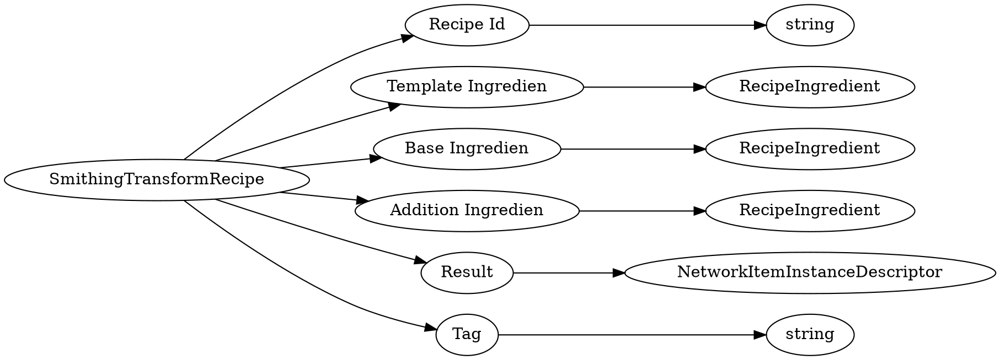

# <!-- md:samp SmithingTransformRecipe -->

> 文档版本：r/20_u7 协议版本：662

<!-- md:samp SmithingTransformRecipe -->类型。

## 结构

## 字段

/// define
SmithingTransformRecipe

Recipe Id：<!-- md:samp string -->

- 类型：string。

Template Ingredien：[<!-- md:samp RecipeIngredient -->](refs/protocols/types/RecipeIngredient.md)

- 类型：RecipeIngredient。

Base Ingredien：[<!-- md:samp RecipeIngredient -->](refs/protocols/types/RecipeIngredient.md)

- 类型：RecipeIngredient。

Addition Ingredien：[<!-- md:samp RecipeIngredient -->](refs/protocols/types/RecipeIngredient.md)

- 类型：RecipeIngredient。

Result：[<!-- md:samp NetworkItemInstanceDescriptor -->](refs/protocols/types/NetworkItemInstanceDescriptor.md)

- 类型：NetworkItemInstanceDescriptor。

Tag：<!-- md:samp string -->

- 类型：string。

///
