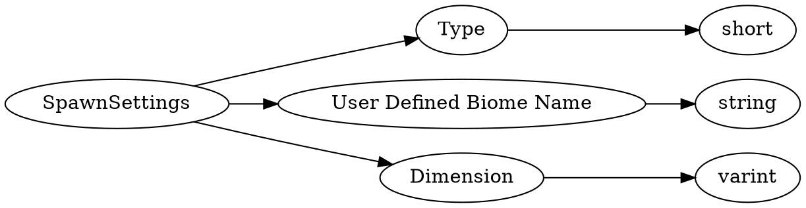

# <!-- md:samp SpawnSettings -->

> 文档版本：r/20_u7 协议版本：662

<!-- md:samp SpawnSettings -->类型。

## 结构

## 字段

/// define
SpawnSettings

Type：<!-- md:samp short -->

- 类型：short。enumeration: SpawnBiomeType

User Defined Biome Name：<!-- md:samp string -->

- 类型：string。

Dimension：<!-- md:samp varint -->

- 类型：varint。Currently 0 for Overworld, 1 for Nether, 2 for The End, 3 Undefined

///
