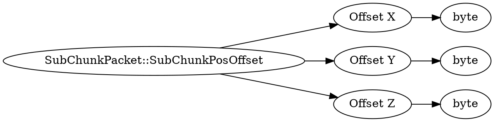

# <!-- md:samp SubChunkPacket::SubChunkPosOffset -->

> 文档版本：r/20_u7 协议版本：662

<!-- md:samp SubChunkPacket::SubChunkPosOffset -->类型。

## 结构

## 字段

/// define
SubChunkPacket::SubChunkPosOffset

Offset X：<!-- md:samp byte -->

- 类型：byte。

Offset Y：<!-- md:samp byte -->

- 类型：byte。

Offset Z：<!-- md:samp byte -->

- 类型：byte。

///
