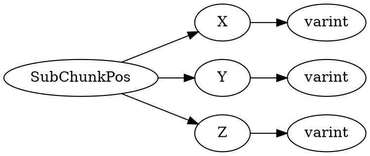

# <!-- md:samp SubChunkPos -->

> 文档版本：r/20_u7 协议版本：662

<!-- md:samp SubChunkPos -->类型。

## 结构

## 字段

/// define
SubChunkPos

X：<!-- md:samp varint -->

- 类型：varint。

Y：<!-- md:samp varint -->

- 类型：varint。

Z：<!-- md:samp varint -->

- 类型：varint。

///
