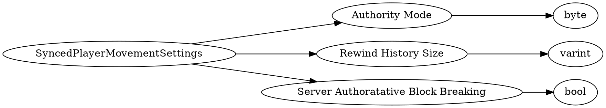

# <!-- md:samp SyncedPlayerMovementSettings -->

> 文档版本：r/20_u7 协议版本：662

<!-- md:samp SyncedPlayerMovementSettings -->类型。

## 结构

## 字段

/// define
SyncedPlayerMovementSettings

Authority Mode：<!-- md:samp byte -->

- 类型：byte。enumeration: ServerAuthMovementMode

Rewind History Size：<!-- md:samp varint -->

- 类型：varint。

Server Authoratative Block Breaking：<!-- md:samp bool -->

- 类型：bool。

///
