# <!-- md:samp TypedClientNetId<struct ItemStackRequestIdTag,int,0> -->

> 文档版本：r/20_u7 协议版本：662

<!-- md:samp TypedClientNetId<struct ItemStackRequestIdTag,int,0> -->类型。

## 结构

```dot
digraph "TypedClientNetId<struct ItemStackRequestIdTag,int,0>" {
	graph [rankdir=LR];
	{
		graph [rank=max];
		84	[comment="name: \"varint\", typeName: \"\", id: 84, branchId: 0, recurseId: -1, attributes: 512, notes: \"\"",
			label=varint];
	}
	82	[comment="name: \"TypedClientNetId<struct ItemStackRequestIdTag,int,0>\", typeName: \"\", id: 82, branchId: 0, recurseId: -1, attributes: 0, notes: \"\"",
		label="TypedClientNetId<struct ItemStackRequestIdTag,int,0>"];
	83	[comment="name: \"Raw Id (32 bit signed)\", typeName: \"\", id: 83, branchId: 0, recurseId: -1, attributes: 0, notes: \"\"",
		label="Raw Id (32 bit signed)"];
	82 -> 83;
	83 -> 84;
}

```

## 字段

/// define
TypedClientNetId<struct ItemStackRequestIdTag,int,0>

Raw Id (32 bit signed)：<!-- md:samp varint -->

- 类型：varint。

///
