# <!-- md:samp TypedServerNetId<struct CreativeItemNetIdTag,unsigned int,0> -->

> 文档版本：r/20_u7 协议版本：662

<!-- md:samp TypedServerNetId<struct CreativeItemNetIdTag,unsigned int,0> -->类型。

## 结构

```dot
digraph "TypedServerNetId<struct CreativeItemNetIdTag,unsigned int,0>" {
	graph [rankdir=LR];
	{
		graph [rank=max];
		8	[comment="name: \"unsigned varint\", typeName: \"\", id: 8, branchId: 0, recurseId: -1, attributes: 512, notes: \"\"",
			label="unsigned varint"];
	}
	6	[comment="name: \"TypedServerNetId<struct CreativeItemNetIdTag,unsigned int,0>\", typeName: \"\", id: 6, branchId: 0, recurseId: -1, attributes: \
0, notes: \"\"",
		label="TypedServerNetId<struct CreativeItemNetIdTag,unsigned int,0>"];
	7	[comment="name: \"Raw Id (32 bit unsigned)\", typeName: \"\", id: 7, branchId: 0, recurseId: -1, attributes: 0, notes: \"\"",
		label="Raw Id (32 bit unsigned)"];
	6 -> 7;
	7 -> 8;
}

```

## 字段

/// define
TypedServerNetId<struct CreativeItemNetIdTag,unsigned int,0>

Raw Id (32 bit unsigned)：<!-- md:samp unsigned varint -->

- 类型：unsigned varint。

///
