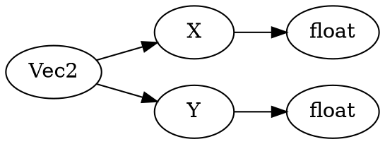

# <!-- md:samp Vec2 -->

> 文档版本：r/20_u7 协议版本：662

<!-- md:samp Vec2 -->类型。

## 结构

```dot
digraph Vec2 {
	graph [rankdir=LR];
	{
		graph [rank=max];
		18	[comment="name: \"float\", typeName: \"\", id: 18, branchId: 0, recurseId: -1, attributes: 512, notes: \"\"",
			label=float];
		20	[comment="name: \"float\", typeName: \"\", id: 20, branchId: 0, recurseId: -1, attributes: 512, notes: \"\"",
			label=float];
	}
	16	[comment="name: \"Vec2\", typeName: \"\", id: 16, branchId: 0, recurseId: -1, attributes: 0, notes: \"\"",
		label=Vec2];
	17	[comment="name: \"X\", typeName: \"\", id: 17, branchId: 0, recurseId: -1, attributes: 0, notes: \"\"",
		label=X];
	16 -> 17;
	19	[comment="name: \"Y\", typeName: \"\", id: 19, branchId: 0, recurseId: -1, attributes: 0, notes: \"\"",
		label=Y];
	16 -> 19;
	17 -> 18;
	19 -> 20;
}

```

## 字段

/// define
Vec2

X：<!-- md:samp float -->

- 类型：float。

Y：<!-- md:samp float -->

- 类型：float。

///
