# <!-- md:samp std::optional<struct CameraInstruction::FadeInstruction> -->

> 文档版本：r/20_u7 协议版本：662

<!-- md:samp std::optional<struct CameraInstruction::FadeInstruction> -->类型。

## 结构

```dot
digraph "std::optional<struct CameraInstruction::FadeInstruction>" {
	graph [rankdir=LR];
	{
		graph [rank=max];
		13	[comment="name: \"bool\", typeName: \"\", id: 13, branchId: 0, recurseId: -1, attributes: 512, notes: \"\"",
			label=bool];
	}
	11	[comment="name: \"std::optional<struct CameraInstruction::FadeInstruction>\", typeName: \"\", id: 11, branchId: 0, recurseId: -1, attributes: \
0, notes: \"\"",
		label="std::optional<struct CameraInstruction::FadeInstruction>"];
	12	[comment="name: \"Has Value\", typeName: \"\", id: 12, branchId: 0, recurseId: -1, attributes: 0, notes: \"If true, follow with appropriate data \
type, otherwise nothing\"",
		label="Has Value"];
	11 -> 12;
	12 -> 13;
}

```

## 字段

/// define
std::optional<struct CameraInstruction::FadeInstruction>

Has Value：<!-- md:samp bool -->

- 类型：bool。If true, follow with appropriate data type, otherwise nothing

///
