# <!-- md:samp std::optional<struct ExternalLinkSettings> -->

> 文档版本：r/20_u7 协议版本：662

<!-- md:samp std::optional<struct ExternalLinkSettings> -->类型。

## 结构

```dot
digraph "std::optional<struct ExternalLinkSettings>" {
	graph [rankdir=LR];
	{
		graph [rank=max];
		30	[comment="name: \"bool\", typeName: \"\", id: 30, branchId: 0, recurseId: -1, attributes: 512, notes: \"\"",
			label=bool];
	}
	28	[comment="name: \"std::optional<struct ExternalLinkSettings>\", typeName: \"\", id: 28, branchId: 0, recurseId: -1, attributes: 0, notes: \"\"",
		label="std::optional<struct ExternalLinkSettings>"];
	29	[comment="name: \"Has Value\", typeName: \"\", id: 29, branchId: 0, recurseId: -1, attributes: 0, notes: \"If true, follow with appropriate data \
type, otherwise nothing\"",
		label="Has Value"];
	28 -> 29;
	29 -> 30;
}

```

## 字段

/// define
std::optional<struct ExternalLinkSettings>

Has Value：<!-- md:samp bool -->

- 类型：bool。If true, follow with appropriate data type, otherwise nothing

///
