# <!-- md:samp SubClientConnectionRequest -->

> 文档版本：r/20_u7 协议版本：662

<!-- md:samp SubClientConnectionRequest -->类型。

## 结构

```dot
digraph SubClientConnectionRequest {
	graph [rankdir=LR];
	{
		graph [rank=max];
		3	[comment="name: \"int\", typeName: \"\", id: 3, branchId: 0, recurseId: -1, attributes: 512, notes: \"\"",
			label=int];
		6	[comment="name: \"byte\", typeName: \"\", id: 6, branchId: 0, recurseId: -1, attributes: 512, notes: \"\"",
			label=byte];
		9	[comment="name: \"int\", typeName: \"\", id: 9, branchId: 0, recurseId: -1, attributes: 512, notes: \"\"",
			label=int];
		12	[comment="name: \"byte\", typeName: \"\", id: 12, branchId: 0, recurseId: -1, attributes: 512, notes: \"\"",
			label=byte];
	}
	0	[comment="name: \"SubClientConnectionRequest\", typeName: \"\", id: 0, branchId: 0, recurseId: -1, attributes: 0, notes: \"\"",
		label=SubClientConnectionRequest];
	1	[comment="name: \"Certificate Chain (JSON)\", typeName: \"\", id: 1, branchId: 0, recurseId: -1, attributes: 8, notes: \"Array of Base64 encoded \
JSON Web Token certificates to authenticate the player.The last certificate in the chain will have a property 'extraData' that contains \
player identity information including the XBL XUID (if the player was signed into XBL at the time of the connection).\"",
		label="Certificate Chain (JSON)"];
	0 -> 1;
	7	[comment="name: \"Raw Token\", typeName: \"\", id: 7, branchId: 0, recurseId: -1, attributes: 8, notes: \"Base64 encoded JSON Web Token that contains \
other relevant client properties. 			Properties Include: 			'SelfSignedId' 			'ClientRandomId' 			'PlatformUserId' 			'SkinId' 			'\
SkinData' 			'SkinImageWidth' 			'SkinImageHeight' 			'CapeData' 			'CapeImageWidth' 			'CapeImageHeight' 			'SkinResources' 			'\
SkinGeometry' 			'SkinGeometryDataEngineVersion' 			'SkinAnimationData' 			'PlayFabId' 			'DeviceId' 			'TrustedSkin' 			'PremiumSkin' 			'\
PersonaSkin' 			'AnimatedImageData = Array of:' 			'-- Type' 			'-- Image' 			'-- ImageWidth' 			'-- ImageHeight' 			'-- Frames' 			'\
-- AnimationExpression' 			'ArmSize' 			'SkinColor' 			'PersonaPieces = Array of:' 			'-- PackId' 			'-- PieceId' 			'-- IsDefault' 			'\
-- PieceType' 			'-- ProuctId' 			'PieceTintColors = Array of:' 			'-- PieceType' 			'-- Colors = Array of color hexstrings' 			'\
DefaultInputMode' = (see enumeration: InputMode) 			'CurrentInputMode' = (see enumeration: InputMode) 			'ThirdPartyName' 			'ThirdPartyNameOnly' 			'\
PlatformOnlineId' 			'PlatformOfflineId'                'DeviceOS' = (see enumeration: BuildPlatform) 			'CapeOnClassicSkin' 			'\
CapeId' 			'PrimaryUser' 			'CompatibleWithClientSideChunkGen'\"",
		label="Raw Token"];
	0 -> 7;
	2	[comment="name: \"Array Size\", typeName: \"\", id: 2, branchId: 0, recurseId: -1, attributes: 0, notes: \"\"",
		label="Array Size"];
	1 -> 2;
	4	[comment="name: \"example element\", typeName: \"\", id: 4, branchId: 0, recurseId: -1, attributes: 16, notes: \"\"",
		label="example element",
		style=dotted];
	1 -> 4;
	2 -> 3;
	5	[comment="name: \"String Data\", typeName: \"\", id: 5, branchId: 0, recurseId: -1, attributes: 0, notes: \"\"",
		label="String Data"];
	4 -> 5;
	5 -> 6;
	8	[comment="name: \"Array Size\", typeName: \"\", id: 8, branchId: 0, recurseId: -1, attributes: 0, notes: \"\"",
		label="Array Size"];
	7 -> 8;
	10	[comment="name: \"example element\", typeName: \"\", id: 10, branchId: 0, recurseId: -1, attributes: 16, notes: \"\"",
		label="example element",
		style=dotted];
	7 -> 10;
	8 -> 9;
	11	[comment="name: \"String Data\", typeName: \"\", id: 11, branchId: 0, recurseId: -1, attributes: 0, notes: \"\"",
		label="String Data"];
	10 -> 11;
	11 -> 12;
}

```

## 字段

/// define
SubClientConnectionRequest

Certificate Chain (JSON)

Certificate Chain (JSON)数组的大小：<!-- md:samp int -->

- 类型：int。

Certificate Chain (JSON)的示例元素

String Data：<!-- md:samp byte -->

- 类型：byte。

Raw Token

Raw Token数组的大小：<!-- md:samp int -->

- 类型：int。

Raw Token的示例元素

///
