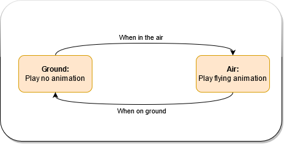
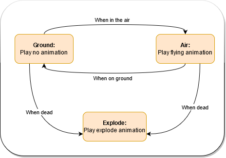

/// details-info | 署名信息
- 该页面翻译自[https://wiki.bedrock.dev/animation-controllers/animation-controllers-intro.html](https://wiki.bedrock.dev/animation-controllers/animation-controllers-intro.html)
- 该页面仓库地址为[https://github.com/Bedrock-OSS/bedrock-wiki/blob/wiki/docs/animation-controllers/animation-controllers-intro.md](https://github.com/Bedrock-OSS/bedrock-wiki/blob/wiki/docs/animation-controllers/animation-controllers-intro.md)
- 该页面的版本为<!-- md:samp Bedrock-OSS/bedrock-wiki@a8f9908938d012a976ac9ee3b2b5b11095fd7570 -->
- 该页面的作者有：
    - <!-- md:samp @SirLich -->
    - <!-- md:samp @solvedDev -->
    - <!-- md:samp @Joelant05 -->
    - <!-- md:samp @MedicalJewel105 -->
    - <!-- md:samp @stirante -->
    - <!-- md:samp @cda94581 -->
    - <!-- md:samp @ThijsHankelMC -->
    - <!-- md:samp @MetalManiacMc -->
    - <!-- md:samp @ThomasOrs -->
///

动画控制器（AC）是状态机，可以在资源包和行为包中使用。在资源包中，动画控制器（RPAC）用于播放动画，而在行为包（BPAC）中，它们用于执行命令和命令“动画”。

## 什么是状态机？

状态机是一种特殊的逻辑管理方式，依赖于一系列状态。每个状态有两个属性：

- 当前状态下要做什么
- 如何转移到其他状态

状态机在各个地方都被广泛使用，尤其是在经典编程中。它们不仅仅存在于Minecraft中！你可以在[这里](https://www.itemis.com/en/yakindu/state-machine/documentation/user-guide/overview_what_are_state_machines)了解更多关于状态机的信息。

状态机一次只能处于一个状态。当状态机“运行”时，可以将其视为在状态之间移动，执行内部逻辑，然后按照`transitions`转移到其他状态。

## 状态机示例

状态机之所以有用，是因为它们允许我们自然地将动画分解为逻辑流程，其中每个状态处理自己的动画和逻辑。

例如，想象一下你想要为直升机的旋转叶片制作动画——但仅限于在地面上时。你有两个状态：

- `地面状态`
- `飞行状态`

我们可以用上述两个信息来标注这些状态：

- `地面状态`：
    - 不播放动画
    - 如果在空中，则转移到`飞行状态`
- `飞行状态`：
    - 播放飞行动画
    - 如果在地面，则转移到`地面状态`

以下是状态机的可视化流程图：



在这个流程图中，状态用矩形表示，箭头表示从一个状态到另一个状态的*转移*。

流程图是一种很好的可视化多状态有限状态机的方法，它允许你跟随动画的逻辑*流程*。让我们看一个更详细的示例，增加一个第三个`爆炸`状态：



如你所见，状态可以同时转移到多个状态。状态也可以是死胡同（因为直升机已经坠毁，不需要进一步的动画）。动画控制器的分支流程是其强大之处的重要组成部分。

## 什么是动画控制器？

动画控制器是Minecraft的状态机，允许我们播放动画和执行命令。动画控制器始终位于`animation_controllers`文件夹中，无论是在RP还是BP中。

### 将控制器附加到实体

动画控制器在其自身的文件中定义，必须在执行任何操作之前“附加”到实体。要将AC附加到你的实体，你必须做两件事：

- 定义动画控制器的短名称
- 通过`scripts`运行动画控制器

以下是一个示例`description`，展示了如何在`animations`中首先定义AC，然后在`scripts/animate`中播放。

```json title="RP/entity/helicopter.ce.json或BP/entities/helicopter.se.json"
"description": {
  "identifier": "wiki:helicopter",
  "animations": {
    "blade_controller": "controller.animation.helicopter.blade"
  },
  "scripts": {
    "animate": [
      "blade_controller"
    ]
  }
}
```

如果你想有条件地播放动画控制器，可以提供一个可选的molang参数。如果该参数评估为真，则控制器将播放：

```json title="RP/entity/helicopter.ce.json或BP/entities/helicopter.se.json"
"scripts": {
  "animate": [
    {
      // 仅在直升机有乘员时播放blade_controller。
      "blade_controller": "q.has_rider"
    }
  ]
}
```

### RP动画控制器

RP动画控制器位于RP中，可以附加到RP实体。它们允许你播放骨骼动画。

### BP动画控制器

BP动画控制器位于BP中，可以附加到BP实体。它们允许你执行命令并向实体发送事件。

## 动画控制器示例

让我们看一个来自上述状态机示例的简单动画控制器：

### 简单示例

```json title="RP/animation_controllers/helicopter.ac.json"
{
  "format_version": "1.10.0",
  "animation_controllers": {
    "controller.animation.helicopter.blade": {
      "initial_state": "ground",
      "states": {
        "ground": {
          "transitions": [
            {
              "flying": "!q.is_on_ground"
            }
          ]
        },
        "flying": {
          "animations": ["flying"],
          "transitions": [
            {
              "ground": "q.is_on_ground"
            }
          ]
        }
      }
    }
  }
}
```

这里有很多内容。让我们一步一步地分解它。在此过程中，请记住两件事：

- 动画控制器是一个*状态列表*
- 每个状态包含两条信息：*在任何给定状态下要做什么*和*如何转移到新状态*。

因此，这个特定示例包含两个状态：

- `ground`
- `flying`

你可以注意到`"initial_state": "ground"`意味着我们的动画控制器将从`ground`状态开始。

```json title="RP/animation_controllers/helicopter.ac.json#animation_controllers/controller.animation.helicopter.blade/states"
"ground": {
    "transitions": [
        {
            "flying": "!q.is_on_ground"
        }
    ]
}
```

`ground`状态包含一个*转移*列表，这就是我们如何转移到其他状态。在这个例子中，默认状态表示：*当`q.is_on_ground`为假时，转移到`flying`状态*。换句话说——当我们飞到空中时，开始飞行动画！

```json title="RP/animation_controllers/helicopter.ac.json#animation_controllers/controller.animation.helicopter.blade/states"
"flying": {
    "animations": [
        "flying"
    ],
    "transitions": [
        {
            "ground": "q.is_on_ground"
        }
    ]
}
```

`flying`状态也包含一个转移列表。在这种情况下，它包含相反的转移：*当`q.is_on_ground`为真时，转移到`ground`状态*。换句话说——当我们降落在地面上时，返回到默认状态！

除了`transition`列表，还有一个`animations`列表，在此状态内播放。在这种情况下，播放`flying`动画。此动画需要在该实体的实体定义文件中定义。

### 完整示例

以下是上面第二个状态机的代码，这次有三个状态。这个示例展示了一些新概念：

- 具有多个转移的状态
- 没有转移的状态

```json title="RP/animation_controllers/helicopter.ac.json"
{
  "format_version": "1.10.0",
  "animation_controllers": {
    "controller.animation.helicopter.blade": {
      "initial_state": "ground",
      "states": {
        "ground": {
          "transitions": [
            {
              "flying": "!q.is_on_ground"
            },
            {
              "explode": "!q.is_alive"
            }
          ]
        },
        "flying": {
          "animations": ["flying"],
          "transitions": [
            {
              "ground": "q.is_on_ground"
            },
            {
              "explode": "!q.is_alive"
            }
          ]
        },
        "explode": {
          "animations": ["explode"]
        }
      }
    }
  }
}
```

## RP动画控制器

资源包动画控制器也可以运行声音和粒子。在AC中调用声音或粒子之前，你需要在客户端实体文件中定义它们。

```json title="RP/entities/custom_tnt.json#minecraft:client_entity/description"
"sound_effects": {
  "explosion": "wiki.custom_tnt.explosion" // 其中wiki.custom_tnt.explosion是像动画声音一样在sound_definitions中定义的声音。
},
"particle_effects": {
  "fuse_lit": "wiki:tnt_fuse_lit_particle"
}
```

然后你才能在AC中调用它们：

```json title="RP/animation_controllers/custom_tnt.animation_controllers.json#controller.animation.custom_tnt"
"states":{
  "default":{
    "transitions":[
      {
        "explode_state":"q.mark_variant == 1"
      }
    ]
  },
  "explode_state":{
    "sound_effects":[
      {
        "effect":"explosion"
      }
    ],
  "particle_effects": [
    {
    "effect": "fuse_lit"
    // "locator": "<bone>" 定位器也可以在这里
    }
  ],
    "transitions":[
      {
        "default":"q.mark_variant == 0"
      }
    ]
  }
}
```

/// warning
警告！并非每个粒子都可以在这里使用。如果你遇到问题，请考虑尝试其他粒子。例如，使用来自blaze ac的粒子。
///

## BP动画控制器

行为包动画控制器使用与RP动画控制器相同的一般格式，不同之处在于它们允许你触发命令，而不是触发动画。一般来说，它们引入了两个新字段：

- `on_entry`：进入状态时播放的命令
- `on_exit`：退出状态时播放的命令

在此上下文中，命令有三种不同的含义：

- 斜杠命令，例如`/say Hello there!`
- 实体上的事件触发，例如：`@s wiki:transform_into_plane`
- 任意molang表达式，例如`v.tickets += 1;`

以下是一个BP动画控制器的示例，展示了一些这种行为：

```json title="BP/animation_controllers/helicopter.ac.json"
{
  "format_version": "1.10.0",
  "animation_controllers": {
    "controller.animation.helicopter.commands": {
      "initial_state": "ground",
      "states": {
        "ground": {
          "on_entry": ["/say I am now in the ground!"],
          "transitions": [
            {
              "flying": "!q.is_on_ground"
            }
          ]
        },
        "flying": {
          "on_entry": ["/say I am now in the air!"],
          "transitions": [
            {
              "ground": "q.is_on_ground"
            }
          ]
        }
      }
    }
  }
}
```

## 动画控制器流程

通过这些示例，希望你开始对动画控制器的流程有一些概念。在本节中，我将更明确地解释它。

### 加载

当实体加载到世界中时，它将在每个附加的动画控制器中*进入*默认动画控制器状态。如果未定义`initial_state`，则使用名为`default`的状态。如果缺少此状态，AC将生成内容日志。

在运行时，AC将在每个刻中执行以下操作：

1. 运行当前状态中的任何动画（如果设置为循环，则将循环播放，否则将仅播放一次）。当状态刚刚被进入时，运行`on_entry`中的任何命令。
2. 检查所有转移以查看是否有任何有效的转移。从列表的顶部到底部搜索，并转移到第一个有效的转移。如果找到转移，将播放`on_exit`命令。

由于动画控制器的设置方式，它每个刻最多只能从一个状态转移到另一个状态一次。

### 重置

动画控制器在实体重新加载时“重置”（玩家加入/离开、区块重新加载等）。这意味着它将“跳回”默认状态。你应该始终在默认状态中有逻辑来处理重新启动任何关键动画。

## 注意事项

你也可以在动画控制器中创建变量（并重新映射它们的值）！

```json
{
  "format_version": "1.17.30",
  "animation_controllers": {
    "controller.animation.sheep.move": {
      "states": {
        "default": {
          "variables": {
            "ground_speed_curve": {
              "input": "q.ground_speed",
              "remap_curve": {
                "0.0": 0.2,
                "1.0": 0.7
              }
            }
          },
          "animations": [
            "wiggle_nose",
            {
              "walk": "v.ground_speed_curve"
            }
          ]
        }
      }
    }
  }
}
```