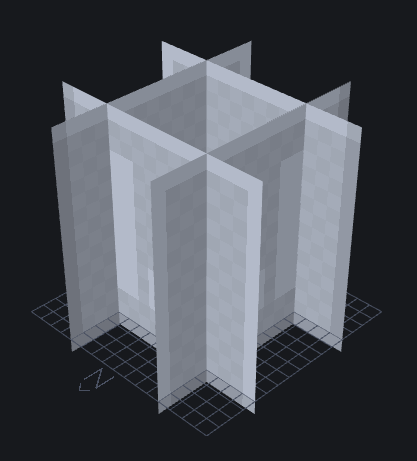

:::tip 格式 & 最低引擎版本 `1.21.40`
本教程假设你对区块和脚本有良好的理解。
在开始之前，请查看[区块指南](../blocks/blocks-intro.md)、[区块状态](../blocks/block-states.md)和[区块事件](../blocks/block-events.md)。
:::

如果你不喜欢胡萝卜，也没关系。你可以制作自己的（更优越的）作物！

制作作物并不像你想象的那么困难，只需在编写特定事件序列的代码时稍加练习和深思熟虑。本页面将指导你创建一个独特的作物方块及其种子和食物项目的过程。

**问题:**

-   自定义作物无法被流动的液体摧毁（[查看反馈帖子](https://discord.com/channels/1138536747932864532/1191224284765491230)）。
-   生长速度无法受到光照水平的影响（[查看反馈帖子](https://discord.com/channels/1138536747932864532/1231369171577602179)）。

## 作物模型

如果你在游戏中查看胡萝卜和土豆等作物，你会看到它们由四个平面组成，每个边缘距离4个像素，如下图所示。可见的面朝内指向，以防止作物在被其他方块包围时产生阴影。

值得注意的是，每个平面向下移动1个像素，不同于传统的方块。如果你忘记将平面向下移动一个像素，作物将会显示得比地农高出一个像素，而地农的模型较短。

通过将位置向下移动一个像素，作物将完美地位于地农之上，使我们的方块世界一切正常。以下是作物的模板模型。



<Button link="https://github.com/Bedrock-OSS/wiki-addon/blob/main/ma-custom_crops/rp/models/blocks/crop.geo.json">
    下载自定义作物几何体
</Button>

## 初始方块 JSON

首先，我们希望自定义作物像原版作物一样具有8个生长阶段，因此方块应包含一个具有8个值的状态。

此代码示例还包括我们作物的基本组件，这些组件将在每个排列中激活。

```json title="BP/blocks/custom_crop.json"
{
    "format_version": "1.21.40",
    "minecraft:block": {
        "description": {
            "identifier": "wiki:custom_crop",
            "menu_category": {
                "category": "none" // Hide from creative inventory - seeds should be used to place.
            },
            "states": {
                "wiki:growth": {
                    "values": { "min": 0, "max": 7 }
                }
            }
        },
        "components": {
            "minecraft:collision_box": false,
            "minecraft:geometry": "geometry.crop", // Model provided in previous step.
            "minecraft:light_dampening": 0,
            // Break the crop if it isn't placed on farmland.
            "minecraft:placement_filter": {
                "conditions": [
                    {
                        "allowed_faces": ["up"],
                        "block_filter": ["minecraft:farmland"]
                    }
                ]
            }
        }
    }
}
```

## 自定义生长组件

下面的事件执行三个重要功能，使你的作物能够运作：

-   [`onRandomTick`](../blocks/block-events.md#random-tick) 事件钩子用于在随机间隔增加 `wiki:growth` 状态。
-   [`onPlayerInteract`](../blocks/block-events.md#player-interact) 事件钩子用于支持骨粉，在生存模式下为 `wiki:growth` 增加随机值或在创造模式下使作物完全生长。

```js title="BP/scripts/custom_crop.js"
import { EquipmentSlot, GameMode, world } from "@minecraft/server";

/**
 * @param {number} min The minimum integer
 * @param {number} max The maximum integer
 * @returns {number} A random integer between the `min` and `max` parameters (inclusive)
 */
const randomInt = (min, max) => Math.floor(Math.random() * (max - min + 1)) + min;

const maxGrowth = 7;

/** @type {import("@minecraft/server").BlockCustomComponent} */
const CustomCropGrowthBlockComponent = {
    onRandomTick({ block }) {
        const growthChance = 1 / 3;
        if (Math.random() > growthChance) return;

        const growth = block.permutation.getState("wiki:growth");
        block.setPermutation(block.permutation.withState("wiki:growth", growth + 1));
    },
    onPlayerInteract({ block, dimension, player }) {
        if (!player) return;

        const equippable = player.getComponent("minecraft:equippable");
        if (!equippable) return;

        const mainhand = equippable.getEquipmentSlot(EquipmentSlot.Mainhand);
        if (!mainhand.hasItem() || mainhand.typeId !== "minecraft:bone_meal") return;

        if (player.getGameMode() === GameMode.creative) {
            // Grow crop fully
            block.setPermutation(block.permutation.withState("wiki:growth", 7));
        } else {
            let growth = block.permutation.getState("wiki:growth");

            // Add random amount of growth
            growth += randomInt(1, maxGrowth - growth);
            block.setPermutation(block.permutation.withState("wiki:growth", growth));

            // Decrement stack
            if (mainhand.amount > 1) mainhand.amount--;
            else mainhand.setItem(undefined);
        }

        // Play effects
        const effectLocation = block.center();
        dimension.playSound("item.bone_meal.use", effectLocation);
        dimension.spawnParticle("minecraft:crop_growth_emitter", effectLocation);
    },
};

world.beforeEvents.worldInitialize.subscribe(({ blockComponentRegistry }) => {
    blockComponentRegistry.registerCustomComponent(
        "wiki:custom_crop_growth",
        CustomCropGrowthBlockComponent
    );
});
```

## 生长排列

既然我们知道如何设置方块状态，当方块处于特定状态值时会发生什么？

以下排列根据 `wiki:growth` 值为方块设置特定的选择框、战利品表和纹理。

例如，如果 `wiki:growth` 为7，纹理将设置为 `custom_crop_3`，并且作物能够掉落食物。

```json title="minecraft:block"
"permutations": [
    {
        "condition": "q.block_state('wiki:growth') < 7",
        "components": {
            // Loot table for when the crop is not fully grown. Vanilla crops only drop seeds when young.
            "minecraft:loot": "loot_tables/blocks/custom_crop_young.json",
            // Trigger growth on random ticks and when interacting with bone meal (only active when the block isn't fully grown).
            "minecraft:custom_components": ["wiki:custom_crop_growth"]
        }
    },
    {
        "condition": "q.block_state('wiki:growth') >= 0",
        "components": {
            "minecraft:material_instances": {
                "*": {
                    "texture": "custom_crop_0",
                    "render_method": "alpha_test",
                    "ambient_occlusion": false,
                    "face_dimming": false
                }
            }
        }
    },
    {
        "condition": "q.block_state('wiki:growth') == 0",
        "components": {
            "minecraft:selection_box": {
                "origin": [-8, 0, -8],
                "size": [16, 1.6, 16]
            }
        }
    },
    {
        "condition": "q.block_state('wiki:growth') == 1",
        "components": {
            "minecraft:selection_box": {
                "origin": [-8, 0, -8],
                "size": [16, 3.2, 16]
            }
        }
    },
    {
        "condition": "q.block_state('wiki:growth') >= 2",
        "components": {
            "minecraft:material_instances": {
                "*": {
                    "texture": "custom_crop_1",
                    "render_method": "alpha_test",
                    "ambient_occlusion": false,
                    "face_dimming": false
                }
            }
        }
    },
    {
        "condition": "q.block_state('wiki:growth') == 2",
        "components": {
            "minecraft:selection_box": {
                "origin": [-8, 0, -8],
                "size": [16, 4.8, 16]
            }
        }
    },
    {
        "condition": "q.block_state('wiki:growth') == 3",
        "components": {
            "minecraft:selection_box": {
                "origin": [-8, 0, -8],
                "size": [16, 6.4, 16]
            }
        }
    },
    {
        "condition": "q.block_state('wiki:growth') >= 4",
        "components": {
            "minecraft:material_instances": {
                "*": {
                    "texture": "custom_crop_2",
                    "render_method": "alpha_test",
                    "ambient_occlusion": false,
                    "face_dimming": false
                }
            }
        }
    },
    {
        "condition": "q.block_state('wiki:growth') == 4",
        "components": {
            "minecraft:selection_box": {
                "origin": [-8, 0, -8],
                "size": [16, 8, 16]
            }
        }
    },
    {
        "condition": "q.block_state('wiki:growth') == 5",
        "components": {
            "minecraft:selection_box": {
                "origin": [-8, 0, -8],
                "size": [16, 9.6, 16]
            }
        }
    },
    {
        "condition": "q.block_state('wiki:growth') == 6",
        "components": {
            "minecraft:selection_box": {
                "origin": [-8, 0, -8],
                "size": [16, 11.2, 16]
            }
        }
    },
    {
        "condition": "q.block_state('wiki:growth') == 7",
        "components": {
            "minecraft:material_instances": {
                "*": {
                    "texture": "custom_crop_3",
                    "render_method": "alpha_test",
                    "ambient_occlusion": false,
                    "face_dimming": false
                }
            },
            "minecraft:selection_box": {
                "origin": [-8, 0, -8],
                "size": [16, 12.8, 16]
            },
            // Drop different loot when fully grown
            "minecraft:loot": "loot_tables/blocks/custom_crop_mature.json"
        }
    }
]
```

你可以根据希望作物具有的生长阶段数量添加更多排列。但不要忘记同时更改状态的 `max` 值和脚本中的 `maxGrowth` 值。

## 最终方块 JSON

以下是完整的 `wiki:custom_crop` 文件，供参考。

/// details-info | 自定义作物方块 JSON

```json title="BP/blocks/custom_crop.json"
{
    "format_version": "1.21.40",
    "minecraft:block": {
        "description": {
            "identifier": "wiki:custom_crop",
            "menu_category": {
                "category": "none" // Hide from creative inventory - seeds should be used to place.
            },
            "states": {
                "wiki:growth": {
                    "values": { "min": 0, "max": 7 }
                }
            }
        },
        "components": {
            "minecraft:flammable": true,
            "minecraft:collision_box": false,
            "minecraft:geometry": "geometry.crop",
            "minecraft:light_dampening": 0,
            // Break the crop if it isn't placed on farmland.
            "minecraft:placement_filter": {
                "conditions": [
                    {
                        "allowed_faces": ["up"],
                        "block_filter": ["minecraft:farmland"]
                    }
                ]
            }
        },
        "permutations": [
            {
                "condition": "q.block_state('wiki:growth') < 7",
                "components": {
                    // Loot table for when the crop is not fully grown. Vanilla crops only drop seeds when young.
                    "minecraft:loot": "loot_tables/blocks/custom_crop_young.json",
                    // Trigger growth on random ticks and when interacting with bone meal (only active when the block isn't fully grown).
                    "minecraft:custom_components": ["wiki:custom_crop_growth"]
                }
            },
            {
                "condition": "q.block_state('wiki:growth') >= 0",
                "components": {
                    "minecraft:material_instances": {
                        "*": {
                            "texture": "custom_crop_0",
                            "render_method": "alpha_test",
                            "ambient_occlusion": false,
                            "face_dimming": false
                        }
                    }
                }
            },
            {
                "condition": "q.block_state('wiki:growth') == 0",
                "components": {
                    "minecraft:selection_box": {
                        "origin": [-8, 0, -8],
                        "size": [16, 1.6, 16]
                    }
                }
            },
            {
                "condition": "q.block_state('wiki:growth') == 1",
                "components": {
                    "minecraft:selection_box": {
                        "origin": [-8, 0, -8],
                        "size": [16, 3.2, 16]
                    }
                }
            },
            {
                "condition": "q.block_state('wiki:growth') == 6",
                "components": {
                    "minecraft:selection_box": {
                        "origin": [-8, 0, -8],
                        "size": [16, 11.2, 16]
                    }
                }
            },
            {
                "condition": "q.block_state('wiki:growth') >= 2",
                "components": {
                    "minecraft:material_instances": {
                        "*": {
                            "texture": "custom_crop_1",
                            "render_method": "alpha_test",
                            "ambient_occlusion": false,
                            "face_dimming": false
                        }
                    }
                }
            },
            {
                "condition": "q.block_state('wiki:growth') == 2",
                "components": {
                    "minecraft:selection_box": {
                        "origin": [-8, 0, -8],
                        "size": [16, 4.8, 16]
                    }
                }
            },
            {
                "condition": "q.block_state('wiki:growth') == 3",
                "components": {
                    "minecraft:selection_box": {
                        "origin": [-8, 0, -8],
                        "size": [16, 6.4, 16]
                    }
                }
            },
            {
                "condition": "q.block_state('wiki:growth') >= 4",
                "components": {
                    "minecraft:material_instances": {
                        "*": {
                            "texture": "custom_crop_2",
                            "render_method": "alpha_test",
                            "ambient_occlusion": false,
                            "face_dimming": false
                        }
                    }
                }
            },
            {
                "condition": "q.block_state('wiki:growth') == 4",
                "components": {
                    "minecraft:selection_box": {
                        "origin": [-8, 0, -8],
                        "size": [16, 8, 16]
                    }
                }
            },
            {
                "condition": "q.block_state('wiki:growth') == 5",
                "components": {
                    "minecraft:selection_box": {
                        "origin": [-8, 0, -8],
                        "size": [16, 9.6, 16]
                    }
                }
            },
            {
                "condition": "q.block_state('wiki:growth') == 7",
                "components": {
                    "minecraft:material_instances": {
                        "*": {
                            "texture": "custom_crop_3",
                            "render_method": "alpha_test",
                            "ambient_occlusion": false,
                            "face_dimming": false
                        }
                    },
                    "minecraft:selection_box": {
                        "origin": [-8, 0, -8],
                        "size": [16, 12.8, 16]
                    },
                    // Drop different loot when fully grown
                    "minecraft:loot": "loot_tables/blocks/custom_crop_mature.json"
                }
            }
        ]
    }
}
```

///

## 作物战利品

以下是你的自定义作物可以使用的一些示例战利品表：

### 幼年作物战利品表

```json title="BP/loot_tables/blocks/custom_crop_young.json"
{
    "pools": [
        {
            "rolls": 1,
            "entries": [
                {
                    "type": "item",
                    "name": "wiki:custom_seeds"
                }
            ]
        }
    ]
}
```

### 成熟作物战利品表

```json title="BP/loot_tables/blocks/custom_crop_mature.json"
{
    "pools": [
        {
            "rolls": 1,
            "entries": [
                {
                    "type": "item",
                    "name": "wiki:custom_food",
                    "functions": [
                        {
                            "function": "set_count",
                            "count": { "min": 2, "max": 5 }
                        }
                    ]
                }
            ]
        },
        {
            "rolls": 1,
            "entries": [
                {
                    "type": "item",
                    "name": "wiki:custom_seeds",
                    "functions": [
                        {
                            "function": "set_count",
                            "count": { "min": 0, "max": 3 }
                        }
                    ]
                }
            ]
        }
    ]
}
```

## 自定义种子

手持作物方块看起来不太合适，因此我们使用种子来种植作物！以下是用于放置作物的自定义项目的 JSON。

```json title="BP/items/custom_seeds.json"
{
    "format_version": "1.21.40",
    "minecraft:item": {
        "description": {
            "identifier": "wiki:custom_seeds", // Make sure this is different from your crop's ID.
            "menu_category": {
                "category": "nature",
                "group": "itemGroup.name.seed"
            }
        },
        "components": {
            "minecraft:icon": "custom_seeds",
            "minecraft:block_placer": {
                "block": "wiki:custom_crop" // The block this item is placing.
            }
        }
    }
}
```

## 自定义食物

你的作物不仅能掉落种子！使用下面的模板创建自定义食物。

```json title="BP/items/custom_food.json"
{
    "format_version": "1.21.40",
    "minecraft:item": {
        "description": {
            "identifier": "wiki:custom_food", // Make sure this is different from your crop and seeds' ID.
            "menu_category": {
                "category": "nature",
                "group": "itemGroup.name.crop"
            }
        },
        "components": {
            "minecraft:icon": "custom_food",
            "minecraft:food": {
                "nutrition": 4,
                "saturation_modifier": 0.6
            },
            "minecraft:use_animation": "eat",
            "minecraft:use_modifiers": {
                "use_duration": 1.6,
                "movement_modifier": 0.33
            }
        }
    }
}
```

## 结果

你的数据包现在应包含以下文件：

<FolderView
    :paths="[
        'BP/blocks/custom_crop.json',
        'BP/items/custom_food.json',
        'BP/items/custom_seeds.json',
        'BP/loot_tables/blocks/custom_crop_mature.json',
        'BP/loot_tables/blocks/custom_crop_young.json'
    ]"
></FolderView>

借助本教程/模板，你现在具备创建自定义作物及其种子和食物项目的知识和技能。

## 下载示例数据包

如果你需要进一步的帮助或想访问完整的模板文件，请使用下面提供的下载按钮。祝你设计愉快！

<Button link="https://github.com/Bedrock-OSS/wiki-addon/releases/download/download/custom_crops.mcaddon">
    下载 MCADDON
</Button>