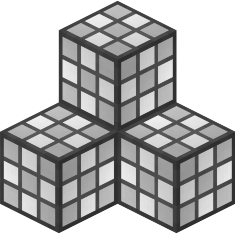

::: tip 格式版本 `1.21.40`
本示例需要对方块有基本了解。
在开始之前，请查看[方块指南](../blocks/blocks-intro.md)。
:::

制作玻璃方块看起来可能是个简单的任务，但当您第一次尝试时，您的方块可能会显得不透明。本页面将向您展示如何使用[材质实例](../blocks/block-components.md#material-instances)实现纹理的半透明效果。

到最后，您应该能够创建如下所示的效果！



## 方块 JSON

<CodeHeader>BP/blocks/custom_glass.json</CodeHeader>

```json
{
    "format_version": "1.21.40",
    "minecraft:block": {
        "description": {
            "identifier": "wiki:custom_glass",
            "menu_category": {
                "category": "construction",
                "group": "itemGroup.name.glass"
            }
        },
        "components": {
            "minecraft:light_dampening": 0, // 不阻挡任何光线（这对于有色玻璃设置为15）
            "minecraft:loot": "loot_tables/empty.json", // 不掉落，除非使用丝绸触碰
            "minecraft:material_instances": {
                "*": {
                    "render_method": "blend" // 允许半透明效果
                }
            }
        }
    }
}
```

## 应用纹理与声音

为了使您的玻璃方块正确进行面剔除，纹理必须在 `RP/blocks.json` 中定义，而不是在材质实例和几何组件中定义。

<CodeHeader>RP/blocks.json</CodeHeader>

```json
{
    "format_version": "1.21.40",
    "wiki:custom_glass": {
        "textures": "custom_glass", // 在 `RP/textures/terrain_texture.json` 中定义的短名称
        "sound": "glass"
    }
}
```