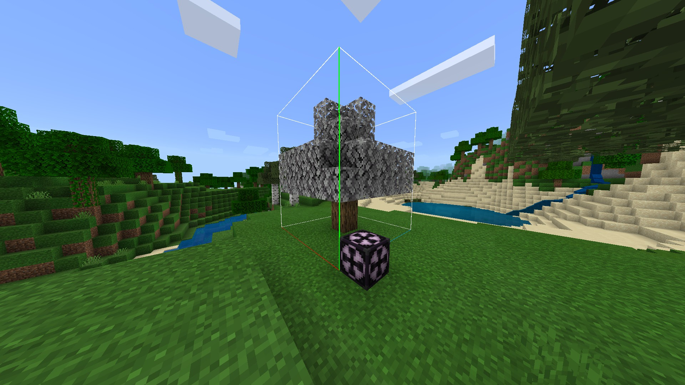
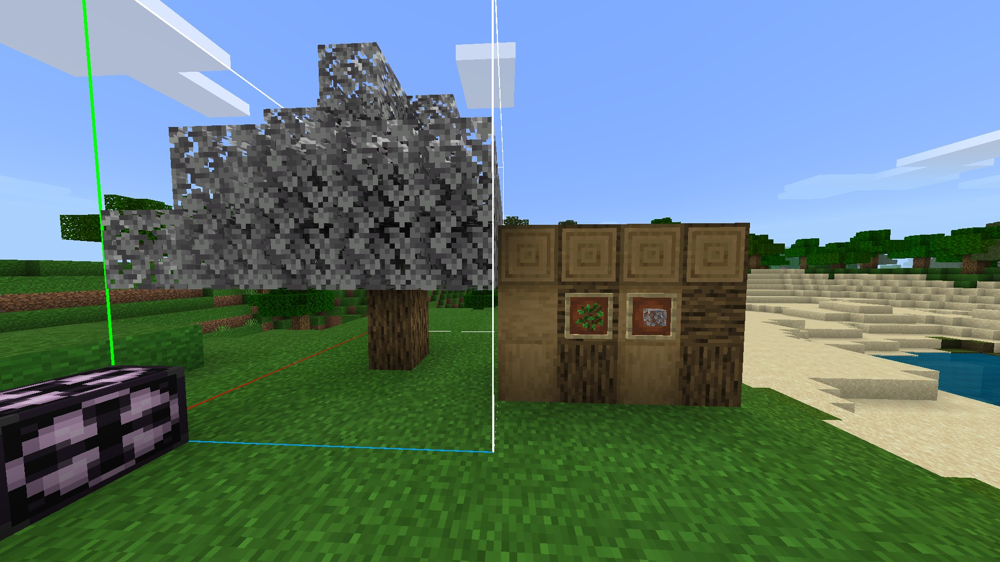

/// tip | 格式与最小引擎版本 `1.21.40`
本教程假设你对区块有高级理解。
在开始之前，请查看[区块指南](../blocks/blocks-intro.md)。
///

创建具有衰变树叶的自定义树木虽然复杂，但完全可行！按照本教程操作，很快你就能拥有自己的树木。

-   功能：

    -   衰变树叶
    -   兼容树木特征
    -   使用剪刀破坏时，树叶会自行掉落
    -   玩家放置的树叶不会衰变
    -   原木可被剥离和旋转
    -   剥离原木兼容其他附加包的工具（如果它们具有 `minecraft:is_axe` 标签）
    -   树苗可以用骨粉催长并长成一棵树

## 衰变树叶

你会立刻注意到，我们的自定义树叶具有一个长列表，用于通过其区块标签搜索原木/自定义木材，尽管代码示例在本教程中使用的是自定义木材。该值为4，此方法用于在圆形半径内搜索最近的原木。

<WikiImage
  src="../assets/images/blocks/custom-trees/decaying_leaves_showcase_example.png"
  alt="衰变树叶展示"
  width=420
/>

我们的自定义树叶在玩家放置时禁用计时，这意味着树叶不会衰变，并且这消除了另一个重复树叶区块的需求。

### 基础 JSON

让我们开始吧。我们将从树叶区块的 JSON 代码开始。

```json title="BP/blocks/custom_leaves.json"
{
    "format_version": "1.21.40",
    "minecraft:block": {
        "description": {
            "identifier": "wiki:custom_leaves"
        },
        "components": {
            "tag:wiki:custom_leaves": {},
            "minecraft:loot": "loot_tables/empty.json",
            "minecraft:geometry": {
                "identifier": "minecraft:geometry.full_block"
            },
            "minecraft:custom_components": [
                "wiki:leaves_stop_decay",
                "wiki:leaves_on_destroyed",
                "wiki:leaves_check"
            ],
            "minecraft:destructible_by_explosion": {
                "explosion_resistance": 1
            },
            "minecraft:destructible_by_mining": {
                "seconds_to_destroy": 0.3
            },
            "minecraft:map_color": "#DDDDDD",
            "minecraft:light_dampening": 0,
            "minecraft:material_instances": {
                "*": {
                    "texture": "custom_leaves",
                    "render_method": "blend"
                }
            }
        }
    }
}
```

### 区块状态

我们已经定义了自定义树叶区块所需的基础内容。我们的自定义树叶仍然缺少一些功能，例如状态、排列以及自定义组件的 JS 代码。让我们添加以下区块状态。

```json title=""minecraft:block" > "description""
"states": {
    "wiki:decay_tier": [4, 3, 2, 1, 0], // 搜索原木的区块距离
    "wiki:should_decay": [true, false], // 当由玩家或特征放置时使用
    "wiki:opaque": [false, true] // 可选；当被包围时使树叶不透明
}
```

### 排列

让我们添加排列代码，以帮助塑造区块的行为。

```json title=""minecraft:block" > "description""
"permutations": [
    {
        "condition": "q.block_state('wiki:decay_tier') == 0",
        "components": {
            "minecraft:custom_components": [
                "wiki:leaves_decay"
            ],
            "tag:decay_tier_0": {}
        }
    },
    {
        "condition": "q.block_state('wiki:decay_tier') == 1",
        "components": {
            "tag:decay_tier_1": {}
        }
    },
    {
        "condition": "q.block_state('wiki:decay_tier') == 2",
        "components": {
            "tag:decay_tier_2": {}
        }
    },
    {
        "condition": "q.block_state('wiki:decay_tier') == 3",
        "components": {
            "tag:decay_tier_3": {}
        }
    },
    {
    "condition": "q.block_state('wiki:decay_tier') == 4",
        "components": {
            "tag:decay_tier_4": {}
        }
    },
    {
    "condition": "q.block_state('wiki:opaque')",
        "components": {
            "minecraft:material_instances": {
                "*": {
                    "texture": "custom_leaves",
                    "render_method": "opaque"
                }
            }
        }
    }
]
```

/// details-info | 代码

```json title="BP/blocks/custom_leaves.json"
{
    "format_version": "1.21.40",
    "minecraft:block": {
        "description": {
            "identifier": "wiki:custom_leaves",
            "states": {
                "wiki:decay_tier": [4, 3, 2, 1, 0], // 搜索原木的区块距离
                "wiki:should_decay": [true, false], // 当由玩家或特征放置时使用
                "wiki:opaque": [false, true] // 可选；当被包围时使树叶不透明
            }
        },
        "components": {
            "tag:wiki:custom_leaves": {},
            "minecraft:loot": "loot_tables/empty.json",
            "minecraft:geometry": {
                "identifier": "minecraft:geometry.full_block"
            },
            "minecraft:custom_components": [
                "wiki:leaves_stop_decay",
                "wiki:leaves_on_destroyed",
                "wiki:leaves_check"
            ],
            "minecraft:destructible_by_explosion": {
                "explosion_resistance": 1
            },
            "minecraft:destructible_by_mining": {
                "seconds_to_destroy": 0.3
            },
            "minecraft:map_color": "#DDDDDD",
            "minecraft:light_dampening": 0,
            "minecraft:material_instances": {
                "*": {
                    "texture": "custom_leaves",
                    "render_method": "blend"
                }
            }
        },
        "events": {
            // 定义工具的掉落物
            "wiki:on_destroyed": {
                "sequence": [
                    {
                        "condition": "q.is_item_name_any('slot.weapon.mainhand','minecraft:shears')",
                        "spawn_loot": {
                            "table": "loot_tables/blocks/custom_leaves_shears.json"
                        }
                    },
                    {
                        "condition": "!q.is_item_name_any('slot.weapon.mainhand','minecraft:shears')",
                        "spawn_loot": {
                            "table": "loot_tables/blocks/custom_leaves.json"
                        }
                    }
                ]
            },
            // 检查原木
            "wiki:check": {
                "sequence": [
                    {
                        "condition": "q.block_state('wiki:should_decay')",
                        "set_block_state": {
                            "wiki:decay_tier": "(q.block_neighbor_has_any_tag(0,0,-1,'log') || q.block_neighbor_has_any_tag(0,0,1,'log') || q.block_neighbor_has_any_tag(-1,0,0,'log') || q.block_neighbor_has_any_tag(1,0,0,'log') || q.block_neighbor_has_any_tag(0,-1,0,'log') || q.block_neighbor_has_any_tag(0,1,0,'log')) ? 4 : ((q.block_neighbor_has_any_tag(0,0,-1,'decay_tier_4') || q.block_neighbor_has_any_tag(0,0,1,'decay_tier_4') || q.block_neighbor_has_any_tag(-1,0,0,'decay_tier_4') || q.block_neighbor_has_any_tag(1,0,0,'decay_tier_4') || q.block_neighbor_has_any_tag(0,-1,0,'decay_tier_4') || q.block_neighbor_has_any_tag(0,1,0,'decay_tier_4')) ? 3 : ( (q.block_neighbor_has_any_tag(0,0,-1,'decay_tier_3') || q.block_neighbor_has_any_tag(0,0,1,'decay_tier_3 ') || q.block_neighbor_has_any_tag(-1,0,0,'decay_tier_3') || q.block_neighbor_has_any_tag(1,0,0,'decay_tier_3') || q.block_neighbor_has_any_tag(0,-1,0,'decay_tier_3') || q.block_neighbor_has_any_tag(0,1,0,'decay_tier_3')) ? 2 : ( (q.block_neighbor_has_any_tag(0,0,-1,'decay_tier_2') || q.block_neighbor_has_any_tag(0,0,1,'decay_tier_2') || q.block_neighbor_has_any_tag(-1,0,0,'decay_tier_2') || q.block_neighbor_has_any_tag(1,0,0,'decay_tier_2') || q.block_neighbor_has_any_tag(0,-1,0,'decay_tier_2') || q.block_neighbor_has_any_tag(0,1,0,'decay_tier_2')) ? 1 : 0 ) ) )"
                        }
                    },
                    {
                        "set_block_state": {
                            "wiki:opaque": "q.block_neighbor_has_any_tag(0,0,-1,'log','stone','custom_leaves') && q.block_neighbor_has_any_tag(0,0,1,'log','stone','custom_leaves') && q.block_neighbor_has_any_tag(0,1,0,'log','stone','custom_leaves') && q.block_neighbor_has_any_tag(0,-1,0,'log','stone','custom_leaves') && q.block_neighbor_has_any_tag(-1,0,0,'log','stone','custom_leaves') && q.block_neighbor_has_any_tag(1,0,0,'log','stone','custom_leaves')"
                        }
                    }
                ]
            },
            // 放置时
            "wiki:stop_decay": {
                "set_block_state": {
                    "wiki:should_decay": false
                }
            },
            // 衰变时
            "wiki:decay": {
                "die": {},
                "spawn_loot": {
                    "table": "loot_tables/blocks/custom_leaves.json"
                }
            }
        },
        "permutations": [
            {
                "condition": "q.block_state('wiki:decay_tier') == 0",
                "components": {
                    "minecraft:random_ticking": {
                        "on_tick": {
                            "event": "wiki:decay"
                        }
                    },
                    "tag:decay_tier_0": {}
                }
            },
            {
                "condition": "q.block_state('wiki:decay_tier') == 1",
                "components": {
                    "tag:decay_tier_1": {}
                }
            },
            {
                "condition": "q.block_state('wiki:decay_tier') == 2",
                "components": {
                    "tag:decay_tier_2": {}
                }
            },
            {
                "condition": "q.block_state('wiki:decay_tier') == 3",
                "components": {
                    "tag:decay_tier_3": {}
                }
            },
            {
                "condition": "q.block_state('wiki:decay_tier') == 4",
                "components": {
                    "tag:decay_tier_4": {}
                }
            },
            {
                "condition": "q.block_state('wiki:opaque')",
                "components": {
                    "minecraft:material_instances": {
                        "*": {
                            "texture": "custom_leaves",
                            "render_method": "opaque"
                        }
                    }
                }
            }
        ]
    }
}
```

///

## 自定义原木

/// details-info | 代码

```json title="BP/blocks/custom_log.json"
{
    "format_version": "1.21.40",
    "minecraft:block": {
        "description": {
            "identifier": "wiki:custom_log",
            "menu_category": {
                "category": "nature",
                "group": "itemGroup.name.log"
            },
            "states": {
                // 原木方向状态
                "wiki:axis": [0, 1, 2]
            }
        },
        "components": {
            "tag:log": {},
            "minecraft:unit_cube": {},
            // 设置原木侧面和上下的不同纹理
            "minecraft:material_instances": {
                "*": {
                    "texture": "custom_log"
                },
                "ends": {
                    "texture": "custom_log_top"
                },
                "up": "ends",
                "down": "ends"
            },
            "minecraft:destructible_by_mining": {
                "seconds_to_destroy": 1
            },
            // 设置玩家放置时原木旋转
            "minecraft:on_player_placing": {
                "event": "wiki:set_axis"
            },
            // 使原木可剥离
            "minecraft:on_interact": {
                "condition": "q.equipped_item_any_tag('slot.weapon.mainhand', 'minecraft:is_axe')",
                "event": "wiki:strip"
            }
        },
        "events": {
            "wiki:set_axis": {
                "set_block_state": {
                    "wiki:axis": "Math.floor(q.block_face / 2)"
                }
            },
            "wiki:strip": {
                "sequence": [
                    {
                        "run_command": {
                            "command": "playsound hit.wood @a ~~~"
                        },
                        // 损坏剥离原木的玩家的斧头
                        "damage": {
                            "type": "durability",
                            "amount": 1,
                            "target": "item"
                        }
                    },
                    {
                        "condition": "q.block_state('wiki:axis') == 0",
                        "run_command": {
                            "command": "setblock ~~~ wiki:custom_stripped_log [\"wiki:axis\"=0]"
                        }
                    },
                    {
                        "condition": "q.block_state('wiki:axis') == 1",
                        "run_command": {
                            "command": "setblock ~~~ wiki:custom_stripped_log [\"wiki:axis\"=1]"
                        }
                    },
                    {
                        "condition": "q.block_state('wiki:axis') == 2",
                        "run_command": {
                            "command": "setblock ~~~ wiki:custom_stripped_log [\"wiki:axis\"=2]"
                        }
                    }
                ]
            }
        },
        "permutations": [
            {
                "condition": "q.block_state('wiki:axis') == 0",
                "components": {
                    "minecraft:transformation": { "rotation": [0, 0, 0] }
                }
            },
            {
                "condition": "q.block_state('wiki:axis') == 1",
                "components": {
                    "minecraft:transformation": { "rotation": [90, 0, 0] }
                }
            },
            {
                "condition": "q.block_state('wiki:axis') == 2",
                "components": {
                    "minecraft:transformation": { "rotation": [0, 0, 90] }
                }
            }
        ]
    }
}
```

///

## 剥离原木

这里所有组件都是相同的

/// details-info | 代码

```json title="BP/blocks/custom_stripped_log.json"
{
    "format_version": "1.21.40",
    "minecraft:block": {
        "description": {
            "identifier": "wiki:custom_stripped_log",
            "menu_category": {
                "category": "nature",
                "group": "itemGroup.name.log"
            },
            "states": {
                // 原木方向状态
                "wiki:axis": [0, 1, 2]
            }
        },
        "components": {
            "tag:log": {},
            "minecraft:unit_cube": {},
            // 设置原木侧面和上下的不同纹理
            "minecraft:material_instances": {
                "*": {
                    "texture": "custom_stripped_log"
                },
                "ends": {
                    "texture": "custom_stripped_log_top"
                },
                "up": "ends",
                "down": "ends"
            },
            "minecraft:destructible_by_mining": {
                "seconds_to_destroy": 1
            },
            // 设置玩家放置时原木旋转
            "minecraft:on_player_placing": {
                "event": "wiki:set_axis"
            }
        },
        "events": {
            "wiki:set_axis": {
                "set_block_state": {
                    "wiki:axis": "Math.floor(q.block_face / 2)"
                }
            }
        },
        "permutations": [
            {
                "condition": "q.block_state('wiki:axis') == 0",
                "components": {
                    "minecraft:transformation": { "rotation": [0, 0, 0] }
                }
            },
            {
                "condition": "q.block_state('wiki:axis') == 1",
                "components": {
                    "minecraft:transformation": { "rotation": [90, 0, 0] }
                }
            },
            {
                "condition": "q.block_state('wiki:axis') == 2",
                "components": {
                    "minecraft:transformation": { "rotation": [0, 0, 90] }
                }
            }
        ]
    }
}
```

///

## 自定义树苗

对于树苗，我们需要树木的结构，使树苗看起来半真实，因为目前无法在 Minecraft 基岩版上通过命令放置特征。

/// details-info | 代码

```json title="BP/blocks/custom_sapling.json"
{
    "format_version": "1.21.40",
    "minecraft:block": {
        "description": {
            "identifier": "wiki:custom_sapling",
            "states": {
                // 树苗的生长阶段
                "wiki:growth_stage": [0, 1, 2]
            }
        },
        "components": {
            "minecraft:collision_box": false,
            "minecraft:selection_box": {
                "origin": [-6, 0, -6],
                "size": [12, 13, 12]
            },
            "minecraft:light_dampening": 0,
            "minecraft:geometry": "geometry.custom_sapling",
            "minecraft:material_instances": {
                "*": {
                    "texture": "custom_sapling",
                    "render_method": "alpha_test",
                    "face_dimming": false,
                    "ambient_occlusion": false
                }
            },
            // 添加掉落组件，以便掉落树苗放置物品
            "minecraft:loot": "loot_tables/blocks/custom_sapling.json",
            // 仅允许在这些区块上放置
            "minecraft:placement_filter": {
                "conditions": [
                    {
                        "allowed_faces": ["up"],
                        "block_filter": ["minecraft:dirt", "minecraft:grass", "minecraft:podzol"]
                    }
                ]
            },
            // 在每个随机刻触发生长
            "minecraft:random_ticking": {
                "on_tick": {
                    "event": "wiki:grow"
                }
            },
            // 使用骨粉时触发生长
            "minecraft:on_interact": {
                "condition": "q.is_item_name_any('slot.weapon.mainhand', 'minecraft:bone_meal')",
                "event": "wiki:fertilize"
            }
        },
        "events": {
            "wiki:grow": {
                "sequence": [
                    {
                        "condition": "q.block_state('wiki:growth_stage') < 2",
                        "set_block_state": {
                            "wiki:growth_stage": "q.block_state('wiki:growth_stage') + 1"
                        }
                    },
                    {
                        "condition": "q.block_state('wiki:growth_stage') == 2",
                        "run_command": {
                            "command": "structure load custom_tree ~-2~~-2"
                        }
                    }
                ]
            },
            "wiki:fertilize": {
                // 移除用于交互的物品
                "decrement_stack": {},
                // 触发生长
                "trigger": {
                    "event": "wiki:grow"
                },
                // 触发效果
                "run_command": {
                    "command": [
                        "particle minecraft:crop_growth_emitter ~~~",
                        "playsound item.bone_meal.use @a ~~~"
                    ]
                }
            }
        }
    }
}
```

///

## 树苗放置器

/// details-info | 代码

```json title="BP/items/custom_sapling_placer.json"
{
    "format_version": "1.21.40",
    "minecraft:item": {
        "description": {
            "identifier": "wiki:custom_sapling_placer",
            "menu_category": {
                "category": "nature",
                "group": "itemGroup.name.sapling"
            }
        },
        "components": {
            "minecraft:max_stack_size": 64,
            "minecraft:block_placer": {
                "block": "wiki:custom_sapling"
            },
            "minecraft:icon": {
                "texture": "custom_sapling_placer"
            }
        }
    }
}
```

///

## 战利品表

/// details-info | 代码">

此掉落物将在使用剪刀破坏时生成树叶区块

```json title="BP/loot_tables/blocks/custom_leaves_shears.json"
{
    "pools": [
        {
            "rolls": 1,
            "entries": [
                {
                    "type": "item",
                    "name": "wiki:custom_leaves"
                }
            ]
        }
    ]
}
```

树叶默认掉落

```json title="BP/loot_tables/blocks/custom_leaves.json"
{
    "pools": [
        {
            "rolls": 1,
            "entries": [
                {
                    "type": "item",
                    "name": "minecraft:apple",
                    "weight": 1
                },
                {
                    "type": "item",
                    "name": "wiki:custom_sapling_placer",
                    "weight": 5
                },
                {
                    // 不会掉落任何物品
                    "type": "empty",
                    "weight": 10
                }
            ]
        }
    ]
}
```

这将生成 `wiki:custom_sapling`

```json title="BP/loot_tables/blocks/custom_sapling.json"
{
    "pools": [
        {
            "rolls": 1,
            "entries": [
                {
                    "type": "item",
                    "name": "wiki:custom_sapling_placer"
                }
            ]
        }
    ]
}
```

</Spoiler>

## 导出结构

为你的树苗构建一棵树木！



## 树木特征

/// tip
树木特征是制作真正自定义树木的非常棒的方式。你需要了解它们的工作原理，但在本教程中，你可以使用这些模板。
///

<Spoiler title="特征

```json title="BP/feature/custom_tree_feature.json"
{
    "format_version": "1.13.0",
    "minecraft:tree_feature": {
        "description": {
            "identifier": "wiki:custom_tree_feature"
        },
        "trunk": {
            "trunk_block": "wiki:custom_log",
            "trunk_height": {
                "range_min": 4,
                "range_max": 7
            }
        },
        "canopy": {
            "leaf_block": "wiki:custom_leaves",
            "canopy_offset": {
                "min": -3,
                "max": 0
            },
            "variation_chance": [
                {
                    "numerator": 1,
                    "denominator": 2
                },
                {
                    "numerator": 1,
                    "denominator": 2
                },
                {
                    "numerator": 1,
                    "denominator": 2
                },
                {
                    "numerator": 1,
                    "denominator": 1
                }
            ]
        },
        "base_block": [
            "minecraft:dirt",
            {
                "name": "minecraft:dirt",
                "states": {
                    "dirt_type": "coarse"
                }
            }
        ],
        "may_grow_on": [
            "minecraft:dirt",
            "minecraft:grass",
            "minecraft:podzol",
            {
                "name": "minecraft:dirt",
                "states": {
                    "dirt_type": "coarse"
                }
            },
            {
                "name": "minecraft:farmland",
                "states": {
                    "moisturized_amount": 0
                }
            },
            {
                "name": "minecraft:farmland",
                "states": {
                    "moisturized_amount": 1
                }
            },
            {
                "name": "minecraft:farmland",
                "states": {
                    "moisturized_amount": 2
                }
            },
            {
                "name": "minecraft:farmland",
                "states": {
                    "moisturized_amount": 3
                }
            },
            {
                "name": "minecraft:farmland",
                "states": {
                    "moisturized_amount": 4
                }
            },
            {
                "name": "minecraft:farmland",
                "states": {
                    "moisturized_amount": 5
                }
            },
            {
                "name": "minecraft:farmland",
                "states": {
                    "moisturized_amount": 6
                }
            },
            {
                "name": "minecraft:farmland",
                "states": {
                    "moisturized_amount": 7
                }
            }
        ],
        "may_replace": [
            "minecraft:air",
            {
                "name": "minecraft:leaves",
                "states": {
                    "old_leaf_type": "oak"
                }
            },
            {
                "name": "minecraft:leaves",
                "states": {
                    "old_leaf_type": "spruce"
                }
            },
            {
                "name": "minecraft:leaves",
                "states": {
                    "old_leaf_type": "birch"
                }
            },
            {
                "name": "minecraft:leaves",
                "states": {
                    "old_leaf_type": "jungle"
                }
            },
            {
                "name": "minecraft:leaves2",
                "states": {
                    "new_leaf_type": "acacia"
                }
            },
            {
                "name": "minecraft:leaves2",
                "states": {
                    "new_leaf_type": "dark_oak"
                }
            }
        ],
        "may_grow_through": [
            "minecraft:dirt",
            "minecraft:grass",
            {
                "name": "minecraft:dirt",
                "states": {
                    "dirt_type": "coarse"
                }
            }
        ]
    }
}
```

///

/// details-info | 特征规则

```json title="BP/feature_rules/custom_tree_feature_rule.json"
{
    "format_version": "1.13.0",
    "minecraft:feature_rules": {
        "description": {
            "identifier": "wiki:custom_tree_feature_rule",
            "places_feature": "wiki:custom_tree_feature"
        },
        "conditions": {
            "placement_pass": "surface_pass",
            "minecraft:biome_filter": [
                {
                    "test": "has_biome_tag",
                    "operator": "==",
                    "value": "plains"
                }
            ]
        },
        "distribution": {
            "iterations": 1,
            "x": {
                "distribution": "uniform",
                "extent": [0, 16]
            },
            "y": "q.heightmap(v.worldx, v.worldz)",
            "z": {
                "distribution": "uniform",
                "extent": [0, 16]
            }
        }
    }
}
```

///

## 资源包（可选指南）

现在是时候制作资源包了！

为区块制作翻译：

``` title="RP/texts/en_US.lang"
tile.wiki:custom_log.name=自定义原木
tile.wiki:custom_leaves.name=自定义树叶
tile.wiki:custom_stripped_log.name=自定义剥离原木
tile.wiki:custom_sapling.name=自定义树苗
item.wiki:custom_sapling_placer=自定义树苗放置器
```

制作 terrain_texture.json 和纹理。

```json title="RP/textures/terrain_texture.json"
{
    "resource_pack_name": "custom-trees",
    "texture_name": "atlas.terrain",
    "num_mip_levels": 4,
    "padding": 8,
    "texture_data": {
        "custom_leaves": {
            "textures": "textures/blocks/leaves_oak"
        },
        "custom_log": {
            "textures": "textures/blocks/log_oak"
        },
        "custom_log_top": {
            "textures": "textures/blocks/log_oak_top"
        },
        "custom_stripped_log": {
            "textures": "textures/blocks/stripped_oak_log"
        },
        "custom_stripped_log_top": {
            "textures": "textures/blocks/stripped_oak_log_top"
        },
        "custom_sapling": {
            "textures": "textures/blocks/sapling_oak"
        }
    }
}
```

为树苗制作几何图形：

```json title="RP/models/blocks/custom_sapling.geo.json"
{
    "format_version": "1.12.0",
    "minecraft:geometry": [
        {
            "description": {
                "identifier": "geometry.custom_sapling",
                "texture_width": 16,
                "texture_height": 16,
                "visible_bounds_width": 2,
                "visible_bounds_height": 2.5,
                "visible_bounds_offset": [0, 0.75, 0]
            },
            "bones": [
                {
                    "name": "sapling",
                    "pivot": [0, 0, 0],
                    "cubes": [
                        {
                            "origin": [-8, 0, 0],
                            "size": [16, 16, 0],
                            "pivot": [0, 0, 0],
                            "rotation": [0, 45, 0],
                            "uv": {
                                "north": { "uv": [0, 0], "uv_size": [16, 16] }
                            }
                        },
                        {
                            "origin": [-8, 0, 0],
                            "size": [16, 16, 0],
                            "pivot": [0, 0, 0],
                            "rotation": [0, -45, 0],
                            "uv": {
                                "north": { "uv": [0, 0], "uv_size": [16, 16] }
                            }
                        }
                    ]
                }
            ]
        }
    ]
}
```

制作 item_texture 文件

```json title="RP/textures/item_texture.json"
{
    "resource_pack_name": "custom-trees",
    "texture_name": "atlas.items",
    "texture_data": {
        "custom_sapling_placer": {
            "textures": "textures/blocks/sapling_oak"
        }
    }
}
```

为区块添加声音

```json title="RP/blocks.json"
{
    "format_version": "1.21.40",
    "wiki:custom_leaves": {
        "sound": "grass"
    },
    "wiki:custom_log": {
        "sound": "wood"
    },
    "wiki:custom_stripped_log": {
        "sound": "wood"
    },
    "wiki:custom_sapling": {
        "sound": "grass"
    }
}
```

## 结果

你创建的内容：

-   [x] 具有衰变树叶的自定义树木
-   [x] 可用的树苗
-   [x] 可旋转和可剥离的原木

<FolderView :paths="[
    'BP/blocks/custom_leaves.json',
    'BP/blocks/custom_log.json',
    'BP/blocks/custom_stripped_log.json',
    'BP/blocks/custom_sapling.json',
    'BP/features/custom_tree_feature.json',
    'BP/feature_rules/custom_tree_feature_rule.json',
    'BP/items/custom_sapling_placer.json',
    'BP/loot_tables/blocks/custom_leaves.json',
    'BP/loot_tables/blocks/custom_leaves_shears.json',
    'BP/loot_tables/blocks/custom_sapling.json',
    'BP/structures/custom_tree.mcstructure',
    'RP/blocks.json',
    'RP/texts/en_US.lang',
    'RP/textures/terrain_texture.json',
    'RP/models/blocks/custom_sapling.geo.json',
    'RP/textures/item_texture.json'
]" />



## 下载示例包

用于游戏中获取概念的模板包。

<Button link="https://github.com/Bedrock-OSS/wiki-addon/releases/download/download/custom_trees.mcaddon">
    下载 MCADDON
</Button>