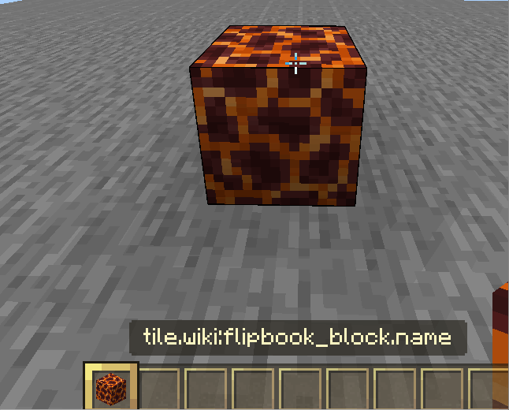
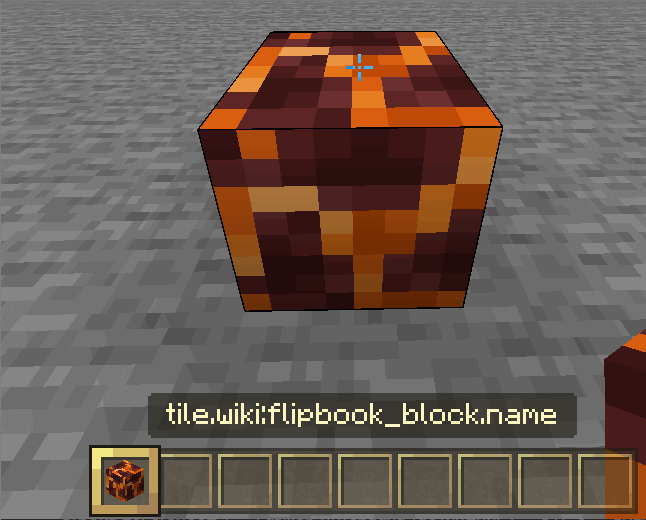

通过本页面，你将学习：

- 如何将翻书纹理应用于方块。
- 在 `RP/textures/flipbook_textures.json` 中可以应用哪些值以及它们的作用。

## 应用翻书纹理

翻书纹理是动画纹理。像火、水、岩浆和熔岩等方块使用它们。你也可以为你的方块使用动画纹理！
第一次让我们使用岩浆的动画纹理。
你只需将岩浆的动画纹理应用于你的方块，通过将 `texture` 值更改为在 `Vanilla RP/textures/terrain_texture.json` 中定义的值：

```json
"magma": {
    "textures": "textures/blocks/magma"
}
```

<CodeHeader>BP/blocks/flipbook_block.json</CodeHeader>

```json
{
    "format_version": "1.21.40",
    "minecraft:block": {
        "description": {
            "identifier": "wiki:flipbook_block",
            "menu_category": {
                "category": "construction"
            }
        },
        "components": {
            "minecraft:geometry": "minecraft:geometry.full_block",
            "minecraft:material_instances": {
                "*": {
                    "texture": "magma" // 在这里添加。
                }
            }
        }
    }
}
```



现在它有了动画纹理！

## 定义翻书纹理

在让方块拥有动画纹理后，是时候弄清楚它是如何工作的了。

1. Minecraft 获取在 `terrain_texture.json` 中定义的纹理名称和路径。

<CodeHeader>RP/textures/terrain_texture.json</CodeHeader>

```json
{
    "texture_name": "atlas.terrain",
    "resource_pack_name": "wiki", // 你的资源包的 ID
    "padding": 8, // 防止纹理在视觉上溢出
    "num_mip_levels": 4, // 从远处或角度查看时的纹理质量
    "texture_data": {
        "magma": {
            "textures": "textures/blocks/magma"
        }
    }
}
```

2. Minecraft 在 `flipbook_textures.json` 中查找该名称（`magma`）的动画参数。

<CodeHeader>RP/textures/flipbook_textures.json</CodeHeader>

```json
[
    {
        "atlas_tile": "magma",
        "flipbook_texture": "textures/blocks/magma",
        "ticks_per_frame": 10
    }
]
```

这里的 `"atlas_tile"` 为在 terrain_texture 文件中定义的 `magma` 名称添加了动画参数。

3. Minecraft 使用此动画纹理为那些将 `magma` 作为纹理的方块。

## 翻书纹理参数

在查看原版翻书纹理文件时，你可能会注意到一些额外的参数：

| 组件               | 类型             | 描述                                                                                                   |
| ------------------ | ---------------- | ------------------------------------------------------------------------------------------------------ |
| flipbook_texture    | 字符串           | 纹理路径。                                                                                             |
| atlas_tile          | 字符串           | 在 terrain_textures.json 中定义的短名称。                                                            |
| atlas_index         | 整数             | 在该短名称定义内的纹理数组索引。                                                                      |
| atlas_tile_variant  | 整数             | 在短名称的方块变体内的方块纹理数组的变体。                                                            |
| ticks_per_frame     | 整数             | 帧更换的速度。20 个刻度 = 1 秒。                                                                       |
| frames              | 数组或整数      | 每帧使用的帧索引列表，或要依次重复的总帧数。                                                         |
| replicate           | 整数             | 设置像素的大小。默认值：1。                                                                           |
| blend_frames        | 布尔值          | 定义帧之间的过渡是否平滑。默认值：true。                                                               |

### `atlas_index`

一个组件，你将在其中定义要动画的方块纹理索引。

<CodeHeader>RP/textures/terrain_texture.json#texture_data</CodeHeader>

```json
"dirt": {
    "textures": [
        "textures/blocks/dirt",
        "textures/blocks/coarse_dirt" // 假设这是你想要动画的路径
    ]
}
```

由于路径 2 有动画纹理，因此你将在泥土方块的翻书纹理上放置 `"atlas_index": 1`。

### `atlas_tile_variant`

一个组件，你将在其中定义要动画的方块变体（已注册到 `variations` 数组中）。

<CodeHeader>RP/textures/terrain_texture.json#texture_data</CodeHeader>

```json
"dirt": {
    "textures": [
        {
            "variations": [
                { "path": "textures/blocks/dirt_va" }, // 假设这是你想要动画的方块变体
                { "path": "textures/blocks/dirt0" },
                { "path": "textures/blocks/dirt1" }
            ]
        }
    ]
}
```

现在假设我们想要路径 1 动画，那么你需要在泥土方块的翻书纹理上放置 `"atlas_tile_variant": 1`。

### `replicate`

更改所用纹理的大小。只能取 2 的倍数。如果帧的像素较少，则会扩展它们。

| `replicate` 值     | 作用                                      |
| ----------------- | ----------------------------------------- |
| < 0               | 中断动画                                  |
| 0                 | 中断动画和纹理                            |
| 2                 | 渲染帧的 1 / 4 像素                      |
| x                 | 渲染帧的 1 / x<sup>2</sup> 像素          |

## 结果



现在你可以修改原版翻书纹理或创建自己的纹理！