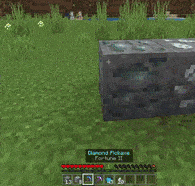

/// tip | 格式版本 `1.21.40`
本教程假设你对方块有基本的了解。
在开始之前，请查看[方块指南](../blocks/blocks-intro.md)。
///

本教程旨在展示一种创建自定义矿石方块及其战利品表的新方法。`minecraft:loot`组件将运行指定的战利品表，无论使用何种工具，但通过在战利品表中添加`match_tool`条件，你可以指定每个掉落池所需的工具。

此外，通过使用脚本和自定义组件，我们可以创建原版矿石在使用正确工具破坏方块时提供的经验球奖励。

-   特性：

    -   可以使用任何给定物品进行挖掘（本教程以铁镐为例）
    -   可以指定物品上的附魔
    -   还会掉落经验奖励

-   问题：

    -   所有物品必须单独指定
    -   非玩家破坏方块的方法（爆炸、命令等）将无法掉落物品

## 战利品表

在下面的示例中，你可以看到如何使用`match_tool`条件来测试`minecraft:iron_pickaxe`：

```json title="BP/loot_tables/blocks/silver_ore.json"
{
    "pools": [
        {
            "rolls": 1,
            "conditions": [
                {
                    "condition": "match_tool",
                    "item": "minecraft:iron_pickaxe",
                    "count": 1
                }
            ],
            "entries": [
                {
                    "type": "item",
                    "name": "wiki:raw_silver"
                }
            ]
        }
    ]
}
```

### 指定附魔

如果需要，你可以将附魔部分添加到条件中，但请记住，每种工具和等级必须作为单独的池列出。

还要注意，它只能正确检测第1和第2级附魔。

```json title="BP/loot_tables/blocks/silver_ore.json > pools"
"conditions": [
  {
    "condition": "match_tool",
    "item": "minecraft:iron_pickaxe",
    "count": 1,
    "enchantments": [
      {
        "fortune": {
          "level": 1
        }
      }
    ]
  }
]
```

## XP奖励脚本

要在矿石方块被破坏时生成经验球，可以使用自定义组件。在这里，我们使用[onPlayerDestroy](../blocks/block-events.md#player-destroy)事件钩子。如果你不希望方块生成经验球，可以忽略此步骤。

与战利品表类似，我们检查玩家手中的物品，然后在方块的位置生成随机数量的经验球。

```js title="BP/scripts/silver_ore.js"
import { world, EquipmentSlot } from "@minecraft/server";

/**
 * @param {number} min 最小整数
 * @param {number} max 最大整数
 * @returns {number} 在`min`和`max`参数之间的随机整数（包含）
 * */
const randomInt = (min, max) => Math.floor(Math.random() * (max - min + 1)) + min;

// 在世界加载之前注册自定义组件
world.beforeEvents.worldInitialize.subscribe(({ blockComponentRegistry }) => {
    blockComponentRegistry.registerCustomComponent("wiki:silver_ore_xp_reward", {
        onPlayerDestroy({ block, dimension, player }) {
            // 检查玩家手中的工具
            const equippable = player?.getComponent("minecraft:equippable");
            if (!equippable) return; // 如果玩家或其装备未定义则退出

            const itemStack = equippable.getEquipment(EquipmentSlot.Mainhand);
            if (itemStack?.typeId !== "minecraft:iron_pickaxe") return; // 如果玩家没有持有铁镐则退出

            // 指定附魔
            const enchantable = itemStack.getComponent("minecraft:enchantable");
            const silkTouch = enchantable?.getEnchantment("silk_touch");
            if (silkTouch) return; // 如果铁镐有丝触附魔则退出

            // 生成经验球
            const xpAmount = randomInt(0, 3); // 生成的经验球数量

            for (let i = 0; i < xpAmount; i++) {
                dimension.spawnEntity("minecraft:xp_orb", block.location);
            }
        },
    });
});
```

## 方块JSON

以下方块行为可以作为模板使用。不要忘记使用`terrain_texture.json`设置方块的纹理。

在这里，你需要做两件事：

-   使用`minecraft:loot`组件指向新的战利品表。
-   将我们的经验奖励自定义组件添加到`minecraft:custom_components`数组中。

```json title="BP/blocks/silver_ore.json"
{
    "format_version": "1.21.40",
    "minecraft:block": {
        "description": {
            "identifier": "wiki:silver_ore",
            "menu_category": {
                "category": "nature",
                "group": "itemGroup.name.ore"
            }
        },
        "components": {
            "minecraft:loot": "loot_tables/blocks/silver_ore.json", // 如果使用丝触则不会掉落。
            "minecraft:custom_components": ["wiki:silver_ore_xp_reward"]
        }
    }
}
```

## 结果

