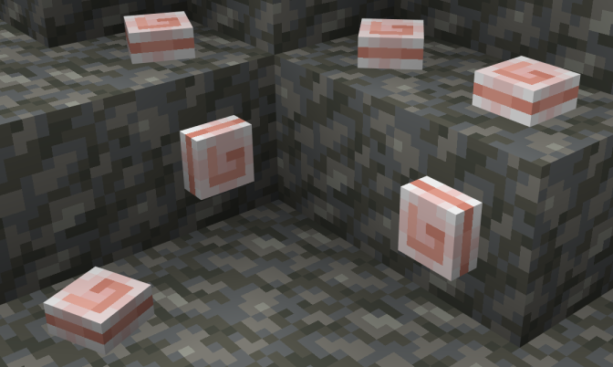
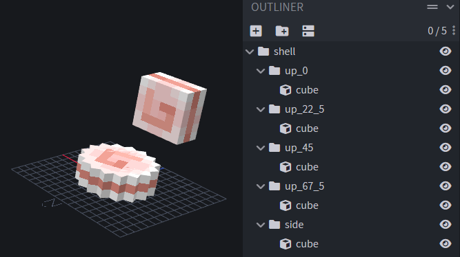
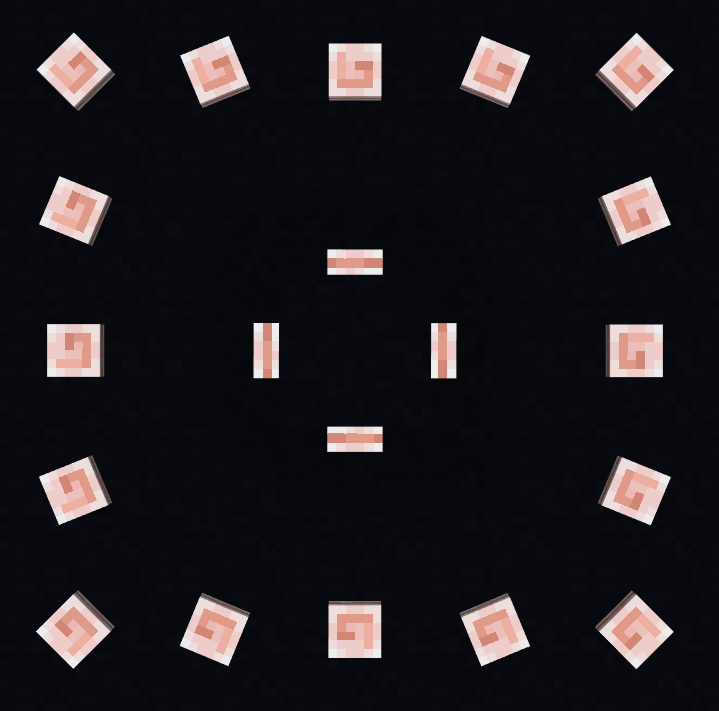

::: tip 格式与最小引擎版本 `1.21.40`
本教程假设你对方块和脚本编写有高级理解。
在开始之前，请先查看[方块指南](../blocks/blocks-intro.md)。
:::

本教程将指导你制作具有子基数旋转的方块（例如苦力怕头颅和标志），并提供具有此旋转类型的“壳”方块示例。

_寻找常规旋转？请[点击这里](../blocks/rotatable-blocks.md)了解更多！_



特点：

- 能放置在方块顶部，具有16种可能的旋转
- 能放置在方块的侧面（北、东、南和西）
- 旋转行为与原版生物头颅相同——无需块实体带来的性能损耗！

## 方块模型

为了实现更精确的旋转，你的方块模型需要一些额外的骨骼。

精确地面旋转需要4个骨骼，每个骨骼具有不同的Y轴旋转：

- `up_0`（Y旋转 = 0）
- `up_22_5`（Y旋转 = 22.5）
- `up_45`（Y旋转 = 45）
- `up_67_5`（Y旋转 = 67.5）

**这些旋转是顺时针方向。**

这些骨骼可能是彼此的复制品，除了旋转变化。

:::tip
保持骨骼的旋转点设置为 `[0, 0, 0]`，以便围绕方块的中心旋转。
:::

此外，还需要一个 `side` 骨骼用于放置在侧面。

以下是“壳”方块模型的参考：



<Spoiler title="壳方块示例模型">

<CodeHeader>RP/models/blocks/shell.geo.json</CodeHeader>

```json
{
    "format_version": "1.21.40",
    "minecraft:geometry": [
        {
            "description": {
                "identifier": "geometry.shell",
                "texture_width": 16,
                "texture_height": 16
            },
            "bones": [
                {
                    "name": "shell",
                    "pivot": [0, 0, 0]
                },
                {
                    "name": "up_0",
                    "parent": "shell",
                    "pivot": [0, 0, 0],
                    "cubes": [
                        {
                            "origin": [-3, 0, -3],
                            "size": [6, 3, 6],
                            "uv": {
                                "north": { "uv": [0, 6], "uv_size": [6, 3] },
                                "east": { "uv": [0, 6], "uv_size": [6, 3] },
                                "south": { "uv": [0, 6], "uv_size": [6, 3] },
                                "west": { "uv": [0, 6], "uv_size": [6, 3] },
                                "up": { "uv": [6, 6], "uv_size": [-6, -6] },
                                "down": { "uv": [6, 6], "uv_size": [-6, -6] }
                            }
                        }
                    ]
                },
                {
                    "name": "up_22_5",
                    "parent": "shell",
                    "pivot": [0, 0, 0],
                    "rotation": [0, 22.5, 0],
                    "cubes": [
                        {
                            "origin": [-3, 0, -3],
                            "size": [6, 3, 6],
                            "uv": {
                                "north": { "uv": [0, 6], "uv_size": [6, 3] },
                                "east": { "uv": [0, 6], "uv_size": [6, 3] },
                                "south": { "uv": [0, 6], "uv_size": [6, 3] },
                                "west": { "uv": [0, 6], "uv_size": [6, 3] },
                                "up": { "uv": [6, 6], "uv_size": [-6, -6] },
                                "down": { "uv": [6, 6], "uv_size": [-6, -6] }
                            }
                        }
                    ]
                },
                {
                    "name": "up_45",
                    "parent": "shell",
                    "pivot": [0, 0, 0],
                    "rotation": [0, 45, 0],
                    "cubes": [
                        {
                            "origin": [-3, 0, -3],
                            "size": [6, 3, 6],
                            "uv": {
                                "north": { "uv": [0, 6], "uv_size": [6, 3] },
                                "east": { "uv": [0, 6], "uv_size": [6, 3] },
                                "south": { "uv": [0, 6], "uv_size": [6, 3] },
                                "west": { "uv": [0, 6], "uv_size": [6, 3] },
                                "up": { "uv": [6, 6], "uv_size": [-6, -6] },
                                "down": { "uv": [6, 6], "uv_size": [-6, -6] }
                            }
                        }
                    ]
                },
                {
                    "name": "up_67_5",
                    "parent": "shell",
                    "pivot": [0, 0, 0],
                    "rotation": [0, 67.5, 0],
                    "cubes": [
                        {
                            "origin": [-3, 0, -3],
                            "size": [6, 3, 6],
                            "uv": {
                                "north": { "uv": [0, 6], "uv_size": [6, 3] },
                                "east": { "uv": [0, 6], "uv_size": [6, 3] },
                                "south": { "uv": [0, 6], "uv_size": [6, 3] },
                                "west": { "uv": [0, 6], "uv_size": [6, 3] },
                                "up": { "uv": [6, 6], "uv_size": [-6, -6] },
                                "down": { "uv": [6, 6], "uv_size": [-6, -6] }
                            }
                        }
                    ]
                },
                {
                    "name": "side",
                    "parent": "shell",
                    "pivot": [0, 5, 8],
                    "rotation": [90, 0, 0],
                    "cubes": [
                        {
                            "origin": [-3, 5, 8],
                            "size": [6, 3, 6],
                            "uv": {
                                "north": { "uv": [0, 6], "uv_size": [6, 3] },
                                "east": { "uv": [0, 6], "uv_size": [6, 3] },
                                "south": { "uv": [0, 6], "uv_size": [6, 3] },
                                "west": { "uv": [0, 6], "uv_size": [6, 3] },
                                "up": { "uv": [6, 6], "uv_size": [-6, -6] },
                                "down": { "uv": [6, 6], "uv_size": [-6, -6] }
                            }
                        }
                    ]
                }
            ]
        }
    ]
}
```

</Spoiler>

## 初始方块 JSON

以下是我们将添加高级旋转的基础“壳”方块。

<CodeHeader>BP/blocks/shell.json</CodeHeader>

```json
{
    "format_version": "1.21.40",
    "minecraft:block": {
        "description": {
            "identifier": "wiki:shell",
            "menu_category": {
                "category": "nature"
            }
        },
        "components": {
            // `up` 面的碰撞/选择框
            "minecraft:collision_box": {
                "origin": [-3, 0, -3],
                "size": [6, 3, 6]
            },
            "minecraft:selection_box": {
                "origin": [-3, 0, -3],
                "size": [6, 3, 6]
            },
            "minecraft:material_instances": {
                "*": {
                    "texture": "shell" // 在 `RP/textures/terrain_texture.json` 中定义的简称
                }
            },
            // 防止方块放置在 `down` 面
            "minecraft:placement_filter": {
                "conditions": [
                    {
                        "allowed_faces": ["up", "side"]
                    }
                ]
            }
        }
    }
}
```

## 方块状态

对于类似头颅的旋转，你需要为你的方块添加2个状态：

<CodeHeader>minecraft:block</CodeHeader>

```json
"description": {
  ...
  "traits": {
    // 方块放置的面 - 默认是 `down`（无法通过放置访问）
    "minecraft:placement_position": {
      "enabled_states": ["minecraft:block_face"]
    }
  },
  "states": {
    // 放置在 `up` 面时方块的精确旋转
    "wiki:rotation": {
      "values": { "min": 0, "max": 15 } // 定义更大整数范围的替代状态值格式
    }
  }
}
```

## 初始脚本

在开始编写脚本之前，请确保你已通过将其导入到入口文件中将其链接到你的包清单。

<CodeHeader>BP/scripts/main.js</CodeHeader>

```js
import "./shell.js";
```

现在，在我们的 `shell.js` 文件中，我们需要从 [`@minecraft/server`](https://learn.microsoft.com/minecraft/creator/scriptapi/minecraft/server/minecraft-server) 导入 `world` 对象：

<CodeHeader>BP/scripts/shell.js</CodeHeader>

```js
import { world } from "@minecraft/server";
```

## 旋转计算

与其手动为每个 `wiki:rotation` 值输入边界，不如使用一些除法和舍入来返回所需的值！

将以下函数添加到你的脚本中：

<CodeHeader>BP/scripts/shell.js</CodeHeader>

```js
/** @param {number} playerYRotation */
function getPreciseRotation(playerYRotation) {
    // 将玩家的头部 Y 旋转转换为正值
    if (playerYRotation < 0) playerYRotation += 360;
    // 头部旋转的360的16分之几？ - 四舍五入
    const rotation = Math.round(playerYRotation / 22.5);

    // 0和16表示重复旋转（0度和360度），如果 `rotation` 的值为16，则返回0
    return rotation !== 16 ? rotation : 0;
}
```

## 设置旋转

现在是时候使用此函数设置你添加的方块状态了！

我们将通过使用[自定义组件](../blocks/block-events.md)和更具体地说，[beforeOnPlayerPlace](../blocks/block-events.md#before-player-place)钩子，在方块放置之前更新我们的方块状态。这意味着在我们的事件处理程序中，我们可以访问玩家的旋转。

将以下内容添加到你的脚本中以注册自定义 `wiki:shell_rotation` 组件：

:::tip
请为自定义组件标识符选择一个唯一的名称。不同包之间不能有重复的自定义组件！
:::

<CodeHeader>BP/scripts/shell.js</CodeHeader>

```js
/** @type {import("@minecraft/server").BlockCustomComponent} */
const ShellRotationBlockComponent = {
    beforeOnPlayerPlace(event) {
        const { player } = event;
        if (!player) return; // 如果玩家未定义，则退出

        const blockFace = event.permutationToPlace.getState("minecraft:block_face");
        if (blockFace !== "up") return; // 如果方块未放置在另一个方块的顶部，则退出

        // 使用前面的函数获取旋转值
        const playerYRotation = player.getRotation().y;
        const rotation = getPreciseRotation(playerYRotation);

        // 告诉Minecraft使用正确的 `wiki:rotation` 值放置方块
        event.permutationToPlace = event.permutationToPlace.withState("wiki:rotation", rotation);
    },
};

world.beforeEvents.worldInitialize.subscribe(({ blockComponentRegistry }) => {
    blockComponentRegistry.registerCustomComponent(
        "wiki:shell_rotation",
        ShellRotationBlockComponent
    );
});
```

现在，你可以将此自定义组件应用于你的方块！

<CodeHeader>minecraft:block</CodeHeader>

```json
"components": {
  ...
  "minecraft:custom_components": ["wiki:shell_rotation"]
}
```

## 旋转排列

然后，使用[排列](../blocks/block-permutations.md)来定义基础基数旋转，这将通过我们模型中的精确骨骼进行扩展。

将以下排列插入到你的方块 JSON 中（按呈现顺序）：

<CodeHeader>minecraft:block</CodeHeader>

```json
"permutations": [
  {
    "condition": "q.block_property('wiki:rotation') >= 4 || q.block_property('minecraft:block_face') == 'east'",
    "components": {
      "minecraft:transformation": { "rotation": [0, -90, 0] }
    }
  },
  {
    "condition": "q.block_property('wiki:rotation') >= 8 || q.block_property('minecraft:block_face') == 'south'",
    "components": {
      "minecraft:transformation": { "rotation": [0, 180, 0] }
    }
  },
  {
    "condition": "q.block_property('wiki:rotation') >= 12 || q.block_property('minecraft:block_face') == 'west'",
    "components": {
      "minecraft:transformation": { "rotation": [0, 90, 0] }
    }
  }
]
```

## 旋转骨骼可见性

并非模型中的所有骨骼都应该可见，因此我们利用骨骼可见性的 `minecraft:geometry` 属性来确保仅渲染所需的骨骼。之所以需要多个骨骼，是因为 `minecraft:transformation` 仅支持90度的倍数，而精确旋转需要22.5度的步进。

向你的方块添加以下组件：

<CodeHeader>minecraft:block > components</CodeHeader>

```json
"minecraft:geometry": {
  "identifier": "geometry.shell", // 第一步中创建的模型
  "bone_visibility": {
    "up_0": "q.block_property('minecraft:block_face') == 'up' && !math.mod(q.block_property('wiki:rotation'), 4)",
    "up_22_5": "q.block_property('minecraft:block_face') == 'up' && !math.mod(q.block_property('wiki:rotation') - 1, 4)",
    "up_45": "q.block_property('minecraft:block_face') == 'up' && !math.mod(q.block_property('wiki:rotation') - 2, 4)",
    "up_67_5": "q.block_property('minecraft:block_face') == 'up' && !math.mod(q.block_property('wiki:rotation') - 3, 4)",
    "side": "q.block_property('minecraft:block_face') != 'up'"
  }
}
```

## 碰撞/选择框

如果你希望方块在放置在另一个方块的侧面时具有不同的碰撞/选择框，就像我的“壳”方块一样，请添加类似以下排列：

<CodeHeader>minecraft:block > permutations</CodeHeader>

```json
{
    "condition": "q.block_property('minecraft:block_face') != 'up'",
    "components": {
        // 添加你的碰撞/选择框
        "minecraft:collision_box": {
            "origin": [-3, 5, 5],
            "size": [6, 6, 3]
        },
        "minecraft:selection_box": {
            "origin": [-3, 5, 5],
            "size": [6, 6, 3]
        }
    }
}
```

## 最终方块 JSON 和脚本

完成上述步骤后，你的方块 JSON 和脚本文件应类似于以下内容：

<Spoiler title="壳方块示例 JSON">

<CodeHeader>BP/blocks/shell.json</CodeHeader>

```json
{
    "format_version": "1.21.40",
    "minecraft:block": {
        "description": {
            "identifier": "wiki:shell",
            "menu_category": {
                "category": "nature"
            },
            "traits": {
                "minecraft:placement_position": {
                    "enabled_states": ["minecraft:block_face"]
                }
            },
            "states": {
                "wiki:rotation": {
                    "values": { "min": 0, "max": 15 }
                }
            }
        },
        "components": {
            "minecraft:collision_box": {
                "origin": [-3, 0, -3],
                "size": [6, 3, 6]
            },
            "minecraft:selection_box": {
                "origin": [-3, 0, -3],
                "size": [6, 3, 6]
            },
            "minecraft:geometry": {
                "identifier": "geometry.shell",
                "bone_visibility": {
                    "up_0": "q.block_state('minecraft:block_face') == 'up' && !math.mod(q.block_state('wiki:rotation'), 4)",
                    "up_22_5": "q.block_state('minecraft:block_face') == 'up' && !math.mod(q.block_state('wiki:rotation') - 1, 4)",
                    "up_45": "q.block_state('minecraft:block_face') == 'up' && !math.mod(q.block_state('wiki:rotation') - 2, 4)",
                    "up_67_5": "q.block_state('minecraft:block_face') == 'up' && !math.mod(q.block_state('wiki:rotation') - 3, 4)",
                    "side": "q.block_state('minecraft:block_face') != 'up'"
                }
            },
            "minecraft:material_instances": {
                "*": {
                    "texture": "shell"
                }
            },
            "minecraft:placement_filter": {
                "conditions": [
                    {
                        "allowed_faces": ["up", "side"]
                    }
                ]
            },
            "minecraft:custom_components": ["wiki:shell_rotation"]
        },
        "permutations": [
            {
                "condition": "q.block_state('wiki:rotation') >= 4 || q.block_state('minecraft:block_face') == 'east'",
                "components": {
                    "minecraft:transformation": { "rotation": [0, -90, 0] }
                }
            },
            {
                "condition": "q.block_state('wiki:rotation') >= 8 || q.block_state('minecraft:block_face') == 'south'",
                "components": {
                    "minecraft:transformation": { "rotation": [0, 180, 0] }
                }
            },
            {
                "condition": "q.block_state('wiki:rotation') >= 12 || q.block_state('minecraft:block_face') == 'west'",
                "components": {
                    "minecraft:transformation": { "rotation": [0, 90, 0] }
                }
            },
            {
                "condition": "q.block_state('minecraft:block_face') != 'up'",
                "components": {
                    "minecraft:collision_box": {
                        "origin": [-3, 5, 5],
                        "size": [6, 6, 3]
                    },
                    "minecraft:selection_box": {
                        "origin": [-3, 5, 5],
                        "size": [6, 6, 3]
                    }
                }
            }
        ]
    }
}
```

</Spoiler>

<Spoiler title="壳方块示例脚本">

<CodeHeader>BP/scripts/shell.js</CodeHeader>

```js
import { world } from "@minecraft/server";

/** @param {number} playerYRotation */
function getPreciseRotation(playerYRotation) {
    if (playerYRotation < 0) playerYRotation += 360;
    const rotation = Math.round(playerYRotation / 22.5);

    return rotation !== 16 ? rotation : 0;
}

/** @type {import("@minecraft/server").BlockCustomComponent} */
const ShellRotationBlockComponent = {
    beforeOnPlayerPlace(event) {
        const { player } = event;
        if (!player) return;

        const blockFace = event.permutationToPlace.getState("minecraft:block_face");
        if (blockFace !== "up") return;

        const playerYRotation = player.getRotation().y;
        const rotation = getPreciseRotation(playerYRotation);

        event.permutationToPlace = event.permutationToPlace.withState("wiki:rotation", rotation);
    },
};

world.beforeEvents.worldInitialize.subscribe(({ blockComponentRegistry }) => {
    blockComponentRegistry.registerCustomComponent(
        "wiki:shell_rotation",
        ShellRotationBlockComponent
    );
});
```

</Spoiler>

## 结果

你已经创建了：

- [x] 支持精确旋转的方块模型
- [x] 具有16个支持旋转值的方块，允许在5个方块面上放置（总共20种方向）
- [x] 可用于设置此旋转状态的自定义方块组件

---



## 下载示例包

根据本教程制作的模板包，将一个“壳”方块添加到`自然`标签中。

<Button link="https://github.com/Bedrock-OSS/wiki-addon/releases/download/download/precise_rotation.mcaddon">
    下载 MCADDON
</Button>