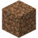
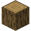
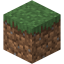

:::tip
本页面包含有关 _块_ 的故障排除信息。在继续之前，请阅读我们的 [全局故障排除](../guide/troubleshooting.md) 文档。
:::

## 0.0 - 问题

> “我跟随了一个教程或尝试自己制作块，但出现了问题！”

不必惊慌！本页面将帮助您调试常见问题。

## 1.0 - 纹理故障排除

修复与块纹理相关的问题。

## 1.1 - 纹理为黑色和品红色

我将审查三种不同类型的块，它们具有不同的布局：类似泥土的 、类似木头的 、类似草的 

导航到您的 `RP/textures/terrain_texture.json`。确保文件命名正确。

<CodeHeader>RP/textures/terrain_texture.json</CodeHeader>

```json
{
    "texture_name": "atlas.terrain",
    "resource_pack_name": "wiki",
    "padding": 8,
    "num_mip_levels": 4,
    "texture_data": {
        "dirt_like": {
            "textures": "textures/blocks/dirt_like" // 您可以将其替换为任何内容，只需记住名称
        },
        "log_like_top": {
            "textures": "textures/blocks/log_like_top" // 您可以将其替换为任何内容，只需记住名称
        },
        "log_like_side": {
            "textures": "textures/blocks/log_like_side" // 您可以将其替换为任何内容，只需记住名称
        },
        "custom_grass_top": {
            "textures": "textures/blocks/custom_grass_top" // 您可以将其替换为任何内容，只需记住名称
        },
        "custom_grass_bottom": {
            "textures": "textures/blocks/custom_grass_bottom" // 您可以将其替换为任何内容，只需记住名称
        },
        "custom_grass_side": {
            "textures": "textures/blocks/custom_grass_side" // 您可以将其替换为任何内容，只需记住名称
        }
    }
}
```

接下来，导航到您的块文件。在您的块文件中，确保您有 `material_instances` 组件。

类似泥土的块示例：

<CodeHeader>BP/blocks/dirt_like.json</CodeHeader>

```json
{
    "format_version": "1.21.40",
    "minecraft:block": {
        "description": {
            "identifier": "wiki:dirt_like"
        },
        "components": {
            "minecraft:material_instances": {
                "*": {
                    "texture": "dirt_like"
                }
            }
        }
    }
}
```

类似木头的块示例：

<CodeHeader>BP/blocks/log_like.json</CodeHeader>

```json
{
    "format_version": "1.21.40",
    "minecraft:block": {
        "description": {
            "identifier": "wiki:log_like"
        },
        "components": {
            "minecraft:material_instances": {
                "*": {
                    "texture": "log_like_side"
                },
                "end": {
                    "texture": "log_like_top"
                },
                "up": "end",
                "down": "end"
            }
        }
    }
}
```

类似草的块示例：

<CodeHeader>BP/blocks/custom_grass.json</CodeHeader>

```json
{
    "format_version": "1.21.40",
    "minecraft:block": {
        "description": {
            "identifier": "wiki:custom_grass"
        },
        "components": {
            "minecraft:material_instances": {
                "*": {
                    "texture": "custom_grass_side"
                },
                "up": {
                    "texture": "custom_grass_top"
                },
                "down": {
                    "texture": "custom_grass_bottom"
                }
            }
        }
    }
}
```

如果您正确遵循了这些步骤，您的块现在应该具有正确的纹理。

## 1.2 - 泥土上显示“?”

问题：我的自定义块变成了一个带问号的泥土块。

<WikiImage
    src="../assets/images/blocks/block_tr/unknown.png"
    pixelated="true"
    width="128"
    class="my-4"
/>

这是一个 `unknown` 块，当块标识符被更改或您的块 JSON 无效时会出现。

解决方案：使用 JSON 校验工具，仔细检查您的标识符是否更改。确保您的块具有 `minecraft:geometry` 和 `minecraft:material_instances`，或者在 `RP/blocks.json` 中有纹理条目。

---

## 2.0 - 渲染故障排除

本节将描述常见的块渲染问题及其解决方法。

## 2.1 - 透明度无效

问题：您的纹理文件中有透明像素，但在游戏中应用时，它们变得不透明。

解决方案：导航到您的块文件。导航到您的 `material_instances` 组件。将以下内容添加到您的组件中：

<CodeHeader>BP/blocks/your_block.json</CodeHeader>

```json
{
  "format_version": "1.21.40",
  "minecraft:block": {
    ...
    "components": {
      "minecraft:material_instances": {
        "*": {
          "render_method": "alpha_test"
        }
      }
    }
  }
}
```

## 2.2 - 块产生阴影

问题：您有一个自定义几何体的块，但它有阴影。

解决方案：将以下组件添加到您的块代码中：

<CodeHeader>minecraft:block > components</CodeHeader>

```json
"minecraft:light_dampening": 0
```

## 3.0 - 常见内容日志错误

本节将描述常见内容日志错误及其调试方法。

## 3.1 - 碰撞/选择框错误

问题：您收到类似于以下内容的内容错误：

> `[Blocks][error]-minecraft:collision_box: min can't be below (-8, 0, -8) and max can't be more than (8, 16, 8)`

解决方案：检查您的 `minecraft:collision_box` 或 `minecraft:selection_box` 组件，并执行以下操作：

-   确保 X 和 Z 值在范围 `-8` - `8` 之间。
-   确保 Y 值在范围 `0` - `16` 之间。
-   确保框不会超出块的 16&times;16&times;16 单位区域。

## 3.2 - 模型错误

问题：您收到类似于以下内容的内容错误：

> `geometry.your_block contains X boxes outside...`

解决方案：您的几何体超出了 Minecraft 块的允许范围。您可以将几何体缩小或将其拆分为多个块。

---

## 现在怎么办？

如果在尝试这些步骤后仍然有问题，请随时加入 Discord 服务器并在那儿提问。

如果您认为任何信息不正确或过时，请通过 GitHub 进行贡献！