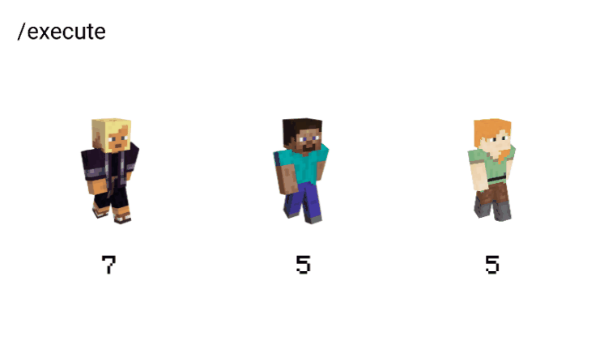

## 介绍

[来源于 Bedrock Commands 社区 Discord](https://discord.gg/SYstTYx5G5)

在本指南中，你将学习如何测试匹配分数的目标/具有最高或最低分数的目标。

## 获取最高分数 ( > )

**命令：**

```yaml title="BP/functions/scoreboards/player/get_highest_score.mcfunction"
## 获取最高分数
scoreboard players operation Highest <objective> > * <objective>

## 你的命令在这里（示例）
execute as <target> if score @s <objective> = Highest <objective> run <command>
```


**命令 1：** 此命令将 `Highest` 分数与指定目标中的每个其他跟踪分数进行比较，如果 `Highest` 分数小于正在比较的分数，则将 `Highest` 分数赋值为该分数。举例说明：

|  #  | 玩家 | 目标: `kills` | 与 `Highest` 的比较 | 比较后的 `Highest` |
| :-: | :----: | :----------------: | :-----------------------: | :------------------------: |
|  1  |  Alex  |         10         |     `Highest > Alex`      |       `Highest = 10`       |
|  2  |  Kai   |         5          |      `Highest > Kai`      |       `Highest = 10`       |
|  3  | Steve  |         20         |     `Highest > Alex`      |       `Highest = 20`       |

_在比较玩家 2 之后，`Highest` 分数与玩家 1 的比较没有变化（因为 10 已经大于 5）。_

:::info 注意：

通配符 (`*`) 与所有跟踪分数进行比较——包括离线玩家。要仅与在线玩家或实体进行比较，请使用 `@a` 或 `@e`。

:::

**命令 2：** 此命令可以修改或扩展。如果 `<target>` 的分数等于 `Highest` 分数，则允许你运行所需的命令。

-   注意：如果你希望将选择限制为仅一个，请使用 `@p` 或 `@e [c=1]` 替代 `<target>`。

**示例：**

```yaml title="BP/functions/scoreboards/player/get_highest_score/kills.mcfunction"
## 获取最高分数
scoreboard players operation Highest kills > * kills

## 给杀敌最多的玩家打标签
tag @a remove topKills
execute as @a if score @s kills = Highest kills run tag @s add topKills
```


## 获取最低分数 ( < )

**命令：**

```yaml title="BP/functions/scoreboards/player/get_lowest_score.mcfunction"
## 获取最低分数
scoreboard players operation Lowest <objective> < * <objective>

## 你的命令在这里
execute as <target> if score @s <objective> = Lowest <objective> run <command>
```


**命令 1：** 此命令将 `Lowest` 分数与指定目标中的每个其他跟踪分数进行比较，如果 `Lowest` 分数大于正在比较的分数，则将 `Lowest` 分数赋值为该分数。举例说明：

|  #  | 玩家 | 目标: `blocks_travelled` | 与 `Lowest` 的比较 | 比较后的 `Lowest` |
| :-: | :----: | :---------------------------: | :----------------------: | :-----------------------: |
|  1  |  Alex  |              100              |     `Lowest < Alex`      |      `Lowest = 100`       |
|  2  |  Kai   |              50               |      `Lowest < Kai`      |       `Lowest = 50`       |
|  3  | Steve  |              200              |     `Lowest < Alex`      |       `Lowest = 50`       |

_在比较玩家 3 之后，`Lowest` 分数与玩家 2 的比较没有变化（因为 50 已经小于 200）。_

:::info 注意：

通配符 (`*`) 与所有跟踪分数进行比较——包括离线玩家。要仅与在线玩家或实体进行比较，请使用 `@a` 或 `@e`。

:::

**命令 2：** 此命令可以修改或扩展。如果 `<target>` 的分数等于 `Lowest` 分数，则允许你运行所需的命令。

-   注意：如果你希望将选择限制为仅一个，请使用 `@p` 或 `@e [c=1]` 替代 `<target>`。

**示例：**

<CodeHeader>
    BP/functions/scoreboards/player/get_lowest_score/distance_travelled.mcfunction
</CodeHeader>

```yaml
## 获取最低分数
scoreboard players operation Lowest distance_travelled < * distance_travelled

## 给行驶距离最短的玩家打标签
tag @a remove eliminate
execute as @a if score @s distance_travelled = Lowest distance_travelled run tag @s add eliminate
```


## 获取匹配分数 ( = )

此命令将执行目标的分数与其他选定目标的分数进行比较。它会对每个具有匹配分数的目标运行指定的命令。

**命令：**

```yaml title="BP/functions/scoreboards/player/get_matching_score.mcfunction"
execute as @a at @s at @a [rm=0.01] if score @s <objective> = @p <objective> run say @s 和 @p 的分数匹配！
```


:::info 注意：

在 `<command>` 中（以 `/say` 为例），`@s` 指的是执行实体或玩家（目标），而 `@p` 或 `@e [c=1]` 指的是正在比较的实体或玩家。
:::

**可视化：**



**示例 1：** 如果距离超过 6 个区块，则将宠物传送到主人：

```yaml title="BP/functions/scoreboards/player/get_matching_score/pet.mcfunction"
## 传送到主人
execute as @e [tag=pet] at @s at @a [rm=7] if score @s id = @p id run tp @s @p
```


**示例 2：** 将地块拥有者设置为创造模式，其他人设置为冒险模式：

```yaml title="BP/functions/scoreboards/player/get_matching_score/plot.mcfunction"
## 将拥有者设置为创造模式
execute as @e [tag=plot] at @s at @a [r=16] if score @s id = @p id run gamemode c @p [m=!c]

## 将非拥有者设置为冒险模式
execute as @e [tag=plot] at @s at @a [r=16] unless score @s id = @p id run gamemode a @p [m=!a]
```

