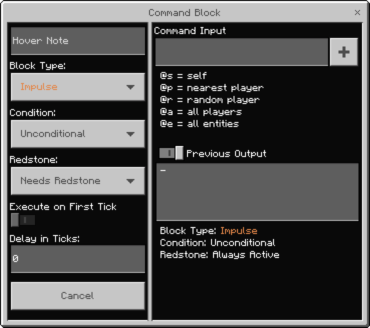
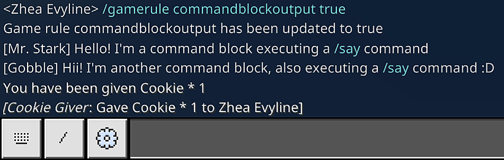
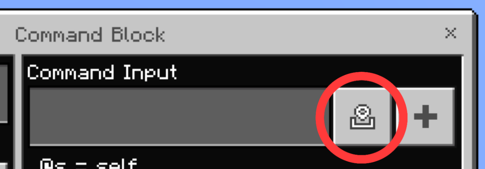
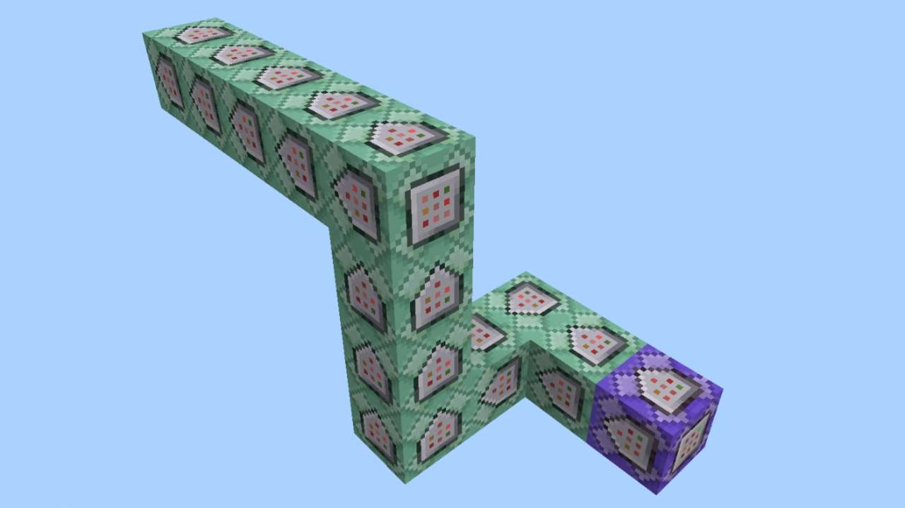
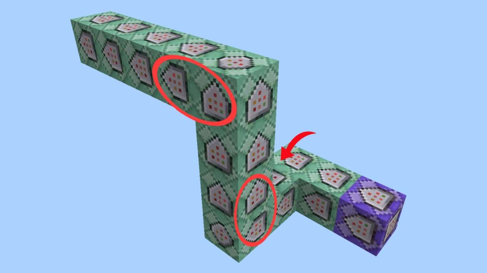

## 简介

[来源于Bedrock Commands社区Discord](https://discord.gg/SYstTYx5G5)

命令方块是Minecraft中的特殊方块。你在聊天中输入的相同命令（作弊）可以通过命令方块自动运行，并且可以重复使用，而无需重新输入。

命令方块只能由具有操作员权限的玩家在创造模式下放置或破坏。

## 获取方法

1. 打开你的世界设置。
2. 在作弊选项下，将“激活作弊”设置为开启。
3. 在聊天中运行 `/give @s command_block`。

## 命令方块用户界面

## 命令方块类型

 **脉冲**每次被激活时运行命令 **一次**。

 **链**按顺序运行命令，即仅在连接的前一个命令方块运行后才会执行。

 **重复**每个游戏刻运行命令。每秒大约有20个刻。可以应用延迟来调整命令执行的频率，具体说明见[下文](../commands/intro-to-command-blocks.md#command-block-tick-delay)。

## 命令方块条件

**条件**命令方块仅在连接的前一个命令方块的输出成功时运行命令。(`true`)

> 条件命令方块的状态通过命令方块箭头纹理的小凹陷显示，如下所示：
>
> -    脉冲条件命令方块
> -    链条件命令方块
> -    重复条件命令方块

**无条件**命令方块无论结果如何都会运行命令。无论连接的前一个命令方块的输出是成功（`true`）还是失败（`false`），命令方块仍会运行命令。

## 命令方块红石状态

**需要红石**命令方块只能通过红石信号激活。可以使用按钮、拉杆、红石火把等。

**始终激活**命令方块将在你关闭命令方块用户界面时立即激活。

## 命令方块刻延迟

在此选项中，你可以指定命令方块运行命令前的延迟时间。

刻是指Minecraft游戏刻。一个 **刻** 只是游戏中时间的度量单位。现实生活中的1秒大约等于Minecraft中的20个游戏刻。

:::tip

:::

## 命令方块悬停备注

此选项允许你在命令方块上方放置悬停文本。它对于在处理多个命令方块链时提供简短名称以便于识别非常有用。

当命令运行时，如果游戏规则 `commandblockoutput` 被启用，悬停备注将与聊天中的输出一起显示。

## 粘贴按钮

粘贴按钮允许你将剪贴板中的命令粘贴到“命令输入”框中。

## 命令方块输出

-   在命令方块用户界面中切换“上一个输出”按钮以查看命令输出和方块详细信息。

-   在命令方块中输入的整个命令前的 `/` 并不是必需的，但这样做不会导致任何错误。

-   红石比较器可以读取命令方块的输出。如果输出成功，它将根据输出强度返回1到15之间的红石信号。

-   你可以通过在聊天中运行命令来检查命令方块的输出是否为 `true`/`false`。红色文本的输出或输出为 `0` 表示语法错误或失败（`false`）输出。白色文本的输出表示命令成功运行。

-   你还可以通过检查操作是否执行来判断命令是否为 `true`/`false`。

### 禁用聊天中的命令消息

在聊天中运行：

-   `/gamerule commandblockoutput false` 禁用聊天中的命令方块消息。
-   `/gamerule sendcommandfeedback false` 禁用聊天中输入命令的反馈。

## 命令方块放置

在为任何系统放置命令方块链（按顺序工作）时，请确保连续的命令方块从前一个命令方块的箭头头部连接/开始。

箭头/朝向可以从命令方块侧面的纹理中观察到。

**✅ 正确放置**

**❌ 错误放置**

## 故障排除命令方块

-   在世界设置中，确保未禁用命令方块。

-   确保游戏规则 `maxcommandchainlength` 未设置为0。

-   确保没有干扰命令方块的多余红石信号。可能来自红石粉、拉杆、红石火把等。

-   尝试在“始终激活”和“需要红石”之间切换。

-   仔细检查方块类型、条件和命令语法。在供电后，再次检查“上一个输出”。

-   与红石一样，命令方块也必须在加载的区块内才能正常工作。你可以使用 tickingarea 来保持它们在玩家不在附近时被加载。有关更多信息，请参考 [/tickingarea](https://learn.microsoft.com/en-us/minecraft/creator/documents/tickingareacommand) 命令文档。

如果仍然无法解决问题，只需破坏并重新放置该命令方块。

## 你所学到的内容

/// tip | 你所学到的内容：

-   如何在游戏中获取命令方块。
-   不同类型的命令方块的行为及其外观。
-   不同的命令方块选项（包括条件、状态和延迟）。
-   命令方块如何通过红石和聊天消息输出数据。
-   如何正确放置命令方块链。
-   如何解决“命令方块无法工作”的问题。

///

为了将你所学到的知识付诸实践，请尝试制作这个简单的 [实体计数器](../commands/entity-counter.md) 系统。

> 在设置命令方块系统时，始终记住第一个命令方块将是  **`无条件始终激活`**，其余命令方块将是  **`无条件始终激活`**。所有设置为0刻延迟，除非另有说明。
>
> 

**（推荐）下一步阅读: [理解选择器](../commands/selectors.md)**