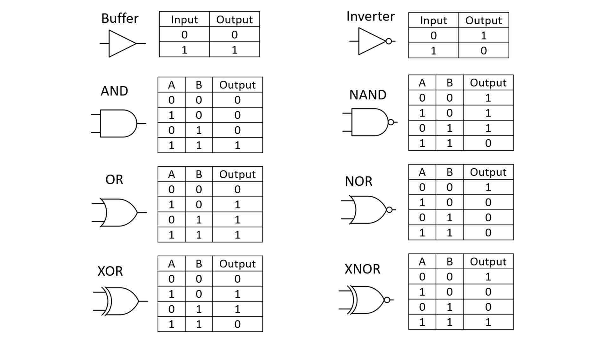

## 介绍

[来源于 Bedrock Commands 社区 Discord](https://discord.gg/SYstTYx5G5)

逻辑门是接收一个或多个二进制输入的设备，顾名思义，它执行逻辑布尔运算以产生一个二进制输出（即 `true` 或 `false`）。

它们是计算机执行任何功能所使用的设备。这些设备在编程中非常有用，使用它们是创建优化命令系统的重要步骤。在本页面中，您将学习如何利用 `/execute` 命令在您的系统中使用任何逻辑门！

## 逻辑门

**图表：**

**转换为命令：**

-   缓冲器：
    -   `/execute if entity @s [tag=red] run <command>`
-   （反相器）NOT 门：
    -   `/execute if entity @s [tag=!red] run <command>`
-   AND 门：
    -   `/execute if entity @s [tag=red, tag=green] run <command>`
-   （NOT AND）NAND 门：
    -   `/execute unless entity @s [tag=red, tag=green] run <command>`
-   OR 门：
    -   `/execute unless entity @s [tag=!red, tag=!green] run <command>`
-   NOR 门：
    -   `/execute if entity @s [tag=!red, tag=!green] run <command>`
-   XOR 门：
    -   `/execute unless entity @s [tag=!red, tag=!green] unless entity @s [tag=red, tag=green] run <command>`
-   XNOR 门：
    -   `/execute unless entity @s [tag=red, tag=!green] unless entity @s [tag=!red, tag=green] run <command>`

## 解释

_由 @Champ0401 提供的解释：_

**AND 门：**

-   `/execute as @p [tag=red, tag=green] run say success`

AND 门至少需要两个输入。在这种情况下，如果玩家满足两个条件（拥有“红色”和“绿色”标签），命令将执行。AND 门是 Minecraft 命令中最常用的门。

**NOT 门：**

-   `/execute as @p [tag=!red] run say success` 或：
-   `/execute as @p unless entity @s [tag=red] run say success`

NOT 门对输入进行反转。在这种情况下，命令仅在玩家没有红色标签时执行。NOT 门在 Minecraft 命令中也非常常用。

**OR 门：**

-   `/execute as @p unless entity @s[tag=!red, tag=!green] run say success`

OR 门接受两个或更多输入。如果玩家满足至少一个条件，命令将执行。在这种情况下，玩家可以拥有红色标签、绿色标签或两者都有。OR 门在 Minecraft 命令中并不自然，但通过添加 `/execute unless`，您可以自己实现。关于 OR 门的工作原理，您可以这样理解：命令在您没有任何标签的情况下执行。这产生的输出表与 OR 门相同。请在游戏中亲自尝试一下！

**XOR 门：**

-   `/execute as @p unless entity @s [tag=!red, tag=!green] unless entity @s [tag=red, tag=green] run say success`

XOR 门接受两个输入。如果玩家恰好满足一个条件，命令将执行。在这种情况下，玩家可以拥有红色标签或绿色标签，但如果他们同时拥有两个标签，命令将不执行。XOR 门在 Minecraft 命令中也并不自然，但这个变通方法将允许您执行该功能。

其余的门只是其他门的反转，您可以通过在命令中切换 `if` / `unless` 来更改，或者参考上述逻辑门的示例。

## 示例命令

以下是可以在执行逻辑门中使用的目标选择器参数列表：

-   `type`
-   `scores`
-   `name`
-   `tag`
-   `family`
-   `hasitem`

> 注意，所有这些都使用 OR 门作为示例，但只要遵循上述语法/顺序，任何逻辑门都可以工作。

**示例：**

-   `/execute unless entity @e [type=!chicken, type=!cow] run <command>`
    -   如果实体是鸡或牛，则运行命令。
-   `/execute unless entity @p [scores={objective.a=!5, objective.b=!5}] run <command>`
    -   如果玩家在记分板 `objective.a` 或 `objective.b` 中的得分为 5，则运行命令。
-   `/execute unless entity @p [hasitem=[{item=diamond_sword,quantity=0},{item=iron_sword,quantity=0}]] run <command>`
    -   如果玩家拥有钻石剑或铁剑，则运行命令。

> 注意：您可以为 OR 门使用多个输入（选择器参数），只要满足其中任何一个或多个输入，命令就会执行。

组合不同的参数选择器也可以工作。示例：

-   `/execute unless entity @p [tag=!red, scores={objective.a=!1..5}] run <command>`
-   `/execute unless entity @p [name=!player, hasitem=[{item=iron_sword, quantity=0}]] run <command>`
-   `/execute unless entity @e [type=!chicken, tag=!green, scores={objective.b=!5}, family=!mob}] run <command>`

如有任何疑问或问题，您可以加入我们上面的 Discord，任何社区专家将乐意为您提供帮助。