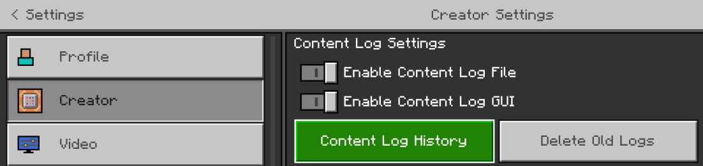
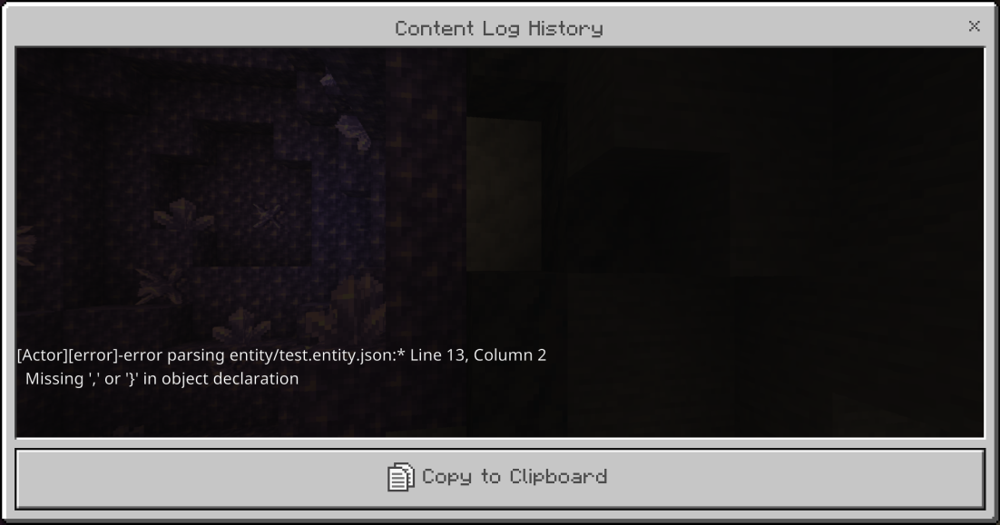

## 介绍

[来源于基岩命令社区Discord](https://discord.gg/SYstTYx5G5)

函数是包含多行命令的`.mcfunction`文件。它们在游戏中通过`/function`命令运行。

函数是在**行为包**中创建的，嵌套在**functions**文件夹内。函数包仅使用函数文件创建系统。

函数在许多方面都很有用，可以减少在命令方块之间调试系统所花费的时间。它们还帮助将系统打包以便在多个世界中使用，并提供许多可以改变一切工作方式的功能。

## 函数包文件夹结构

<FolderView
	:paths="[
    'BP',
    'BP/functions',
    'BP/functions/this_code.mcfunction',
    'BP/functions/more_of_this_code.mcfunction',
    'BP/functions/tick.json',
    'BP/functions/nested',
    'BP/functions/nested/this_code_is_nested.mcfunction',
]"
></FolderView>

为了帮助创建一致的格式，使每个人都能更容易遵循，并保持函数之间的统一性，建议遵循以下最佳实践来组织文件夹结构：

1. 包中的文件夹和文件必须使用`snake_case`命名
    - 这意味着只允许**小写**字母数字字符和下划线（`_`）。
    - ✅️ `BP/functions/scoreboards/objective/add_all.mcfunction`
    - ❌️ `BP/functions/SCOREBOARDS/Objective/Add-all.mcfunction`
2. 它们必须正确嵌套：
    - ✅️ `function teleport/zone/hell`
    - ❌ `function teleport_hellzone`
3. 名称必须遵循`action_object`结构。也就是说，动词应在主语之前。
    - ✅️ `add_all`
    - ✅️ `shuffle_position`
    - ❌️ `all_add`
    - ❌️ `position_shuffle`
4. 任何路径的总字符长度不得超过80个字符（控制台限制）。
5. 内容文件夹应使用一致的复数形式：保持所有名称都是复数或单数，不要混合使用。例如：

✅️ 一致：

```
BP/functions/abilities/ice_blast.mcfunction
BP/functions/events/player/on_death.mcfunction
BP/functions/events/world/on_initialise.mcfunction
BP/functions/quests/jungle/1.mcfunction
```

- 所有内容文件夹`abilities`、`events`和`quests`都是一致的复数形式。
- `events`中的内容文件夹也是一致的，因为`player`和`world`都是单数。

❌️ 不一致：

```
BP/functions/ability/ice_blast.mcfunction
BP/functions/event/players/on_death.mcfunction
BP/functions/event/world/on_initialise.mcfunction
BP/functions/quests/jungle/1.mcfunction
```

- 只有`quests`内容文件夹是复数形式，而`ability`和`event`是单数。
- 此外，在`event`文件夹中，`players`文件夹是复数，而`world`是单数。

## 初学者注意事项

_以下是供初学者参考的示例函数文件：_

```yaml title="BP/functions/effects.mcfunction"
# 这些效果用于生成
effect @a [tag=atSpawn] regeneration 12 255 true
effect @a [tag=atSpawn] saturation 12 255 true
effect @a [tag=atSpawn] weakness 12 255 true

# 这些效果用于下界
effect @a [tag=inNether] fire_resistance 12 255 true
```

- 函数中的命令不能以斜杠（`/`）开头。函数文件中的每一新行表示一个新命令（如果留空则被忽略）。你可以用井号（`#`）开头来添加注释——`#`后面的空格仅为格式偏好。有关函数的注释样式指南，请参见**[下文](#comments-style-guide)**部分。

- 函数中的所有命令在_同一刻_运行。因此，导致大变化的函数可能会导致突然的延迟峰值，如果可能，建议将某些命令分配到多个刻中。函数中的命令仍然按顺序运行。

- 在Minecraft基岩版中，函数文件中的命令不能超过10,000条。这包括在原始文件中执行的任何其他函数文件。

- 无法运行条件命令。这些仍然需要以某种方式利用命令方块，或者可以利用1.19.50执行语法。

- 在函数中以指定延迟运行命令涉及使用记分板计时器逐步计算每个刻，直到某个点，并在文件中的特定分数下执行命令。有关设置的详细信息，请参见[记分板计时器](../commands/scoreboard-timers.md)页面。

## 注释样式指南

- 在处理包含许多命令的函数时，使用多个井号在注释中指示不同的标题级别有助于保持组织。
- _可选地_，为了进一步区分这些级别，你可以应用不同的样式：
    - 级别1标题 - **# 大写**
    - 级别2标题 - **## 标题式**
    - 级别3标题 - **### 句子式**
- 尽量避免使用超过三个标题级别或太多标题，因为这会使代码看起来杂乱。供你参考，以下是示例文件：

<Spoiler title="示例函数文件">

```yaml title="BP/functions/abilities/fire_trail.mcfunction"
# 玩家物品丢弃时

## 给予效果
### 火焰抗性
execute at @e [type=item, name="Fire Trail Ability"] run effect @p [r=3] fire_resistance 10 255
### 速度
execute at @e [type=item, name="Fire Trail Ability"] run effect @p [r=3] speed 10 1 true

## 添加粒子时间（10秒）
execute at @e [type=item, name="Fire Trail Ability"] run scoreboard players set @p [r=3] abilities.fire_trail 200

## 删除物品
kill @e [type=item, name="Fire Trail Ability"]


# 实体计时器

## 发射粒子轨迹
execute at @a [scores={abilities.fire_trail=1..}] run particle minecraft:basic_flame_particle ~~~

## 倒计时
scoreboard players remove @a [scores={abilities.fire_trail=1..}] abilities.fire_trail 1
```

</Spoiler>

请注意，在级别1标题前留有两行空白，在级别2标题前留有一行空白，以提高可读性。

这种做法有助于创建一致的格式，使每个人都能更容易遵循，并保持函数之间的统一性。

有关记分板和标签的样式指南，请参见**[这里](../meta/style-guide.md#scoreboard-and-tags)**。

## 创建函数

1. 找到`📁 com.mojang`文件夹并导航到`📁 development_behavior_packs`

    - 开发文件夹用于快速重新加载包，因为这些包不会被缓存到世界文件中。

2. 创建一个文件夹（任意名称）作为函数包。这将被称为行为包或BP。

3. 在BP文件夹内创建一个`📄 manifest.json`文件和一个`🖼 pack_icon.png`文件（可选）。
    - 清单文件包含注册包所需的所有信息，而包图标在包菜单中以视觉方式显示。包图标通常是128x128或256x256的图像，尽管任何2的幂次分辨率都可以，它们会相应地放大和缩小。

<Spoiler title="示例 📄 manifest.json">

```json title="BP/manifest.json"
{
    "format_version": 2,
    "header": {
        "description": "在这里写下你的包描述",
        "name": "在这里写下你的包名称",
        "uuid": "00000000-0000-0000-0000-000000000000",
        "version": [1, 0, 0],
        "min_engine_version": [1, 19, 73]
    },
    "modules": [
        {
            "description": "§r",
            "type": "data",
            "uuid": "00000000-0000-0000-0000-000000000000",
            "version": [1, 0, 0]
        }
    ]
}
```

请注意，uuid字段需要替换为实际的uuid，并且两个生成的uuid必须不同。你可以在**[uuidgenerator.net](https://uuidgenerator.net/)**上生成uuid。

</Spoiler>
<Spoiler title="示例 🖼 pack_icon.png">

示例A:


示例B:


</Spoiler>

4. 创建一个`📁 functions`文件夹。此文件夹内以**.mcfunction**结尾的任何文件将在游戏中注册为函数，可以通过`/function <function_name>`运行。

    - 允许嵌套函数，只需按相对于functions文件夹的文件路径列出，如函数包文件夹结构所示。

5. 在游戏中应用行为包并尝试使用函数。函数文件的更改可以通过运行`/reload`或简单地重新登录来反映在世界中。

:::tip 注意：

函数是有版本的；因此，它们将在`📄 manifest.json`中列出的版本中运行，例如：

- `min_engine_version` 1.19.50或更高版本将采用新的执行语法。
- `min_engine_version` 1.19.70或更高版本将要求aux值替换为方块状态。

:::

## 执行

函数可以通过输入`/function name_of_function`在游戏中执行。这将执行函数文件中的所有命令，所有命令在一个刻中执行。

嵌套函数，例如`BP/functions/lobby/items/1.mcfunction`可以使用嵌套文件夹路径运行，在这种情况下为`/function lobby/items/1`

## Tick JSON

函数中的最后一个文件是**tick.json**文件。该文件指定在每个游戏刻上在服务器端运行的函数（类似于重复命令方块）。它位于`BP/functions`文件夹中。默认情况下，在此文件中运行的函数在下界的原点`0, 0, 0`处执行。

<CodeHeader>BP/functions/tick.json</CodeHeader>
```json
{
  "values": [
    "function_1",
    "function_2"
  ]
}
```
> 注意：此文件中的函数在世界*初始化*时立即运行，无论玩家是否已被*加载*。如果使用不当，可能会导致意外行为。

## 示例函数包

<Card image="../assets/images/commands/BClogo.png" title="下载" link="https://github.com/Bedrock-OSS/wiki-addon/releases/download/download/functions_sample.mcpack">

</Card>

## 故障排除函数

当使用`/function`时，你的函数可能不会出现在命令建议中。这通常是由于函数中的一个或多个命令出现错误。

在创建者设置中启用[内容日志](../guide/troubleshooting.md#content-log)可以让你查看函数包中是否有任何错误，错误出现在哪个函数中，在哪一行，以及该命令的确切语法错误是什么。

每次加载世界或运行`/reload`以反映编辑文件后的更改时，错误列表将生成。该列表可以在屏幕上查看几秒钟，也可以在设置中的内容日志历史记录中查看。



